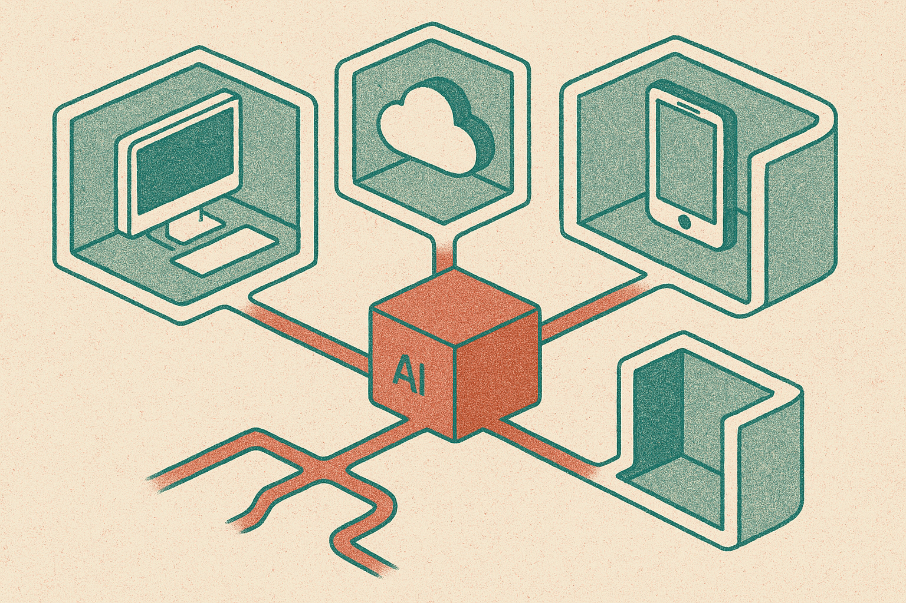

TL;DR: Open-weight models should not be regulated like deployed AI products, but builders still need serious controls around where, how, and by whom those models get used.

## What are Nvidia, Microsoft, and Meta actually arguing?

The primary source is the letter titled “Open-Weights and American AI Leadership,” from Nvidia, Microsoft, and Meta. The core argument is straightforward: do not overregulate open-weight models, because they are part of American AI competitiveness.

That framing matters. This is not an abstract academic defense of open science. Nvidia sells the hardware used to train and run these models. Meta has made open-weight releases central to its AI strategy. Microsoft is more complicated, since it backs closed frontier labs while also supporting a large developer ecosystem that benefits from downloadable models.

So yes, there is self-interest here. That does not make the point wrong.

Open-weight models are not the same thing as fully open source software. Usually, you get model weights, maybe a license, maybe a technical report, maybe evals, maybe not enough training data detail to reproduce anything. Still, downloadable weights change the market. They let startups fine-tune locally. They let researchers inspect behavior without asking for API access. They let hospitals, governments, and manufacturers run models inside their own infrastructure when sending data to a third-party endpoint is a nonstarter.

That is useful. It is also messy.

The worst policy move would be treating every released model file like a finished consumer product. A model sitting on a server is not the same as a model wired into a loan decision, a medical triage tool, a cyber workflow, or a tutoring product for children. The risk comes from capability plus context plus access.

## Where should the control point be?

The better control point is deployment.

If a company ships an AI feature that affects healthcare, employment, finance, education, public services, or physical systems, it should have obligations. Evaluation. Logging. Red-team results. Incident response. User disclosure where appropriate. Human review where the cost of error is high. Clear ownership when the system fails.

That should apply whether the underlying model is closed, open-weight, fine-tuned, distilled, or duct-taped together from five APIs and a retrieval pipeline.

Regulating the model file itself sounds clean, but it gets weird fast. Which weights count? Only frontier models? What about small models fine-tuned into dangerous tools? What about mixture-of-experts checkpoints? What about weights shared inside a company, inside a university, or across borders? What about a model that is harmless alone but risky when paired with an agent scaffold, browser access, code execution, and stolen credentials?

This is the part policy debates often flatten. “Open” is not one risk category. Neither is “closed.” A closed API can be abused at scale. An open-weight model can be studied, patched, filtered, fine-tuned defensively, or run in a secure setting. Both can fail.

The right question is not “are open weights safe?” The right question is “what combinations of capability, access, and use deserve mandatory controls?”

## What should builders take from this fight?

Builders should expect the policy line to keep moving. The safest operating assumption is that model provenance, license terms, eval artifacts, and deployment logs will matter more over time.

If you are using open-weight models, keep a boring paper trail. Which model. Which version. Which license. Which fine-tuning data. Which evals before launch. Which mitigations after launch. If you swap a hosted API for a local model to save cost or protect data, do not treat that as a governance vacation. You just moved more responsibility inside your own shop.

Also watch the incentives. Meta, Nvidia, and Microsoft are defending an ecosystem that benefits them. Regulators are reacting to real concerns, but broad rules can easily protect incumbents by making compliance too expensive for smaller teams. Both things can be true at once.

For operators, the practical move is to separate model choice from product risk. Use open-weight models where they give you control: privacy-sensitive workflows, latency-sensitive features, cost management, domain fine-tuning, offline environments. Then wrap them like production systems, not research toys. The catch most readers miss: the model license is only the first gate. The real liability lives in the workflow you build around it.
