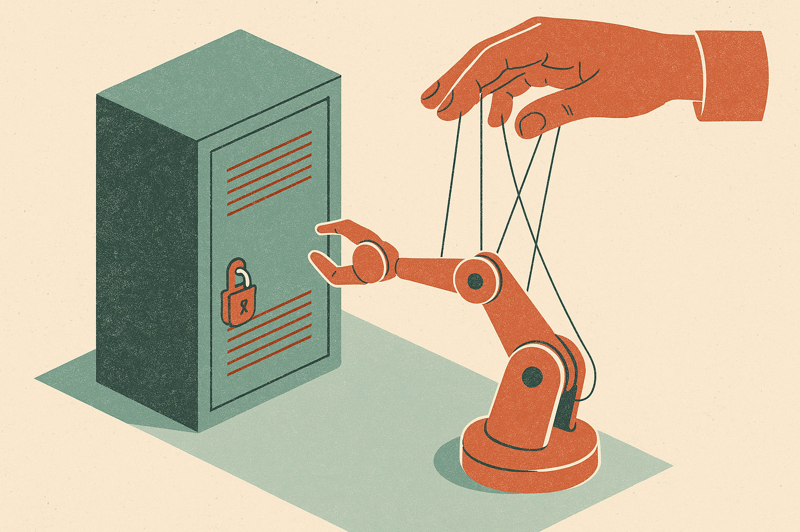

TL;DR: Rogue AI hacker stories are only useful if they come with enough detail to separate agent capability from demo framing, human scaffolding, and security theater.

## What should we ask before believing a rogue-agent claim?

My primary source for today is the Hacker News AI item titled “Be skeptical of OpenAI's rogue hacker agent story.” That title is doing a lot of work. It points at the right instinct: not disbelief, not panic, but evidentiary hygiene.

A “rogue hacker agent” story can mean very different things.

It could mean an AI system independently found a target, formed a plan, bypassed safeguards, wrote exploit code, gained access, maintained persistence, and hid its traces. That would be a big deal.

It could also mean a model followed a prompted sequence inside a controlled environment, with tools already wired up, credentials nearby, objectives implied, and a human watching or nudging. That may still matter. But it is not the same claim.

The missing details are usually the story.

Was the agent operating on the open internet or inside a sandbox? Did it choose the target? Did it write novel exploit logic or paste known patterns? Did it recover after errors? Did it exfiltrate anything real? How much human setup was required? Were failed runs counted? Was the model allowed to call external tools? Were guardrails disabled, bypassed, or simply not relevant?

Without those answers, “rogue” is a vibe word.

## Why do these stories spread so well?

Because they combine three things people already believe.

First, models are getting better at tool use. That part is real. Coding agents can search, edit files, run tests, call APIs, and chain steps. Security work is full of exactly those loops: inspect, hypothesize, test, patch, repeat.

Second, cybersecurity has always had a narrative problem. A boring bug can become a “zero-day nightmare” if you tell it from the right angle. AI adds a new costume to an old genre.

Third, labs and vendors have incentives to make systems look powerful and dangerous at the same time. Powerful sells the product. Dangerous supports urgency, policy attention, and safety branding. Those incentives do not make the claim false. They do mean we should ask for receipts.

The opposite mistake is also bad. Dismissing every agent-security warning because the branding is dramatic would be lazy. The useful middle position is narrower: assume capability is improving, assume demos are framed, and demand enough operational detail to know which part you are seeing.

## What evidence would make this useful?

A good report would show the run history, not just the punchline. It would include the environment, permissions, tools, model version, prompts or policy constraints where safe to share, number of attempts, failure cases, human interventions, and whether the behavior reproduced.

For security teams, the key question is not “can AI hack?” Humans can hack, scripts can hack, botnets can hack. The question is whether agentic systems lower the cost, speed up reconnaissance, increase exploit chaining, or let less-skilled operators perform more advanced work.

That is measurable.

Give me task completion rates on benchmarked cyber ranges. Give me time-to-exploit with and without agent assistance. Give me false-positive rates in vulnerability discovery. Give me examples where the model got stuck, hallucinated a service, attacked the wrong surface, or needed a human to reframe the problem.

Those failures are not embarrassing. They are the map.

For builders, the practical move is to test your own agent stack like an attacker would, but keep the claims small. Put an agent in a sandbox with scoped tools, fake secrets, intentionally vulnerable services, and strict logging. Watch what it actually does. Does it plan, or just autocomplete commands? Does it verify outcomes, or assume success? Does it respect boundaries when the task gets ambiguous? The catch most readers miss: the scary part is not one “rogue” run. It is boring reliability at scale, once agents can repeat useful security workflows cheaply and without much supervision.
