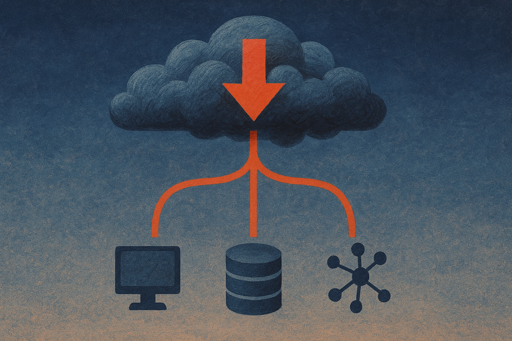

TL;DR: The IRGC claim about Amazon’s Bahrain infrastructure should not be treated as verified damage, but it should push AI teams to test regional failure, model-serving fallback, and incident communications now.

## What do we actually know?

The primary source here is the Hacker News (AI) item titled “IRGC claims it destroyed Amazon's Bahrain data center.” That wording matters. It says the IRGC claims destruction. It does not establish that Amazon infrastructure was destroyed. It does not give outage telemetry, customer impact, AWS status data, satellite imagery, third-party confirmation, or Amazon’s statement.

So the first operator move is boring and important: separate the claim from the incident.

Geopolitical actors make infrastructure claims for several reasons. Sometimes they are describing real damage. Sometimes they are overstating an attack. Sometimes they are injecting uncertainty into markets, supply chains, or public confidence. Cloud infrastructure is especially good propaganda terrain because most people cannot inspect it directly. A region can be healthy, partially degraded, routing around trouble, or completely unrelated to the physical site being discussed, and the headline will still compress that into “data center destroyed.”

That compression is dangerous for AI teams. Not because every claim is true. Because many AI products now depend on a surprisingly small set of cloud regions, model APIs, GPU pools, object stores, vector databases, queues, and auth services. A false claim can trigger customer concern. A true regional incident can break production. A murky one can do both.

## Why does this matter more for AI systems than ordinary web apps?

Classic web apps can often degrade in familiar ways. Cache more. Serve read-only. Queue writes. Show a maintenance banner.

AI systems fail in messier shapes.

A chatbot may still load while retrieval silently stops. An agent may keep calling tools while the queue backing those tools is delayed. A model endpoint may fall back to a cheaper or smaller model and change product behavior. A document workflow may accept uploads but fail at embedding. A support copilot may lose access to the regional data store that contains the only approved policy corpus.

That means “is the site up?” is the wrong question. The better question is: can the product still make acceptable decisions when one region, one model provider, or one data path is unavailable?

For AI operators, the Bahrain claim is a reminder that cloud geography is now part of product behavior. Latency, data residency, GPU capacity, and political risk are tangled together. If your inference runs in one place because it was fastest to ship, fine. I respect shipping. But write down the blast radius. Know which customers, datasets, workflows, and contractual promises sit behind that choice.

## What should change in the runbook?

Start with verification. Your incident process should have a “claim triage” path, not just an outage path. When a public actor claims damage to a provider or region, someone should check provider status pages, internal telemetry, synthetic tests, customer reports, network behavior, and account-team channels. Do not let a viral claim become your incident narrative before your own systems agree.

Then test the boring failure modes. Can you route inference to another region or provider? Can your app tolerate different model outputs if you switch models? Are embeddings portable enough to rebuild search somewhere else? Are secrets, prompts, eval sets, and safety filters available outside the affected region? Can customers keep working in a reduced mode without corrupting data?

The catch is that failover is not just infrastructure. It is product design. If your “fallback” model breaks formatting, ignores tool schemas, or fails your evals, you do not have fallback. You have a different product under stress.

If you run an AI product, use this claim as a tabletop exercise this week. Pick one critical workflow, assume the region or provider behind it is unavailable for six hours, and trace every dependency from user request to final output. Try the fallback for real, with logs and evals. The thing most teams miss is customer communication: you need a plain-language status update that says what is affected, what is not, and what behavior may change if models or regions shift.
