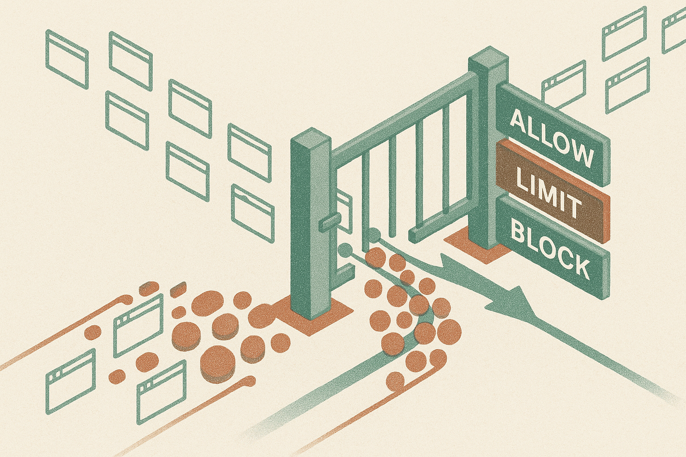

TL;DR: Cloudflare is treating AI crawlers as a distinct traffic class, which means web access for model training, search, and agents is shifting from polite requests to enforceable infrastructure rules.

## What is Cloudflare actually changing?

The primary item here is Cloudflare’s announcement, “Cloudflare's new AI traffic options for customers,” surfaced through Hacker News. The title is doing more work than it may seem. Cloudflare is not just talking about bots in the old spam-and-scraping sense. It is carving out AI traffic as its own category, something site owners can identify, shape, permit, or block.

That is the shift.

For years, the web mostly relied on soft signals. `robots.txt`. User agents. Public norms. Search engines got indexed access because they sent traffic back. Scrapers were tolerated, blocked, or ignored depending on how annoying they became. AI crawlers broke that balance. They can consume content at scale, provide little or no referral traffic, and create downstream products that compete with the pages they trained on.

Cloudflare sits in the right layer to make this fight practical. It handles traffic before it hits the origin server. That gives customers a place to make policy real, not just post a preference and hope crawlers honor it.

The important question is not whether every AI company will obey. Some will. Some will not. Some traffic will be mislabeled. Some will be routed through residential proxies or generic cloud infrastructure. But once AI traffic becomes a first-class control surface, site owners can start making operational decisions instead of symbolic ones.

## Why does this matter for builders?

Because the open web is becoming less open by default for machines.

If you are building an AI product that retrieves pages, summarizes sites, trains on public text, monitors competitors, enriches leads, or runs browser agents, you should assume more friction ahead. Not only CAPTCHA friction. Policy friction. Rate limits. Blocks. Paid access. Allow lists. Audit trails.

That changes product architecture.

A cheap crawler plus a model call used to feel like enough for many prototypes. Now the durable version needs provenance, consent, caching, fallback data sources, and a clean explanation of what your system fetches and why. If your agent hits a site hundreds of times because it cannot plan well, that is not just inefficient. It may look abusive at the network edge.

The same applies in reverse. If you run a media site, developer docs, marketplace, forum, or SaaS knowledge base, Cloudflare’s move suggests AI traffic policy should sit next to caching, WAF rules, and analytics. Not in a legal PDF nobody reads.

There is a product question here too. Some publishers may want search bots but not training bots. Some may want AI assistants to quote snippets but not bulk-copy archives. Some SaaS companies may want agents to read public docs but not hammer pricing pages or support portals. One “allow AI” toggle will not be enough.

## Is this good for the web?

Mostly, yes. With caveats.

The web needs a better bargain between content owners and AI systems. “Everything public is free training data forever” was never going to survive contact with real incentives. But a world where every useful page is gated, blocked, or licensed through private deals would also be worse. Smaller builders would lose. New search products would lose. Users would get fewer strange, useful tools.

Cloudflare’s role is powerful because it can make rules enforceable at scale. That is useful, and also worth watching. When infrastructure providers become policy chokepoints, their defaults matter. Their classifications matter. Their customer controls matter. A mislabeled crawler is not just a logging issue if it loses access to half the web.

I would not read this as the end of web crawling. I would read it as the end of casual, consequence-free AI crawling. The next phase looks more like API discipline than web-scraping culture: identify yourself, respect limits, cache aggressively, pay where appropriate, and design agents that do not behave like broken load tests.

Practitioner's Take: If you build with web data, add an “AI traffic hygiene” pass to your stack now. Set a clear user agent, document what you fetch, reduce repeated requests, cache aggressively, and build fallbacks for blocked sources. If you own a site, start by separating the traffic you want from the traffic you do not. The catch most teams miss: this is not only a legal or policy issue. Bad agent behavior will become an infrastructure reliability problem first.
