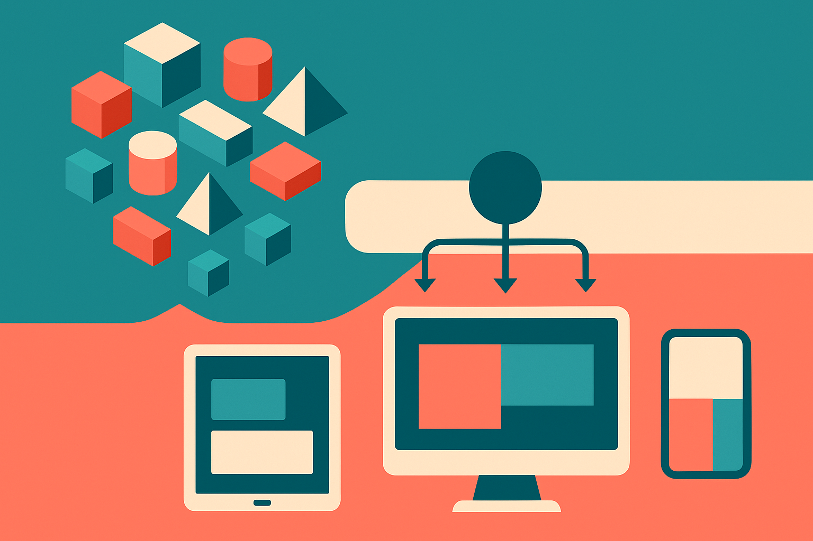

TL;DR: Open-weight AI’s real shift is not “free models beat closed models,” it is that teams now need an operating layer for choosing, serving, testing, swapping, and governing models.

## What does “Kubernetes moment” mean for open-weight AI?

The Hacker News AI item titled “Open-weight AI is having its Kubernetes moment” is a useful frame because Kubernetes was never just about containers. Containers existed first. Kubernetes mattered because it made containers manageable across real systems: scheduling, scaling, health checks, rollouts, networking, failure recovery.

Open-weight AI is hitting a similar stage. The interesting unit is no longer just the model file.

A team can download weights, quantize them, run them through llama.cpp, serve them with vLLM, package them behind Ollama, tune adapters with LoRA, host artifacts on Hugging Face, and wrap the whole thing in an API that looks like OpenAI’s. None of those pieces solves the full job alone. Together, they start to look like an operating stack.

That is the Kubernetes comparison. Not because AI serving needs Kubernetes specifically, though sometimes it will. The comparison works because the center of gravity moves from “can I run this thing?” to “can I run many versions of this thing safely, cheaply, and repeatedly?”

Closed models made the early product surface simple. Call an API. Get a result. Pay the bill. Open-weight models give more control, but they also hand the operational burden back to the builder.

## Where does the analogy break?

Kubernetes standardized around a fairly crisp artifact: the container. Open-weight AI does not have that same clean boundary yet.

A model is not just a model. It is weights, tokenizer, context window, license, inference engine, quantization format, prompt template, safety behavior, tool-calling quirks, memory needs, eval profile, and sometimes a chat format that breaks when you swap families. GGUF, Safetensors, ONNX, MLX, and vendor-specific serving paths all solve different parts of the problem.

That makes “Kubernetes for AI” a tempting slogan and a dangerous product claim.

The orchestration problem is real. But model workloads are less uniform than web services. Latency depends on prompt length and output length. Cost depends on hardware occupancy, batching, cache hits, and quantization tradeoffs. Quality depends on task shape, not leaderboard rank. A 7B or 8B model may be fine for classification and extraction. It may be weak for long-horizon coding or multi-step research. A larger model may still lose if the prompt format, retrieval layer, or eval set is sloppy.

So I buy the Kubernetes moment as a phase change. I do not buy it as proof that one platform will abstract everything away.

The better mental model is a control plane for model operations. It should help teams route requests, compare models, manage fallbacks, monitor drift, enforce data boundaries, and roll back bad changes. Boring work. Valuable work.

## What should builders do with this now?

Start by treating model choice as a deployable dependency, not a brand preference.

If you are building with open weights, put three things in place early. First, a small eval set made from your real user tasks. Not a public benchmark you admire. Your tasks. Second, a serving abstraction thin enough that you can swap models without rewriting the product. Third, observability around latency, token usage, refusal patterns, empty answers, malformed JSON, and human correction rates.

This is where many teams get fooled. They test a model in a notebook, get five good answers, and assume they have infrastructure. They do not. They have a demo.

The Kubernetes lesson is that adoption accelerates when the operational surface becomes predictable. Open-weight AI needs the same boring maturity: package formats that do not surprise you, deployment paths that match the hardware, evals that catch regressions, and governance that says which model can touch which data.

A builder should try one practical experiment this week: take one production AI task and run it through two open-weight models plus one closed model, behind the same interface, scored against the same private eval set. Measure quality, latency, failure mode, and operating cost. The catch most readers miss: the winner is not the model with the best vibes, it is the setup you can improve, monitor, and replace without breaking the product.
