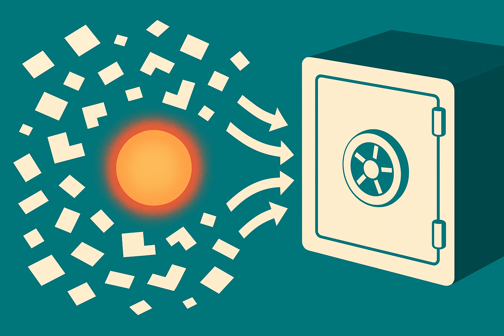

TL;DR: GrapheneOS's approach to protecting data on a locked phone is the same problem on-device AI has to solve, and if you ship models to devices you should treat "locked" and "unlocked" as two completely different security worlds.

The primary source here is a Hacker News (AI) discussion titled "GrapheneOS protections against data extraction from locked devices." It is a thread, not a paper, so I am treating it as a lens rather than a finding. The thing worth pulling out: the exact defenses GrapheneOS builds against forensic extraction tools are the defenses an on-device AI stack needs, and almost nobody building local models thinks in those terms yet.

## Why does a phone-security thread matter to AI builders?

Because the industry has spent two years telling people that on-device AI is the private option. Run the model locally, your data never leaves the phone, no cloud, no leakage. That story is mostly true against one threat: a remote server reading your prompts. It is much weaker against a different threat: someone with physical possession of the device.

On-device AI creates a new pile of sensitive data that sits on the hardware. Think about what a local assistant accumulates. Indexed messages. Cached embeddings of your photos and notes. A vector store of everything you asked it to remember. Model context that persists between sessions. Every one of those is a juicy target, and it lives on the same flash storage that a forensic tool tries to pull when a phone is seized, stolen, or handed to a border agent.

The GrapheneOS thread is about resisting exactly that class of attack: data extraction from a locked device. The overlap with AI is not a metaphor. It is the same bytes on the same chip.

## What is GrapheneOS actually defending against?

The forensic-extraction world runs on a simple distinction that most consumer AI marketing ignores. There are two states a phone can be in, and they are not equally safe.

Before First Unlock (BFU): the phone has booted but nobody has typed the passcode yet. In this state, disk encryption keys are not in memory, so most user data is cryptographically sealed. Extraction tools get very little.

After First Unlock (AFU): once you enter the passcode, keys live in RAM to make the device usable. From that point, even if you lock the screen, a lot of data stays decryptable in the background, and that is the window forensic tools exploit. GrapheneOS narrows that window with things like aggressive auto-reboot back to the BFU state after a period of inactivity, disabling low-level debug and data ports, and hardening against the kind of brute-force and exploit-chain attacks that commercial extraction boxes rely on.

I am describing the general model here, not quoting specifics beyond what the thread's title and topic establish, because the discussion is community commentary rather than an official spec. The BFU/AFU framing is standard in this space and it is the right frame for AI.

Here is the uncomfortable part for AI builders. A local model is useful precisely because it is warm. It has your context loaded, your recent history indexed, your personal data decrypted and ready. That is the AFU state, and it is the vulnerable one. The convenience that makes on-device AI feel magic is the same property that makes its data extractable when the phone is in the wrong hands.

## How should on-device AI handle the locked-versus-unlocked split?

Treat them as two separate products with two separate data policies.

When the device is unlocked and the user is present, load context, run inference, keep embeddings warm, do everything that makes the assistant fast. When the device locks, the default assumption should be that this data is now a liability, not an asset. That means flushing decrypted model state and caches out of memory on lock, storing the vector index and any personal embeddings under hardware-backed encryption tied to the user's authentication, and never leaving a warm copy of someone's indexed life sitting in a background process that survives a screen lock.

Most local-AI apps I have looked at do none of this. They build an index once, leave it on disk in whatever the app sandbox gives them, and keep serving it whenever the OS lets the process run. That is fine against a remote adversary and weak against a physical one. The GrapheneOS thread is a reminder that "on-device" and "private" are not synonyms. On-device means the attack surface moved from a data center to a pocket, and pockets get lost.

There is a real tension here and I will not pretend otherwise. Aggressive flushing hurts the user experience. Re-indexing after every lock is slow and battery-hungry. Auto-reboot to BFU means your assistant is cold when the user picks the phone back up. GrapheneOS accepts that friction because its users have chosen a threat model where physical extraction is the priority. Consumer AI products have mostly chosen the opposite, optimizing for warmth and speed, and they have made that choice silently, without telling users which threat they are and are not protected against.

## What can a builder do this week?

Start with an honest threat model, written down, that says out loud what your on-device AI protects against and what it does not. If your answer is "we protect against the cloud reading your data but not against someone with your unlocked phone," that is a legitimate position. It just needs to be a decision, not an accident.

Then audit where your persistent AI data lives. Is the vector store encrypted at rest with a key that is unavailable in the BFU state, or is it sitting in plaintext in your app's sandbox? Does decrypted model context survive a screen lock, and if so, why? On Android, hook the lock event and clear sensitive in-memory state. On both platforms, use the hardware keystore for anything derived from personal data, and tie decryption to user authentication rather than to app launch.

The catch most readers miss: the sensitive artifact is usually not the model, it is the index of the user built on top of it. The model weights are the same for everyone and boring to steal. The embeddings of your messages, the cached summaries of your documents, the memory the assistant kept about you: that is the extraction target, and it is the part that almost no local-AI shipping guide talks about. GrapheneOS spends its effort protecting user data on a locked device. If you are putting AI on that same device, you are now adding to the exact pile they are trying to defend, and the responsible move is to defend it the same way.

The community framing in the thread is worth trusting on direction even where I cannot cite exact mechanisms. Physical access is a distinct threat, locked is not unlocked, and warmth is a cost. Build like you believe that.
