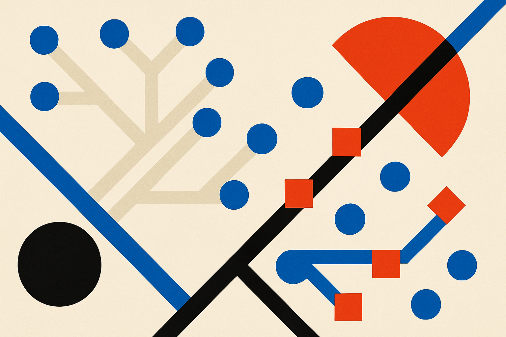

TL;DR: For agent workflows, routing every LLM call independently can make feedback noisy, so TRACE-Router routes once at task admission and learns from the final outcome.

## Why is per-call routing a bad fit for agents?

Most model routers are built around a simple idea: each LLM call gets sent to the model that looks best for that call’s expected cost and quality. Cheap model for easy stuff. Stronger model when risk looks higher. That makes sense for single-turn chat, classification, extraction, or short tool calls.

Agents are messier.

An agent might plan, call tools, inspect outputs, revise, ask another model call, hit a terminal command, recover from an error, then produce a final answer. The system is judged at the task level. Did it book the right thing? Fix the repo? Finish the support workflow? Pass the benchmark?

That creates a credit assignment problem. If a 20-step agent fails, which model routing decision caused the failure? The cheap model used in step 3? The strong model used in step 9? The planner? The tool result? The final response? Per-call routing pretends each call can be judged cleanly, but the reward often arrives only after the whole workflow ends.

The arXiv cs.AI/cs.LG paper, “TRACE-ROUTER: Task-Consistent and Adaptive Online Routing for Agentic AI,” makes that mismatch the core point. The paper’s router assigns the whole task to one backend model at admission, then pins later LLM calls in that workflow to the same model. After the task ends, it updates the routing policy using the terminal reward, with both accuracy and latency in the objective.

That is less fancy than a router that switches models constantly. It may also be more aligned with the thing operators actually care about.

## What does TRACE-Router actually change?

TRACE-Router uses a contextual bandit. In plain English: it sees task context, picks a model, observes the final result later, and adjusts future picks. It does not need an explicit task-complexity estimator, which is useful because “complexity” is usually a leaky abstraction in agent systems.

The important design choice is the unit of routing. TRACE-Router routes the task, not the call.

That has trade-offs. Pinning every call to one backend may miss opportunities where a cheap model could handle easy intermediate steps. If the agent is doing 50 small actions and only 3 require heavy reasoning, per-call routing has an intuitive appeal. But the paper argues that the benefit of cleaner learning signal can beat the theoretical efficiency of micro-routing.

The reported results are worth paying attention to, without over-reading them. Across three agentic benchmarks, TRACE-Router improved the accuracy-latency trade-off and achieved non-dominated Pareto frontier points. On tau2-Bench, it beat latency-matched interpolation between individual models by 7 to 8 accuracy points. On Terminal-Bench, it achieved 7.1 higher accuracy points than the strongest single-model baseline with 36% lower latency.

Those are meaningful numbers. They do not prove this is the final architecture for production agent routing. Benchmarks are bounded. Real workloads have changing prompts, uneven tool reliability, vendor outages, caching, rate limits, and user-specific success criteria. But the idea maps cleanly to production: optimize on the same boundary where the business measures success.

## Where would this matter in a real stack?

I would look at TRACE-Router first for long-running, outcome-graded workflows. Coding agents. Browser agents. Customer operations agents. Data cleaning agents. Anything where the final success metric matters more than the apparent quality of any single intermediate call.

The lesson is not “always use one model for the whole task.” It is “do not train your router on fake feedback.” If your eval says the task passed or failed, your routing policy should learn from that task-level result. Otherwise you are building a high-resolution controller around a low-resolution signal.

There is also a product point here. Many teams think of routing as a cost hack. It is. But for agents, routing becomes part of reliability engineering. The router decides not only how much you spend, but how stable the reasoning path is across a workflow. Constant model switching can change style, assumptions, tool-use patterns, and error recovery behavior. Sometimes consistency is a feature.

For builders, I would start by logging agent runs as task objects, not just model calls. Store the admission context, selected backend, all intermediate calls, latency, cost, and final success label. Then compare three baselines: strongest single model, cheapest acceptable single model, and a simple task-level router. The catch most teams miss: if you do not have trustworthy terminal rewards, a smarter router will just learn your measurement noise faster.
