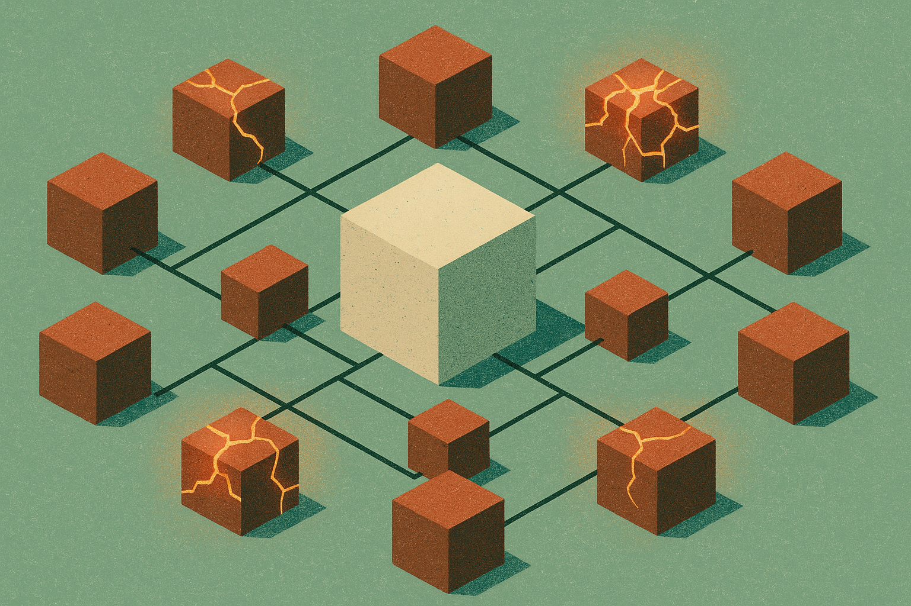

TL;DR: The last two Llama Stack releases contain zero new features and about ten CVE patches between them, which is the real ongoing cost of running an AI serving stack that most demos never mention.

I want to talk about the least glamorous thing in AI right now. Not a model. Not an agent. Two patch releases from `meta-llama/llama-stack`: v1.2.2 and v0.7.3. Neither adds a capability. Every single line item is a security fix or a dependency bump. And that is exactly why they are worth writing about.

## What actually shipped in these releases?

The primary source here is the GitHub release notes for `meta-llama/llama-stack` v1.2.2 and v0.7.3.

v1.2.2 is tiny. Two changes. A `pyasn1` bump for CVE-2026-59885, and a fix that adds `_enforce_credentials=False` to a passthrough `AsyncOpenAI` client. That second one is interesting because it is not a dependency bump, it is a behavior fix in how the inference layer hands off credentials to a passthrough OpenAI-compatible client. The rest is housekeeping.

v0.7.3 is where the pattern gets loud. Seven changes, and almost all of them are CVE patches across the dependency tree:

- `pillow` bumped past 12.2.0 for CVE-2026-40192
- `python-multipart` to >=0.0.27 for CVE-2026-42561
- `pyasn1` for CVE-2026-59885 (the same backport as v1.2.2)
- `urllib3` and `python-dotenv` for three CVEs at once
- `pillow`, `nltk`, and `langchain-core` for "multiple CVEs" in a single backport
- `aiohttp` and `pyjwt` for two more CVEs
- a CI fix pinning client checkouts to the matching release branch

Count the named CVEs and you are somewhere around ten. In two releases. None of these are in Llama Stack's own code. They are in the packages Llama Stack pulls in to do its job: image handling, form parsing, HTTP, JWT verification, ASN.1 encoding, NLP tokenizing.

That is the shape of the thing. The core is fine. The perimeter is where the fires are, and the perimeter is enormous.

## Why does an AI serving stack have this many dependencies?

Because it sits at a junction. Llama Stack is Meta's attempt to standardize the layers around inference: the API surface, the provider abstractions, the tooling for agents and RAG and safety. To do that it has to speak a lot of formats and protocols. `pillow` because multimodal models take images. `python-multipart` and `aiohttp` because it serves HTTP and parses uploads. `pyjwt` because it does auth. `langchain-core` and `nltk` because of the orchestration and text-processing bits. `pyasn1` and `urllib3` because those sit underneath the auth and networking layers whether you asked for them or not.

Every one of those is a package maintained by someone else, on their own schedule, with their own vulnerability history. When you `pip install` a serving stack, you are not adopting one project. You are adopting the union of every project it touches, transitively. The v0.7.3 notes are a snapshot of that union having a bad month.

This is not a Llama Stack problem. It is the AI infra problem, and Llama Stack just happens to be honest enough to itemize it in public. Every serving framework, every agent toolkit, every "just clone and run" repo carries the same tree. Most of them do not backport fixes to old release branches at all, which brings me to the part operators actually need to sit with.

## What does this mean if you're running it in production?

Notice the two version lines. Fixes are landing in both a 1.2.x branch and a 0.7.x branch, with several marked as backports. `cdoern` even pinned CI client checkouts to the matching release branch so the 0.7.x line builds against the right client. That tells you people are running old versions in production and cannot easily jump to the latest. The maintainers are patching where users actually are, not just at head.

If you pinned Llama Stack six months ago and walked away, here is the uncomfortable read: you are almost certainly exposed to some of these CVEs right now. A pinned version is not a safe version. It is a frozen snapshot of whatever vulnerabilities existed the day you froze it, plus every one disclosed since.

The `pyjwt` and `python-multipart` fixes deserve extra attention. JWT verification bugs are the kind that turn into auth bypass, and multipart parsing bugs are the kind that turn into denial of service or worse on any endpoint that accepts uploads. If your Llama Stack instance is internet-reachable and takes image uploads for a multimodal model, those two are not theoretical. That is your front door.

The passthrough credentials fix in v1.2.2 is the one I would read the diff on. `_enforce_credentials=False` on a passthrough `AsyncOpenAI` client sounds like it is loosening credential enforcement, but in a passthrough context it usually means "do not double-apply our credentials on top of what the caller already supplied." Either way, if you route requests through a passthrough provider to an upstream OpenAI-compatible endpoint, that change affects how your keys get handled. Worth confirming before you assume the upgrade is a no-op.

## How should a team actually handle this going forward?

Treat your AI stack like the dependency-heavy web service it is, not like a magic model box.

Concretely: run a scanner. `pip-audit` or Dependabot or Trivy against your image, on a schedule, not once. Any one of them would have flagged most of the CVEs in these two releases. The whole point of a CVE having an ID is that a machine can check for it. Do not do that check by reading release notes by hand.

Pin, but pin with a review cadence. Pinning for reproducibility is correct. Pinning and never looking again is how you end up nine CVEs behind. Put a recurring calendar item on it, monthly at least, to pull the latest patch release on your branch.

And watch the branch, not just the tag. Llama Stack is maintaining 0.7.x and 1.2.x in parallel. Know which line you are on, subscribe to its releases specifically, and take the backports. The maintainers went to the trouble of shipping them. The failure mode is on the consumer side, teams that never noticed.

Here is the practitioner's take. The move is boring and it works: add one CVE scanner to your CI today, point it at the actual container image you deploy, and fail the build on high-severity findings. That is an afternoon of work and it converts the entire class of problem in these release notes from "hope someone notices" into "the pipeline tells you." The catch most people miss is that the vulnerability is almost never in the AI part. It is in `pillow` and `urllib3` and `pyjwt`, the plumbing you never think about because the model is the shiny thing. Attackers do not care that you shipped a model. They care that your image parser is from 2025.
