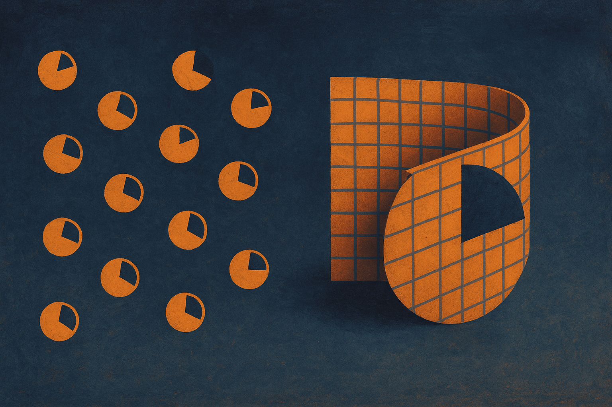

TL;DR: Quantum Spectral Models build the data-encoding step of a quantum circuit from the input matrix's own spectrum instead of scattering its numbers across rotation gates, and on four small benchmarks that design led the other quantum models tested, though the benchmarks are too narrow to call this a breakthrough yet.

The paper is "Quantum Spectral Model: Data Reuploading with Input-Conditioned Frequency Support," posted to arXiv under both cs.AI and cs.LG. It is a design paper first and a benchmark paper second, which is the right way to read it. The interesting part is not the accuracy numbers. It is the encoding idea.

## What problem are Quantum Spectral Models actually solving?

Most quantum machine learning models load classical data into a quantum circuit the same boring way: take each number in your input, feed it into a rotation gate, one number per gate. This is called coordinate-wise encoding. It works, but it treats your data as a bag of independent scalars. The circuit never sees that your input is a matrix with matrix-level structure.

For matrix-valued inputs, the structure that matters usually lives in the spectrum: the eigenvalues (spectral values) and the eigenvectors (spectral subspaces). Those tell you the relationships between rows and columns, not just the raw entries. Coordinate-wise encoding throws that away and hopes the trainable layers rediscover it. Sometimes they do. Often they waste capacity relearning something the input already contained.

The authors' move: construct the generator of the data-encoding unitary directly from each input matrix. Instead of chopping the matrix into scalars, they use the matrix itself to define how the quantum state rotates. The circuit now encodes spectral relationships by construction, not by hope.

This is the "align your inductive bias with the structure of the data" principle, applied at the encoding layer rather than the model layer. It is a familiar idea in classical ML. Convolutions bake in translation structure. Attention bakes in set structure. This paper asks what it looks like to bake spectral structure into a quantum encoding.

## How does the encoding actually work?

The mechanism leans on data reuploading, a standard trick where you feed the input into the circuit multiple times across depth. The output of a reuploading circuit can be written as a truncated Fourier series: a sum of sines and cosines with specific frequencies and coefficients. In ordinary encodings, those frequencies come from fixed gate structure. In QSMs, the input-dependent spectral gaps supply the candidate phase carriers, and the spectral subspaces help set the coefficients.

Plainly: the eigenvalue gaps of your input decide which frequencies the model can express, and the eigenvectors decide how much weight each gets. The model's expressible function is shaped by the spectrum of the thing you handed it. That is the whole pitch, and it is a clean one, because it makes the model analysable. You can reason about what functions it can and cannot represent from the spectrum of the input.

They test three variants that differ in how they build the Hamiltonian generator:

- Symmetric Hamiltonian.
- Global block Hamiltonian, using the whole matrix.
- Patch-local block Hamiltonian, chopping the matrix into non-overlapping blocks.

The patch-local one is the quantum cousin of a patch-based vision model. The global one keeps the full matrix intact. Which wins depends on the task, and that dependence is the most useful finding in the paper.

## Where do these models actually win, and by how much?

Here is where I pump the brakes. The benchmarks are four items: two matrix representations of Pendigits (a small handwritten-digit dataset) and two synthetic tasks defined by spectral statistics. That is it. No ImageNet, no language, nothing at scale. This is a proof-of-concept evaluation on toy problems, and the paper does not pretend otherwise.

Within that scope, the results are consistent. At the largest circuit depth tested, the QSM variants led the other quantum models in mean test accuracy across all four benchmarks. Not one lucky win. All four. That consistency matters more than any single accuracy figure, because it suggests the encoding idea, not a benchmark fluke, is doing the work.

The split between variants is the honest, interesting part. The patch-local QSM led on Pendigits. The global block-Hamiltonian QSM led on the controlled spectral tasks. So there is no single best variant. The right structure depends on whether the signal is local (patches of a digit) or global (whole-matrix spectral statistics). That is exactly the kind of task-dependence you would expect if the encoding is really tracking data structure rather than just adding parameters.

The ablations sharpen this and also complicate it. They show a task-dependent reversal: subspace-preserving controls (keep the eigenvectors) did better on Pendigits, while spectral-value-only controls (keep the eigenvalues, drop the subspaces) led among the tested ablations on the synthetic tasks. In other words, on real-ish data the eigenvectors carry the signal, and on the synthetic spectral tasks the eigenvalues do. That is coherent, because the synthetic tasks were defined by spectral statistics, so of course the values matter there. But it also means you cannot ship one recipe. You have to know which spectral property your data hides its signal in, and that is not obvious in advance.

## Should a practitioner care right now?

Be clear-eyed about what this is not. It is not a claim of quantum advantage. It is not a result on a dataset anyone builds products on. It is not evidence that quantum machine learning is about to outrun classical models. Every quantum result at this scale runs on simulators or tiny circuits, and the gap between "leads other quantum models on Pendigits" and "useful on hardware at scale" is enormous. Read the win as "this encoding is a better idea than the default," not "this beats your neural net."

What it is: a well-reasoned argument that the encoding step in quantum ML has been under-thought, and that building the encoding from the input's own structure gives you a model you can actually analyse. The Fourier-series framing means you are not just hoping the circuit learns the right function. You can characterise the function class from the spectrum. That analysability is worth more than the accuracy points, because it turns a black box into something you can reason about.

The idea also travels beyond quantum. The authors frame it as a broader lesson in structure-aware design, and they are right. "Encode the input's structure into the representation instead of relearning it downstream" is a principle any ML builder can use.

Practitioner's take: if you work in quantum ML, the actionable move is to stop defaulting to coordinate-wise rotation encoding for matrix data and try a spectrum-derived generator, then run the same subspace-preserving versus spectral-value-only ablation on your own data to learn where your signal lives, because the paper shows that answer flips between real and synthetic tasks. If you are a classical practitioner, the transferable idea is cheaper and available today: audit your pipeline for structure your input already contains (spectrum, graph, sequence order) that your model is currently paying capacity to rediscover, and push that structure into the encoding. The catch most readers will miss is the scale. Four toy benchmarks is enough to validate a design principle and nowhere near enough to claim a working system, so treat this as a good hypothesis with early support, not a method to deploy.
