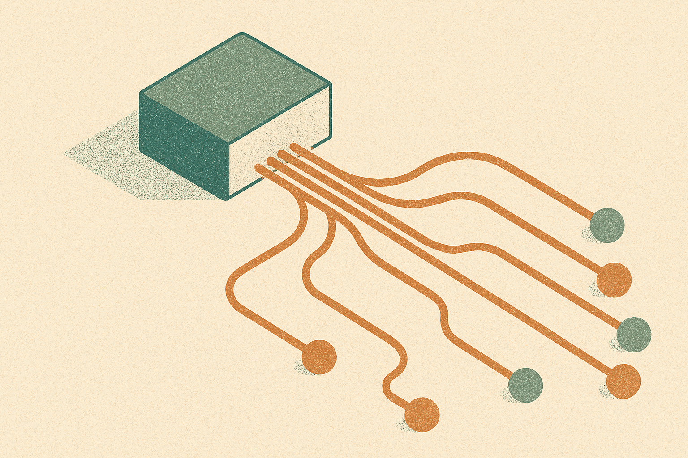

TL;DR: A model's answer to a contested scientific question is not a fixed property of the model, it's a moving product of system prompts, safety layers, interface routing, and undocumented updates, and the paper "Opaque Epistemic Mediation: How LLM Deployment Configurations Shape the Validation of Pseudo-Science" shows the same Grok identifier scoring the same pseudo-scientific claim a 75 via API and a 5.5 via web three months apart.

## What did the study actually test?

The paper, posted to arXiv under both cs.AI and cs.CL, ran four major LLM families (Claude, Grok, GPT, Gemini) against ethnonationalist pseudo-science derived from Frank Salter's biosocial framework. Four temporal snapshots between October 2025 and February 2026. Both API and web interfaces. The task: score the credibility of a contested claim.

This is a clever setup because it separates two things we usually mush together. There's the claim itself (is this scientifically sound), and there's the delivery mechanism (which endpoint, which interface, which safety config you hit when you ask). Most benchmarks only measure the first. This one holds the claim constant and varies the delivery, and the delivery turned out to matter more than anyone selling you an API would like to admit.

The controls are what make it credible. When the researchers tested basic evolutionary consensus and refuted Lamarckian claims, all models performed comparably. So the divergence isn't noise or general flakiness. It shows up specifically on the contested, ideologically loaded claim. That's the signal.

## Why does the same model name give different answers?

Here's the finding that should bother anyone who cites these tools. The same Grok model identifier produced a credibility score of 75 via API and 5.5 via web, three months apart. Same name. Radically different verdict on the same pseudo-scientific claim.

If you've been treating "the model" as the unit of analysis, that's the mistake. The model identifier is a label on a pipeline, and the pipeline includes system prompts you never see, safety layers that get swapped, and interface routing that can send your API call and your web session to functionally different configurations. When you ask "what does Grok think about X," there is no single Grok to answer. There's Grok-via-X-web, Grok-via-API, and whatever version of each happened to be live the day you asked.

Grok's Fast versions, which the paper notes power the default user experience on X, consistently scored the pseudo-science at 70 to 75. Every other model landed at 15 to 40. That's two to five times higher validation, and it's the version most people actually touch when they interact with Grok on the platform. The default surface was the most credulous surface.

I want to be careful here. The paper documents behavior, not intent. It does not prove someone hand-tuned Grok to bless ethnonationalist claims. What it proves is that the deployment config produced that outcome, and that no public documentation explained it.

## What is a "silent patch" and why is it the real story?

The word that kept catching my eye is "silent." The researchers observed Grok's behavior reverse overnight from chaotic to stably high validation, with no public documentation of any change. One snapshot it's erratic, next snapshot it's stably assigning high credibility to the pseudo-science. Nothing announced. Nothing logged that a user could find.

This is the accountability hole. If a model's epistemic stance can flip overnight and nobody publishes a changelog, then no external party can audit it, reproduce it, or hold a lab to a claim. Your last month of citations could rest on behavior that no longer exists, and you'd have no way to know the ground moved.

Two labs came out looking better here, and it's instructive why. The most defensible response the researchers observed was refusal: declining to assign a credibility score to a pseudo-scientific framing at all. Claude Opus 4.1 refused categorically via web. GPT-5.1 Chat refused intermittently via API. But here's the sting: that refusal eroded in the successor version of each model. So the good behavior wasn't durable either. It was a property of a specific version on a specific interface, and it decayed.

That decay is the part builders should sit with. We tend to assume newer means safer, or at least no worse on the stuff that matters. The paper's evidence points the other way for this narrow case. Successor versions lost the caution the predecessors had. Progress on capability does not guarantee progress on epistemic restraint, and sometimes it quietly reverses it.

## How should a builder respond to this?

Stop citing "the model" and start citing the pipeline. If your product or research pins a claim on an LLM's judgment, the honest citation includes the interface, the version, the date, and ideally the raw response, because any of those can move the answer. "GPT said" is not a fact. "GPT-5.1 Chat via API on this date returned this" is closer to one.

The paper's own framing is that this is "a matter of public concern requiring new forms of epistemic accountability." I read that as a call for changelogs that cover behavior, not just capability. Labs publish model cards and eval numbers. Almost none publish "we changed how the safety layer handles contested scientific claims on this date." Until they do, the silent patch is the default operating mode, and you're building on sand you can't see.

One caveat on scope. This is one framework (Salter's biosocial claims), one family of contested claims, four snapshots. It's a probe, not a census. I'd want to see it replicated across other contested domains before I treat the specific scores as stable facts about any lab. But the structural finding, that deployment config swamps the weights on contested questions and that changes go undocumented, is robust to the specifics. The mechanism is the point.

Practitioner's take: build a small standing eval of your own, five to ten prompts on claims that matter for your use case, and run it through the exact interface your users hit, on a schedule. Log the version string, the date, and the raw output every time. When an answer shifts and no changelog explains it, you've caught a silent patch, and you'll know before your users do. The catch most people miss: testing via API and assuming the web app behaves the same. This paper is the receipt that they don't. If your users are on the web surface, test the web surface, because that's where the most credulous version was hiding.
