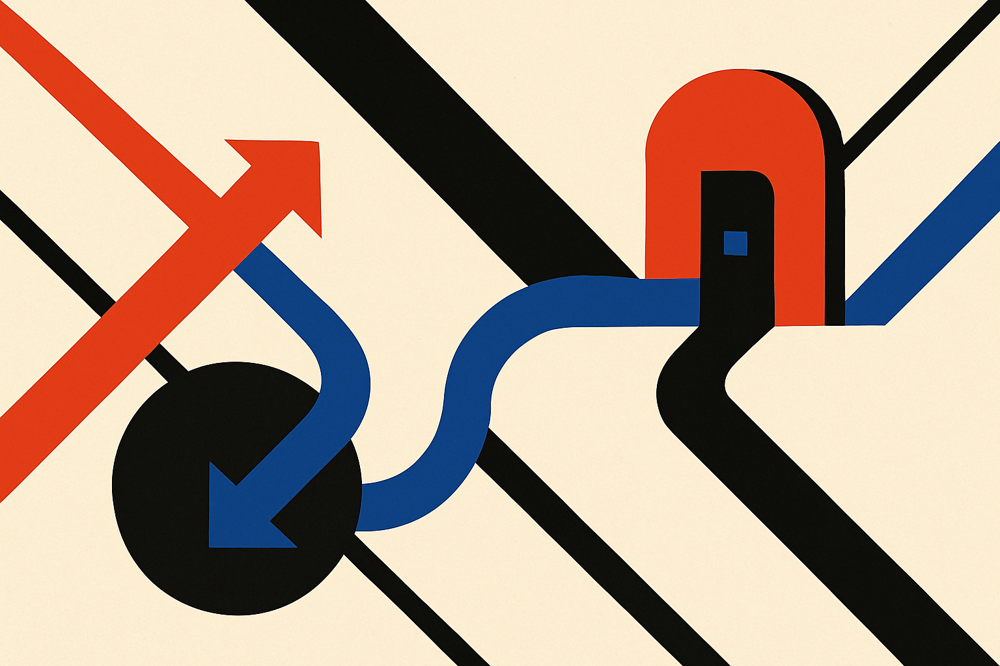

TL;DR: A premium domain is not a growth strategy, but if customers already confuse your name, type the wrong URL, or hesitate during buying, fixing that friction can be a rational operating expense.

## What did ZipChat actually buy?

DomainInvesting reported in “Spending $40k on a Domain Name to Eliminate Friction” that Ruslan, founder of the AI sales tool ZipChat, said the company spent $40,000 to acquire ZipChat.com. ZipChat’s active website uses ZipChat.ai.

That detail matters. This was not framed as a speculative domain flip or a vanity trophy. Ruslan’s stated reason was simpler: eliminate friction.

For an AI sales product, that is a very specific kind of friction. Prospects hear the name on calls. Sales teams mention it in demos. Someone forwards it in Slack. Someone else types the domain from memory. The .ai extension is common in this market, but .com is still the default reflex for many buyers. If the name is “ZipChat” and a buyer instinctively tries ZipChat.com, owning that path can prevent a small leak.

Small leaks matter more when the product is sold through conversation.

That does not make $40,000 automatically cheap. It only makes the tradeoff legible. ZipChat appears to be paying for fewer wrong turns, fewer explanations, and less ambiguity around the brand.

## When is a domain upgrade worth caring about?

The mistake is treating this as a universal rule for AI startups. It is not.

A domain upgrade is worth caring about when the name is already working and the domain is the part getting in the way. If nobody remembers the product, the .com will not fix that. If the positioning is vague, the .com will not fix that either. If the sales motion is weak, a cleaner URL is decoration.

But when the product has traction, the calculation changes. A better domain can reduce drag in places that rarely show up cleanly in analytics: word-of-mouth referrals, podcast mentions, outbound replies, procurement searches, forwarded links, and executive conversations where nobody wants to explain why the “real” site is not the obvious one.

The operator question is not “Is a .com more credible?” That is too broad.

The better question is: “Where are buyers hesitating, misremembering, or landing in the wrong place?”

If the answer is “often, and in high-value moments,” then a domain can be part of the product surface. Not the software product, but the buying product. The thing a customer experiences before they even start a trial.

## The .ai signal cuts both ways

The .ai domain has been useful shorthand. It tells people what category you are in. For a young AI company, that can help. ZipChat.ai says “AI product” before the page loads.

But category shorthand can age quickly. If every tool in a buyer’s inbox ends in .ai, the signal gets noisy. The .com does something different. It says less about the category and more about the company trying to be the default owner of its name.

That is a subtle shift. Early, you may want the category signal. Later, you may want the brand to stand alone.

There is also a risk on the other side. Premium domains can become founder theater. Teams can spend scarce cash on naming polish while the onboarding flow leaks users, the demo data is weak, or the product still needs a human in the loop to work reliably. A cleaner domain will not create trust if the experience after the click breaks it.

No investment advice here, and no domain hype. Domains are tradable assets, prices can be weird, and the market attracts plenty of magical thinking. The practical lens is boring: compare the cost of the domain with the cost of confusion in your actual funnel.

Practitioner’s take: Before buying the perfect domain, instrument the messy one. Track branded search queries, support emails asking for the right URL, sales-call confusion, bounced outbound replies, and direct traffic patterns around common mistakes. If the evidence shows real buyer drag, negotiate from an operating budget, not ego. The catch most teams miss: the domain only pays off after the name itself is already doing work.
