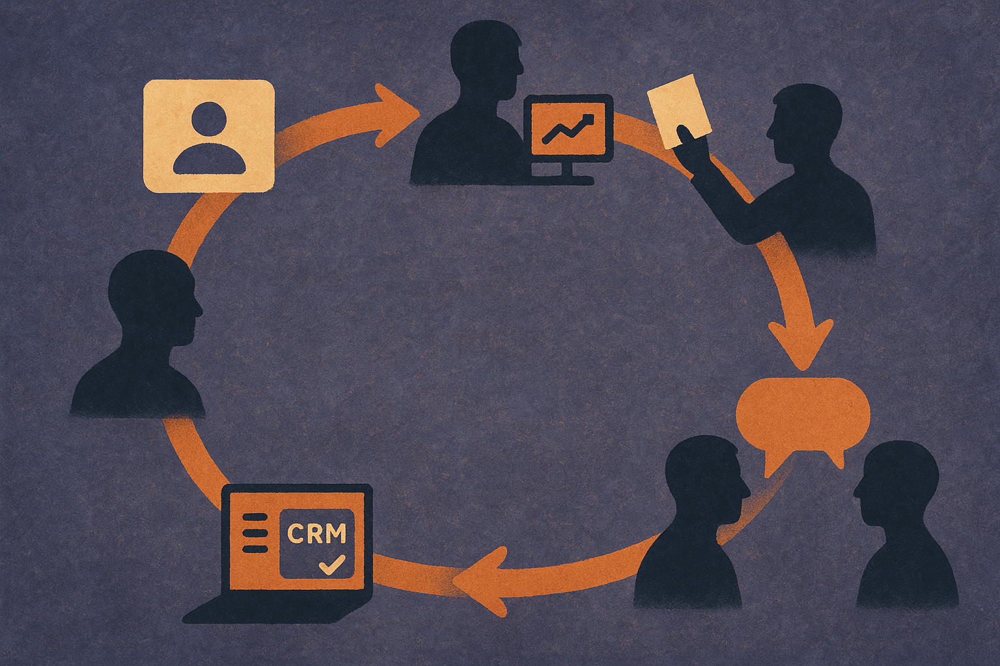

TL;DR: OpenAI’s ChatGPT Work sales demos are strongest when viewed as a closed-loop revenue system, not as a replacement for sellers.

## What is ChatGPT Work actually doing for sales teams?

OpenAI’s two sales demos, “ChatGPT Work for Sales: Revenue Intelligence for Sales Leaders” and “ChatGPT Work for Sales: Account Research and Customer Outreach,” show the same idea from two angles.

At the rep level, ChatGPT Work watches for account signals, like an earnings report update, then builds an account brief, maps stakeholders, drafts outreach, prepares a meeting deck after a calendar booking, reviews the call transcript, updates CRM records, suggests a follow-up email, and recommends next actions.

At the leadership level, ChatGPT Work rolls those traces into a weekly revenue learning report. OpenAI’s demo describes inputs from seller activity, customer conversations, and market signals. The output is not just a dashboard. It summarizes trends, categorizes objections, identifies competitor mentions in deals, compares how top reps and lower performers handle issues, and drafts proposed changes for leadership in Slack.

That is the interesting part. The workflow is not “AI writes a better cold email.” That was table stakes two years ago. The real pattern is an agent that carries context forward across the whole revenue motion, from signal to outreach to meeting prep to CRM hygiene to manager review.

## Why does the closed loop matter more than the generated email?

Sales teams already have too many partial systems. CRM, call recording, enrichment, enablement, forecasting, email, calendar, Slack, BI. The pain is not only writing. It is translation between systems.

OpenAI is pitching ChatGPT Work as connective tissue. In the revenue intelligence demo, the agent can answer questions like which objections and competitive threats show up in strategic deals, how top performers handle them, and whether those objections should change product or sales priorities. It then turns that into suggested owners and next steps.

That changes the unit of work. Instead of a manager asking an analyst to pull call snippets, comparing them to CRM notes, then writing a summary for a weekly meeting, the agent starts with the underlying evidence and produces a draft operating narrative.

Still, this only works if the evidence is good. OpenAI says the system provides well-cited answers in the demo, which is the right direction. Sales AI without citations becomes rumor automation. A bad transcript, stale CRM field, or hallucinated stakeholder relationship can burn trust fast, especially in enterprise accounts.

The boring controls matter: source links, access permissions, audit trails, editable drafts, and clear human ownership. If those are weak, the system becomes a confident intern with admin rights.

## Where should operators be skeptical?

I would watch three things.

First, data fragmentation. The demo assumes ChatGPT Work can see the right account signals, call transcripts, CRM records, calendar events, pitch templates, Gmail drafts, and Slack channels. Many companies cannot grant that access cleanly. Some should not, at least not broadly.

Second, attribution. If a recommendation says to shift product strategy because an objection is rising, leaders need to know whether that came from five enterprise calls, one noisy deal, or a rep’s subjective CRM note. Pattern detection is useful. Pattern laundering is dangerous.

Third, rep behavior. If sellers see the agent as surveillance, they will route around it. If they see it as admin relief and better prep, adoption has a shot. The product design has to make the rep faster before it makes management smarter.

For builders, the practical move is to start with one narrow loop: account signal, brief, meeting prep, transcript review, CRM update, follow-up. Measure whether reps save time and whether CRM quality improves. Then add manager-level reporting once the ground truth is usable. The catch most readers miss: the AI layer is not the hard part by itself. The hard part is designing a sales operating system where every generated action feeds cleaner evidence into the next cycle.
