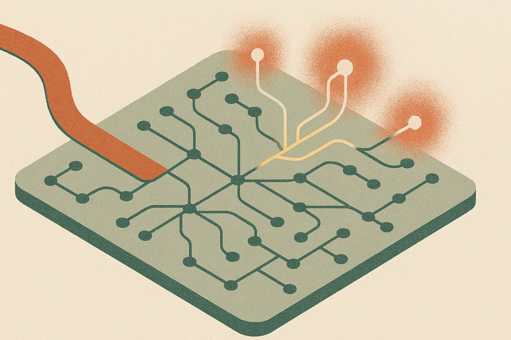

TL;DR: Kimi K3 is a serious open-weight frontier attempt, but its real value for builders will depend less on the headline 2.8T parameters and more on whether its long-context, agentic, and coding behavior survives outside the paper’s own eval setup.

## What actually changed in Kimi K3?

The primary source is the arXiv paper **“Kimi K3: Open Frontier Intelligence”**, listed under cs.CL and cs.LG. It describes Kimi K3 as a 2.8 trillion parameter Mixture-of-Experts model with 104 billion activated parameters per token, native vision, and a 1-million-token context window.

That combination matters. Not because “2.8T” is magic. Dense parameter counts became a bad proxy years ago. The important detail is the active compute path: Kimi K3 uses Stable LatentMoE to route each token through 16 of 896 experts. If that routing works well, you get more capacity without paying the full compute bill on every token.

The paper also names two architecture pieces: Kimi Delta Attention and Attention Residuals. Kimi Delta Attention is presented as the long-context engine, while Attention Residuals are meant to improve information flow through model depth. The claim is an approximately 2.5x improvement in overall scaling efficiency over Kimi K2.

That is the claim to watch. Scaling efficiency is where open models can compete, because they usually cannot win by brute force against the biggest closed labs. If Kimi K3 gets meaningfully more capability per unit of training and inference cost, the model is interesting even if it does not beat the top proprietary systems outright.

And it does not claim to. The Kimi K3 paper says the model still trails the most powerful proprietary models in its evaluation suite, specifically Claude Fable 5 and GPT-5.6 Sol. That caveat is useful. It keeps the announcement out of fantasy land.

## Does full weight release change the game?

Maybe. But not in the simplistic “open beats closed” way.

The paper says the full Kimi K3 weights are being released. That is a big deal for research groups, infra teams, and companies that need inspection, customization, or deployment control. Open weights let people test failure modes, tune behavior, study internals, and build specialized systems without waiting on API policy changes.

But open weights do not mean easy access. A 2.8T MoE model is not a weekend download-and-run project for most teams. The paper itself points to the amount of system work needed: algorithm-system co-design for Kimi Delta Attention, balanced expert-parallel training, efficient memory management, million-token agentic RL with persistent rollout and sandbox states, plus deployment innovations.

Translation: the weights are open, the operating stack is still serious infrastructure.

That distinction matters for builders. The useful comparison is not “can I run this on a laptop?” You cannot, in any normal sense. The useful comparison is “can a capable team host, adapt, evaluate, and govern this model on its own terms?” For labs, clouds, and larger enterprises, that answer may be yes. For smaller teams, Kimi K3 will probably arrive through hosted endpoints, distilled variants, tool-specific deployments, or managed inference providers.

## Where should builders be skeptical?

The most interesting claims are around long-horizon execution. Kimi K3 was post-trained with reinforcement learning across general, agentic, and coding domains, with multiple reasoning-effort levels. The paper also mentions million-token agentic RL with persistent rollout and sandbox states.

That is exactly where benchmark claims often look better than product behavior. Long-context models can hold a million tokens, but still miss the one line that matters. Agentic models can pass curated tasks, but fall apart when tools are flaky, requirements shift, or the environment contains stale state. Coding agents can solve long-horizon tasks in evals, then waste an hour in a real repo because the dependency graph is ugly.

So I would test Kimi K3 on messy workflows, not clean prompts. Give it a large codebase with hidden conventions. Give it a 300-page policy corpus and ask for decisions with citations. Give it a browser, a shell, a budget, and a multi-step task where backtracking is required. Compare low, medium, and high reasoning-effort settings on cost, latency, and correction rate.

The catch most readers miss: open frontier models are not just model drops, they are systems bets. If you are building with Kimi K3, start by evaluating the behaviors the paper emphasizes: long context, tool use, coding, vision, and agentic persistence. But measure them in your own environment, with your own failure costs. The practical win is not “replace GPT-5.6 Sol.” It is finding the slice where control, inspectability, and task fit beat the convenience of a closed API.
