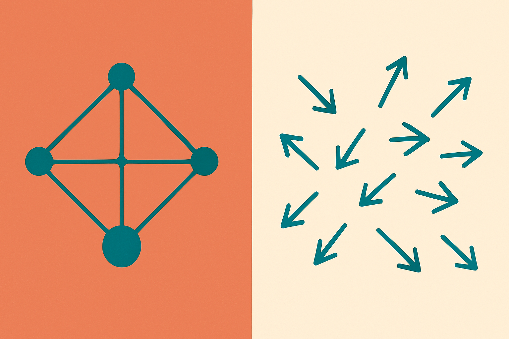

TL;DR: A sparse autoencoder feature can be interpretable and causally relevant and still be useless for steering, because the direction it points a model in changes depending on context.

The paper is "Sparse Autoencoders Encode Both Concepts and Functions: The Downstream Geometry of Feature Effects," posted to arXiv across cs.AI, cs.CL, and cs.LG. It introduces a method the authors call Feature-Effect Geometry Analysis, or FEGA, and it lands on a conclusion that should reset expectations for anyone treating SAE features as knobs.

If you have spent any time with interpretability tooling, you know the pitch. Train a sparse autoencoder on a model's activations, get a dictionary of features, each of which lights up for something human-legible ("the Golden Gate Bridge," "code comments," "deception"). Then, in theory, you amplify or suppress a feature to steer behavior. Clean concepts, clean controls. This paper says the second half of that pitch is shakier than the demos suggest, and it explains why in a way that is actually mechanistic rather than hand-wavy.

## What is FEGA actually measuring?

Most SAE analysis studies feature geometry *inside* the model, at the point where the feature is computed. That tells you what a feature responds to. It does not tell you what happens downstream when you touch it.

FEGA flips the camera around. Instead of looking at where a feature fires, it looks at the effect of removing that same active feature across many different contexts, then studies the resulting cloud of logit changes. So for one feature, you get not a single "this is what it does" vector but a distribution of what it does to the output, prompt by prompt.

That distinction matters. A feature that means one thing when it activates could still push the output in wildly different directions depending on surrounding text. Activation description and causal effect are two separate questions, and FEGA is built to measure the second one directly.

## Why do so many "steerable" features fail?

Here is the finding that reframes things. Across SAE variants, consistent one-dimensional effects are rare. Very few features behave like a reusable direction you can reliably crank up or down.

The authors are blunt about the failure modes practitioners already hit: features with clear activation descriptions can have weak or unexpected causal effects, steering can vary across prompts or even oppose the direction you intended, and picking features by activation can miss the ones that actually produce the output change you want. If you have tried to reproduce a slick steering demo on your own prompts and gotten mush, this is the underlying reason. You were selecting on activation and assuming a stable effect. The effect was not stable.

The key line is that a feature can be interpretable and causally relevant without providing a stable direction for steering. Those three properties are usually collapsed into one in casual talk. This paper pulls them apart. Interpretable means you can describe when it fires. Causally relevant means intervening on it changes the output. Steerable means intervening moves the output in a predictable, consistent direction. The third does not follow from the first two.

## Value-like versus pointer-like: which features can you actually trust?

To make sense of the variation, the authors draw a distinction that borrows an intuition from programming. Some features are value-like: they are tied to static information, factual attributes, the kind of thing that does not depend much on context. Other features are pointer-like: they are associated with context-dependent operations, closer to a function that runs against whatever it is handed.

The empirical split follows the intuition. Value-like features more often show structured, low-dimensional effects, though even those typically span several directions rather than one clean axis. Pointer-like features mostly show diffuse effects, spraying across many directions with no consistent pull.

This is the practically useful part. It gives you a triage heuristic. If a feature encodes a static fact, it has a better shot at being usable for controlled intervention, though you should still expect several directions rather than a single dial. If a feature encodes a context-dependent operation, treat steering claims about it with real suspicion. The very thing that makes pointer-like features interesting, their sensitivity to context, is what makes them unreliable to push on.

## Does this break the case for SAEs?

No, and I want to be careful here because it would be easy to read this as an anti-SAE result. It is not. It is a maturity result.

The honest read is that SAEs remain a decent lens for *understanding* what a model represents. Value-like and pointer-like are themselves a useful lens on what a feature is doing. What the paper punctures is the leap from "I found a feature for X" to "therefore I can control X by steering that feature." Understanding and control are different products, and the interpretability field has been quietly selling both under one label.

The caution I would flag: this is a synthesis of a single arXiv preprint, cross-listed across three categories but one piece of work. The FEGA framework is new, the value/pointer distinction is a proposed interpretation rather than a settled taxonomy, and the abstract does not give us the specific models or SAE variants or numbers behind "rare" and "predominantly." I would want the full results before treating the value/pointer split as a hard rule. As a framing to test against your own features, it is strong. As a law, not yet.

There is also a deeper implication for safety work. A lot of alignment-via-interpretability hope rests on being able to find and suppress bad features. If the features that matter most for behavior are pointer-like and diffuse, suppression by steering may be exactly where it is weakest. That is worth sitting with.

For a builder doing interpretability or model control work, the move is concrete: stop selecting steering features by activation alone, and start measuring the downstream effect cloud before you trust any feature as a knob. Run something FEGA-shaped, remove the feature across a spread of contexts, and look at whether the logit changes cluster in one direction or spray everywhere. Prefer value-like, factual features for anything you need to be reliable, and assume pointer-like features will betray you across prompts. The catch most readers will miss is that a feature passing an interpretability audit tells you nothing about whether it will steer. Those are two separate tests, and until now most pipelines only ran the first one.
