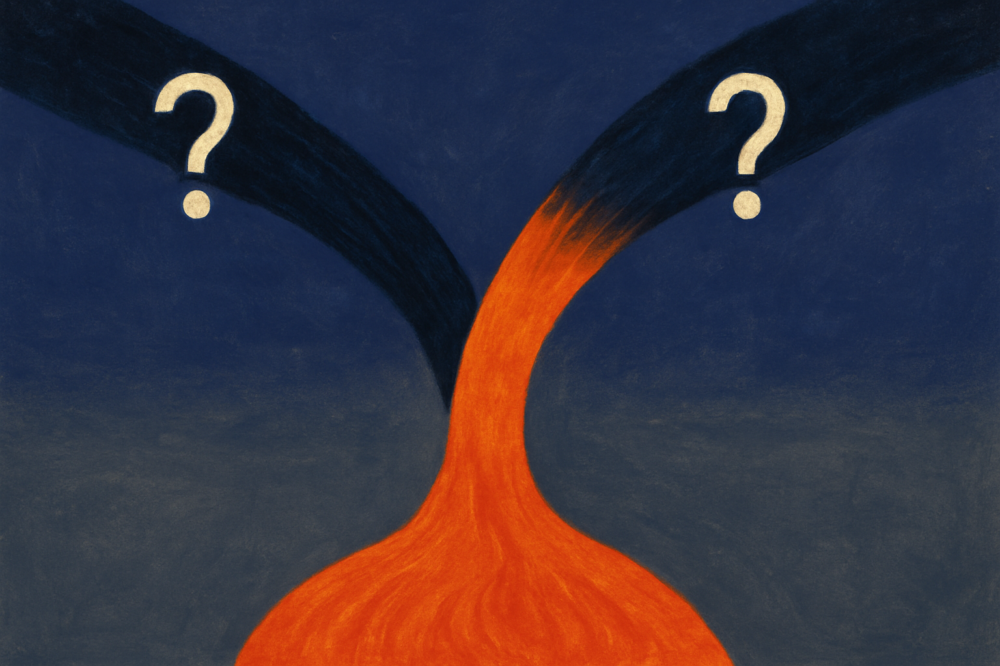
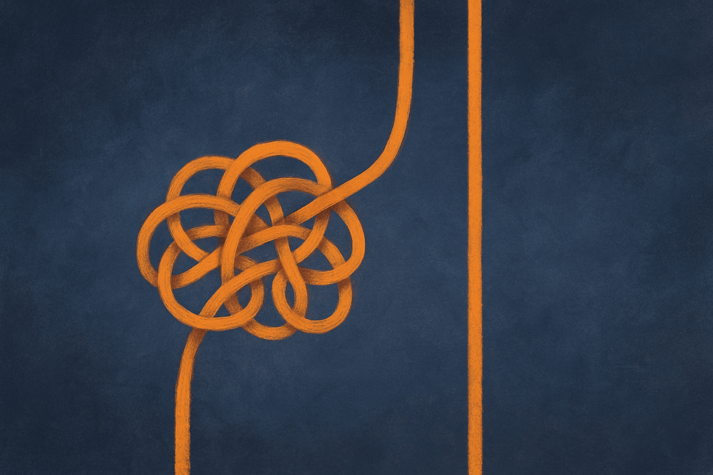

TL;DR: When you distill a diffusion model that uses classifier-free guidance, the standard trick of matching the combined guided output can quietly make one half of the model worse while the other half gets better, and a paper called "Rethinking Classifier-Free Guidance in On-Policy Diffusion Distillation" gives that failure a name (Negative Branch Asymmetry) and a fix (Positive-Direction Matching).

This one is technical, so I want to be upfront about why it matters to an operator and not just a research audience. If you run a fast video or image generator in production, you almost certainly run a distilled model. Distillation is what takes a slow, high-quality teacher and compresses it into something that responds in a second or two. When distillation has a subtle bug, your users feel it as weird sensitivity to settings and inconsistent output quality. That is exactly the problem this paper is chasing.

## What is on-policy distillation, and why does CFG complicate it?

Two moving parts here. Let me define both plainly.

On-policy distillation (OPD) is a way to teach a small "student" model by having it generate samples itself, then asking a slow "teacher" model what it would have done at each step along that student-generated path. You match the student to the teacher on the trajectories the student actually walks, not on some fixed set of examples. That is the "on-policy" part. It tends to work better than off-policy approaches because the student learns to fix its own mistakes rather than mistakes it would never make.

Classifier-free guidance (CFG) is the near-universal trick in modern diffusion systems for making outputs follow the prompt more strongly. Instead of running the model once, you run it twice per step: once with the conditioning (the "positive branch," your prompt) and once without it or with a null conditioning (the "negative branch"). Then you combine them, pushing the output away from the unconditioned prediction and toward the conditioned one. The guidance scale is the knob that controls how hard you push.

The complication is what happens when you combine these. OPD, as usually implemented, matches the student's final CFG-combined output to the teacher's final CFG-combined output. Sounds reasonable. One number in, one number out, match them. The paper's core argument is that this is where things go wrong.

## What is Negative Branch Asymmetry?

Here is the insight, and it is a good one. The authors point out that the combined guided prediction is "under-identified at the branch level." Translation: because you only supervise the combined output, the positive-branch error and the negative-branch error can cancel each other out. The combined number can look right while both underlying pieces are wrong in opposite directions.

They walk through two contrasting cases. When the teacher and student share the same negative conditioning, naive matching is fine. Both branch errors go down together, no drama. This is the common, benign case, which is probably why the problem went unnoticed for a while.

But when the model's native CFG setup gives the teacher's negative branch some privileged information that the student does not have access to, the joint reduction breaks. The combined objective starts trading one error for the other: it drives the positive-branch error down while pushing the negative-branch error up. The paper calls this Negative Branch Asymmetry, or NBA. The two branches are no longer cooperating during training. They are fighting, and the combined loss hides the fight because the net looks acceptable.

If you have ever distilled a model and found the result works great at one guidance scale and falls apart at another, this is a plausible culprit. The student learned to be correct only at the specific combination it was trained on, because the branch errors happen to cancel there. Move the guidance scale and the cancellation stops working.

## How does Positive-Direction Matching fix it?

The fix follows directly from the diagnosis. If the problem is that one combined objective lets two branches hide each other's errors, then stop using one combined objective. Supervise the branches separately.

That is what Positive-Direction Matching (PDM) does. Instead of matching the CFG-composed velocity as a single blob, PDM separately constrains the positive prediction and the CFG conditional direction. You give each branch its own target so neither can compensate for the other. The paper describes this as "branch-aware" supervision, which is a clean way to say it: the training signal knows which branch it is talking to.

The test bed is dense-to-sparse video control. Naive guided matching there was "highly sensitive to inference guidance scales," which is the operator-facing symptom I described above. Branch-aware supervision produced "more robust and effective knowledge transfer." I would love to give you a hard number, but the abstract the authors provide (both the cs.AI and cs.LG postings carry the identical text) does not include benchmark figures, so I am not going to manufacture one. Read the full paper for the quantitative claims. What the abstract does commit to is a qualitative result: the sensitivity to guidance scale drops.

## Why should a builder who does not train models care?

Because you inherit these bugs whether you train or not. Most teams do not distill their own models. They download a distilled checkpoint from someone who did. If that someone used naive guided matching, the model you are serving may carry NBA baked in, which shows up as guidance-scale brittleness you cannot easily diagnose.

Here is the practical read. If you ship a distilled diffusion generator and you notice quality swings hard when you nudge the guidance scale, that is a signal, not a settings problem to tune around. The instinct is to hunt for the one magic guidance value that looks best. This paper suggests that magic value might just be the point where two hidden errors cancel, which is a fragile place to stand. A model distilled with branch-aware supervision should behave more predictably across a range of guidance scales, which is what you actually want in production where prompts vary.

One honest caveat on scope. The paper's evidence centers on dense-to-sparse video control, and the failure mode requires a specific condition: the teacher's negative branch holding privileged information the student lacks. If your setup uses shared negative conditioning, the authors say naive matching is fine. So this is not a universal "everyone is doing distillation wrong" claim. It is a precise diagnosis of when and why it breaks, which is more useful than a broad one.

Practitioner's take: if you are training or fine-tuning distilled diffusion models, treat guidance-scale robustness as a first-class metric, not an afterthought. Sweep the guidance scale during eval and look at whether quality is flat or spiky. A spike at one value is the tell. If you consume distilled checkpoints rather than making them, ask the provider how they handled CFG during distillation, and run your own guidance-scale sweep before you commit to a single serving config. The catch most people miss: the model that scores highest at your default guidance scale is not automatically the most robust one, and shipping for peak instead of stability is how you end up with a generator that quietly degrades the moment a prompt pushes it off the sweet spot.
