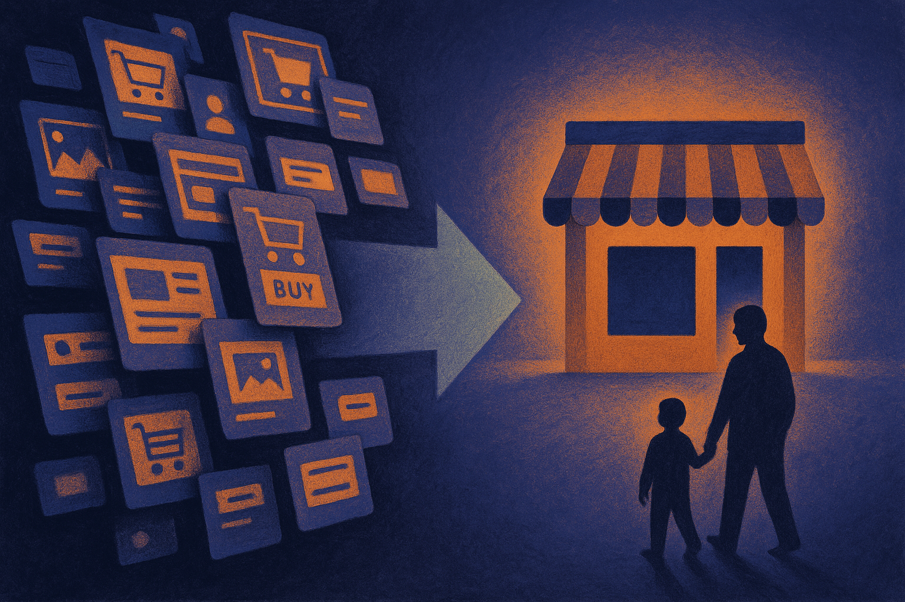

TL;DR: A better domain will not fix a weak AI product, but for trust-heavy categories like kids, freelancing, and auto, it can reduce friction before the user ever sees the app.

## What does an end-user domain sale actually tell us?

Domain Name Wire’s primary report, “Fourteen end user domain names sales at Atom this month,” is not an AI story on its face. It is a domain market note. But it has a useful operator signal buried in it.

Atom reported fourteen end-user domain sales this month. Domain Name Wire highlighted buyers including a used car dealer, a freelancing platform, and an AI platform for kids. Sedo, usually the major marketplace that publishes sales lists, is taking a month-long break from reported sales heading into August, so Atom’s list gets a little more attention than it might otherwise.

The phrase “end user” matters. This is not just domain investors trading inventory with each other. An end-user buyer is usually a company or operator that plans to put the name to work. That makes these sales more interesting than raw domain chatter, because they show where real businesses still think naming friction costs them money.

The AI platform for kids is the one that caught my eye. Kids plus AI is a category where trust is not a nice-to-have. Parents are going to look at the product name, the domain, the privacy posture, the onboarding flow, and the tone of the whole thing before they let a child near it. A sketchy name can make the best safety architecture feel cheap. A clear name does not prove safety, but it can stop users from bouncing before they evaluate the product.

## Why does this matter more for AI than normal software?

AI products often ask users to take a bigger leap than ordinary SaaS. They ask for documents, conversations, workflows, photos, classroom activity, voice input, or personal context. In kids’ AI, that leap is even bigger. The buyer is not only asking, “Does this work?” They are asking, “Who built this, what are they collecting, and will I regret trusting it?”

A domain name is a weak signal, but weak signals stack. A clean domain, plain privacy language, sane default settings, visible company information, and a product that does not overclaim all point in the same direction. None of them are enough alone. Together, they shape whether someone continues.

This is where some AI teams get too clever. They ship a clever model wrapper with a forgettable name, a confusing URL, and a landing page full of vague promises. Then they wonder why paid acquisition is expensive or why schools, parents, clinics, firms, or regulated buyers hesitate. The answer is not always model quality. Sometimes the trust surface is noisy.

The Domain Name Wire note does not tell us the domain names, prices, or strategy behind each buyer from the snippet available here. So I would not overread it. This is not proof of a broad AI domain boom. It is a small market signal that serious buyers still spend to clean up the first impression.

## What should builders do before chasing a better name?

A better name is useful when it removes confusion. It is not useful when it becomes procrastination dressed up as strategy.

Before buying or rebranding around a domain, I’d ask three questions. Can a user say it out loud after hearing it once? Does it make the category or promise clearer without sounding scammy? Does it match the level of trust the product asks for?

For an AI product aimed at kids, the bar is higher. The name should feel calm, accountable, and easy for a parent to type. The domain should not look like a temporary hack. The site should make safety, data use, and adult controls obvious. If the product is for schools, procurement pages and policy documents matter too. The domain is just the front door.

The practical move: audit your trust path from search result to signup. Look at the domain, landing page, pricing, privacy language, and onboarding as one system. If users need to hand over sensitive data, invite a child, or connect a business workflow, remove anything that feels disposable. The catch most readers miss is that naming is not brand polish at the end. For AI products, it is part of the product’s permission layer.
