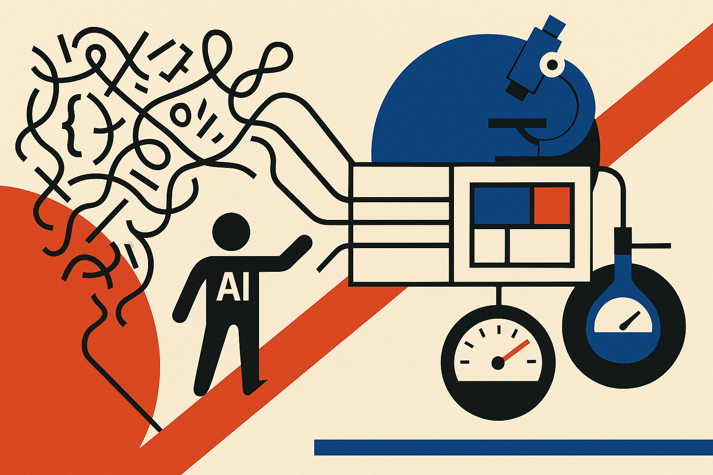

TL;DR: OpenAI’s field report says the near-term value of agentic AI in science is less “AI scientist” and more “patient software engineer for messy research code.”

## What is actually changing in scientific computing?

OpenAI’s primary claim in **“Scientific computing in the age of agentic AI”** is practical: scientists are using AI coding agents to modernize scientific computing, accelerate software development, and support discovery in genomics and related fields.

That sounds broad. The useful read is narrower.

Most scientific computing is not pristine. It is old scripts, half-documented pipelines, cluster-specific glue, notebooks that became production, and graduate-student code nobody wants to touch. The work matters, but the software stack is often fragile because the incentives rewarded papers, not maintainable systems.

Coding agents fit that gap well. Not as oracle brains. As tireless helpers for the unglamorous parts: reading unfamiliar repositories, writing tests, translating code, updating dependencies, generating documentation, refactoring small modules, and building repeatable workflows.

That is not a small thing. In science, better software can mean faster iteration, fewer silent errors, easier peer review, and less time lost to “why does this only run on one machine in one lab?”

## Where do coding agents help without pretending to do science?

The line I care about is agency under constraint.

A coding agent can open files, propose edits, run commands, inspect failures, and try again. That loop is much more useful than a chatbot answering questions about Python in the abstract. Scientific code has context. The model needs to see the repo, the logs, the tests, and the environment.

But science adds a harder requirement: correctness is not just “the program runs.” A pipeline can run and still produce a biologically meaningless output. A genomics workflow can pass syntax checks and still mishandle samples, references, metadata, or statistical assumptions.

So the real operating model is not “let the agent handle it.” It is closer to pair programming with a very fast junior engineer who has read a lot but lacks domain accountability.

That means scientists and research engineers still need to define the target behavior, review generated changes, validate outputs against known cases, and keep provenance. The agent can shrink the loop. It should not erase the loop.

This is where some of the hype gets sloppy. Agentic AI in scientific computing does not automatically mean autonomous discovery. OpenAI’s field report points to acceleration in software development and discovery workflows, but the safe interpretation is that better tools can remove bottlenecks around the science. That is different from saying the model independently understands the experiment.

## What should labs try first?

Start with modernization tasks that are valuable, bounded, and checkable.

Take one research pipeline that people still use but fear changing. Ask an agent to map the repo, identify entry points, explain dependencies, and propose a test plan. Then have it write a few regression tests around known inputs and outputs. Do not begin with “invent a new method.” Begin with “make this thing less brittle.”

Next, use agents for translation work. Old MATLAB to Python. Ad hoc scripts into a package. Notebook cells into a command-line workflow. Inline assumptions into documentation. These are exactly the jobs that slow labs down because they are important but rarely rewarded.

The catch: agentic workflows expose the quality of your scientific software culture. If there are no tests, no sample data, no environment files, no expected outputs, and no review process, the agent has little to grab onto. It will still produce code. That may be worse.

A builder working with scientific teams should package the agent around the workflow, not around the demo. Give it repo access, sandboxed execution, version control, test harnesses, and human approval gates. Try it first on code cleanup and reproducibility. The missed catch is that the best “AI for science” product may look boring: fewer broken pipelines, clearer repos, and more experiments that someone else can actually rerun.
