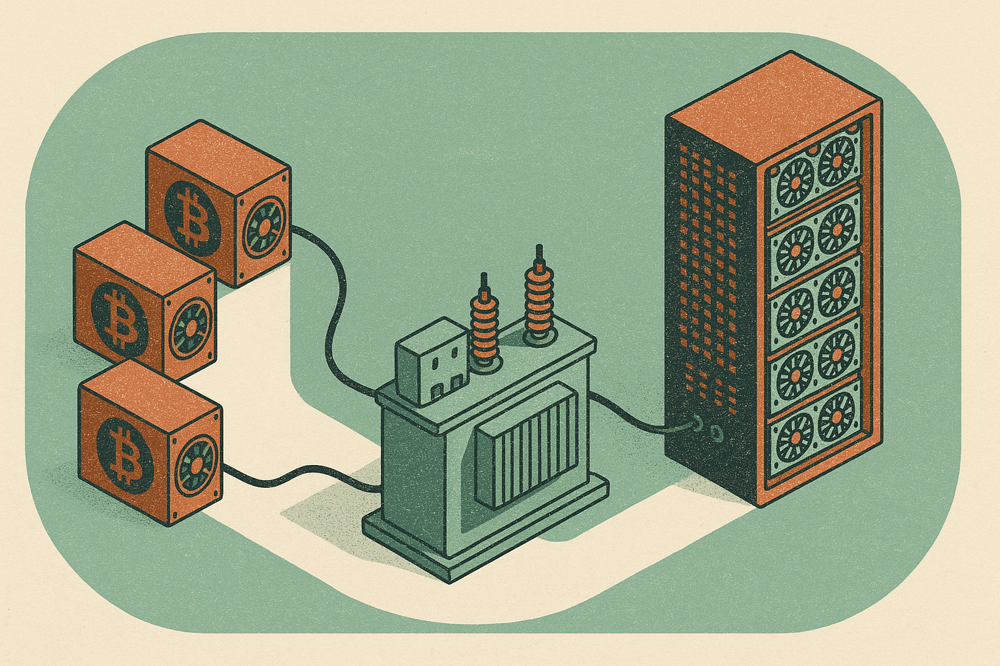

TL;DR: Ionic Digital’s Nasdaq debut is a clean example of the crypto-to-AI infrastructure pivot, but builders should watch the physical assets and operating control, not the first-day stock move.

## What actually changed at Ionic Digital?

The Block reported in “Ionic Digital jumps 25% in Nasdaq debut after expanding Celsius bitcoin mining assets into AI infrastructure” that Ionic Digital was formed from Celsius Mining’s assets and later took direct control of its sites from Hut 8. CoinTelegraph, in “Celsius-linked Bitcoin miner Ionic Digital gains 26% in Nasdaq debut,” reported that the company closed at $62.90, with a market capitalization of about $2.8 billion after its direct listing.

The exact first-day gain differs slightly across the reports, 25% versus 26%. That is not the important part. First-day trading in a newly listed company can be noisy, especially when the company sits at the intersection of two hype-prone markets: bitcoin mining and AI infrastructure.

The more useful fact is the asset path. Celsius Mining assets became Ionic Digital. Ionic then moved from relying on Hut 8 to taking direct control of its sites. That matters because AI infrastructure is not just a pitch deck category. It depends on power access, facilities, cooling, connectivity, operations, uptime, and customer demand. Control of sites gives a company more room to change what those sites do.

That does not mean a bitcoin mining campus automatically becomes a high-end AI data center. Mining workloads and AI workloads have different hardware, networking, latency, redundancy, and customer requirements. But the overlap starts with power and real estate. In today’s AI buildout, that is enough to get attention.

## Why are bitcoin miners pitching AI infrastructure?

Because the physical bottleneck in AI is moving upstream.

Models get the headlines. GPUs get the memes. But anyone trying to ship AI products at scale keeps running into less glamorous constraints: where the compute runs, who can get enough electricity, how long interconnection takes, and whether the facility can support sustained high-density workloads.

Bitcoin miners already spent years hunting for cheap power, building or leasing sites, and operating energy-intensive compute. That does not make them AI companies. It does give some of them a starting position in a market where power access is scarce.

This is the core translation Ionic Digital is trying to make. The business started with bitcoin mining assets linked to Celsius, a name that still carries baggage from the last crypto cycle. The Nasdaq listing reframes the story around AI infrastructure, where investors are currently more willing to assign strategic value to power-backed compute capacity.

I am skeptical of easy “miners become AI cloud providers” takes. Running ASICs for mining is simpler than serving enterprise AI workloads. Customers buying AI capacity care about service levels, security, networking, software stack, deployment support, and often geographic or compliance constraints. If a miner only has land and power, it has an input, not a finished product.

Still, land and power are very good inputs right now.

## What should builders take from the listing?

The operator lesson is not “follow public market enthusiasm.” No buy or sell call here. The market cap and day-one price move are facts from CoinTelegraph, not proof that the strategy will work.

The better lesson is that infrastructure strategy is becoming more modular. A site built for one compute market can be repositioned for another if the company controls the right primitives. Power contracts. Site operations. Cooling pathways. Interconnection. Permitting. Vendor relationships. Those are boring assets until demand spikes, then they become strategic.

For AI builders, this means the compute supply map is getting stranger. Capacity may come from hyperscalers, GPU clouds, colocation providers, former crypto miners, sovereign projects, and vertical SaaS companies that bought too much hardware. The label on the provider matters less than the questions underneath: what hardware is available, what network fabric exists, what uptime is guaranteed, what data controls are in place, and how pricing changes when demand surges.

If you are evaluating infrastructure partners, treat the AI rebrand as a starting flag, not validation. Ask for facility specs, GPU roadmap, customer references, security controls, support model, and real workload benchmarks. The catch most readers miss: the scarce asset is not “AI” branding. It is controlled, usable, powered capacity that can run your workload reliably next quarter, not someday.
