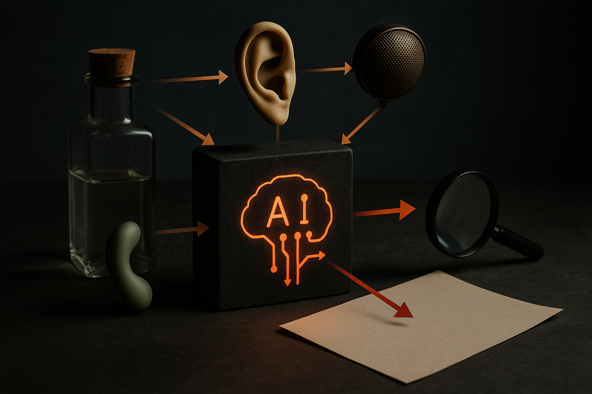

TL;DR: MODUS matters because it tries to make multimodal AI less like a pile of task-specific adapters and more like one decoder-only model that can translate, generate, and check across modalities.

## What is MODUS actually changing?

The primary source here is **“MODUS: Decoder-Only Any-to-Any Modeling of Diverse Modalities”**, an arXiv paper listed under both cs.AI and cs.LG, with materials open-sourced at https://modus-multimodal.epfl.ch/.

The core idea is simple to say and hard to build: any modality can be input, any modality can be output, and the same model handles the path between them. Text to image. Image to text. Audio to something else. Scientific signals to another representation. Not with a special head for each output, not with separate losses and task plumbing for every pairing.

That symmetry is the point. Many multimodal systems still feel like assemblies. A vision encoder here, a language model there, a diffusion model for generation, task-specific adapters around the edges. That can work well, but it tends to lock the product into supported routes. If the system was built for image captioning, image captioning is what you get. If you want a new route, you often need a new pipeline.

MODUS asks whether decoder-only modeling, the dominant pattern behind strong language models, can become the shared prior for broader modality exchange. The paper reports strong out-of-the-box performance and says MODUS is competitive with specialist and multitask baselines across benchmarks. The abstract does not give numbers in the provided material, so I would treat that as an architectural claim worth testing, not a settled scoreboard.

## Why does decoder-only matter here?

Decoder-only models are not magic. But they have two practical advantages. First, the ecosystem knows how to train, serve, and scale them. Second, they are good at treating sequences as a common interface.

MODUS applies that instinct to multiple modalities. Instead of building modality-specific machinery around a central language model, it tries to represent diverse inputs and outputs in a shared generative setup. That matters for builders because the annoying part of multimodal work is often not the demo. It is the maintenance surface.

Every extra encoder, decoder, head, routing rule, and loss function becomes another thing to tune, monitor, and break. A single network that treats modalities symmetrically could reduce that surface. Could. The catch is that symmetry in architecture does not guarantee equal quality in practice. Some modalities are denser. Some have nastier alignment problems. Some tasks reward specialist inductive bias.

So I read MODUS less as “one model beats all specialists” and more as “the general interface is getting cleaner.” That is useful. Especially outside consumer chatbots, where multimodal data often comes in weird combinations. Ecology and astronomy are mentioned in the paper’s abstract for a reason. Scientific work is full of partial observations, sensor data, images, tables, and derived representations. Any-to-any modeling is a natural fit there.

## What new workflows does this enable?

The most interesting bit is not just direct conversion. It is chaining and self-checking.

Because every modality can be both input and output, MODUS can generate an intermediate modality before producing the final one. That gives builders a way to decompose messy tasks without hand-wiring a bespoke pipeline. A system could move from observation to structured representation to explanation, or from one scientific signal to another interpretable view, then to a report.

The other pattern is cross-modal self-verification. The MODUS paper describes scoring the model’s own outputs with another generated modality. In plain English: make the model show its work in a different form, then compare. That is not a cure for hallucination. But it is a useful product pattern. If an image-derived answer can be checked against a generated mask, caption, or alternate representation, the system has more than one chance to catch inconsistency.

For operators, I would start with a narrow eval. Pick one high-value multimodal loop where today you glue together two or three systems. Test whether a MODUS-style approach can reduce the pipeline while keeping quality acceptable. The catch most readers miss: any-to-any only helps if your product actually needs flexible modality routing. If your task is stable and a specialist model is cheap, fast, and accurate, do not replace it for architectural elegance. Use this where flexibility is the product.
