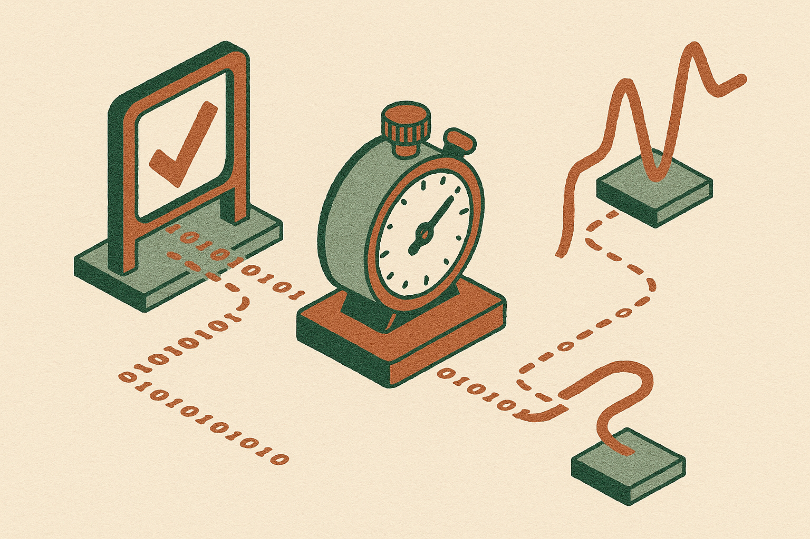

TL;DR: Teaching code models to optimize runtime works only when the benchmark, timing sandbox, and RL reward are designed together, not when speed is bolted onto a correctness reward.

## Why does optimizing code with RL fail so easily?

The primary source here is the arXiv cs.AI/cs.LG paper titled “Reinforcement Learning for Code Optimization.” Its core point is practical and a little annoying: RL for code correctness is clean compared with RL for code speed.

Correctness has a crisp signal. Generate a program. Run hidden tests. Pass or fail. Reward the pass.

Runtime is messier. Two correct programs can differ by milliseconds because of sandbox noise, test construction, cache behavior, language runtime quirks, or random variance. If the reward depends on that timing, small measurement errors can drown out the actual learning signal. The paper says this causes the obvious approach, “just reward faster solutions,” to fail in practice. Outputs get barely faster, and more can fail.

That matters because the most valuable coding-agent gains will not come only from “writes code that compiles.” They will come from models that can choose a better algorithm, avoid waste, and preserve behavior under pressure. But speed is a sparse and noisy target. A model may need to discover a different complexity class, not just shave a loop. That is much harder than learning syntax or common fix patterns.

## What did “Reinforcement Learning for Code Optimization” change?

The paper’s setup has three pieces: better tests, better rewards, and training changes for noisy timed execution.

First, “Reinforcement Learning for Code Optimization” builds DMC-Optim, a benchmark aimed at optimization rather than plain correctness. The key detail is large optimization tests and a calibrated sandbox. Small tests do not reveal algorithmic differences. A slow but correct quadratic solution can look fine until inputs get large enough to punish it.

Second, the reward is not speed alone. The environment composes correctness and speed, so the model does not learn to produce fast nonsense. The paper also uses an offline simulator to predict which reward and environment configurations are worth trying before burning training runs. That is a very operator-ish move. Do not guess your reward scheme live if you can simulate candidates first.

Third, the paper adapts GRPO and evaluation for sparse, noisy timing rewards. This is the part I would not skip. The result is not “RL magically makes code faster.” It is “RL can learn speed if the measurement system stops lying to it often enough.”

The reported gains are real, with caveats. On DMC-Optim, the strongest optimization-aware configurations improve strict top-50% pass@1 from 18.0% to 31.3% on Qwen 2.5 7B, and from 30.7% to 50.4% on CWM 32B. At stricter top-30% evaluation, CWM 32B gets a 125% relative improvement. The paper also reports that pure-correctness scores are preserved, which is important. Faster but flakier code is usually a regression.

On LCB, CWM 32B wins up to 83% of median-sample speed comparisons against standard RLVR. Compared with the fastest correct human submissions per problem, it reaches about half the human rate of complexity-class improvements, 14% vs. 28%. That last number is the useful humility check. The model is learning meaningful algorithmic upgrades, but it is not matching top humans.

## What should builders do with this?

If you are building coding agents, this points to a product gap: most evals still overvalue correctness and undervalue runtime under realistic inputs. A coding assistant that passes tests but ships slow paths can create hidden cost. That is true for backend services, data pipelines, mobile code, and agent-generated glue that runs many times per day.

The catch is that runtime rewards are easy to fake by accident. If your sandbox is unstable, your model may learn benchmark noise. If your tests are too small, it may learn micro-optimizations instead of better algorithms. If your reward punishes time too aggressively, it may trade away correctness. The paper’s numbers are strongest because the team treated evaluation infrastructure as part of the learning problem, not as a side task.

Practitioner’s take: if I were applying this tomorrow, I would start smaller than full RL. Build a timing harness for your own codebase tasks, add large adversarial inputs, compare multiple correct candidate solutions, and log speed distributions instead of single runs. Then use that data for reranking or rejection before training anything. The missed catch is measurement quality. A bad stopwatch teaches the model the wrong lesson.
