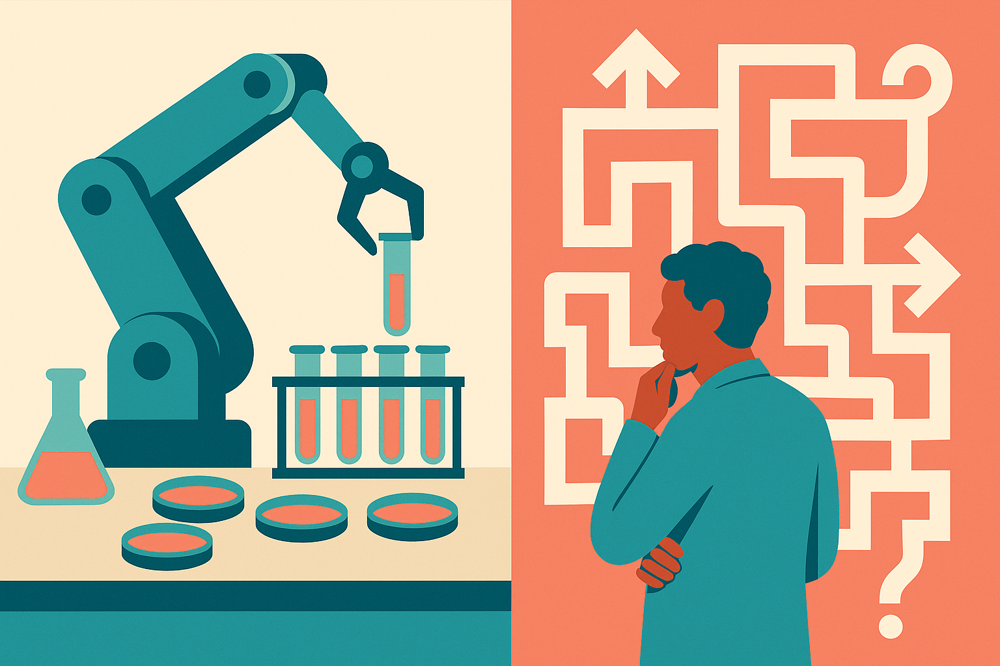

TL;DR: Frontier agents are getting good at executing research code, but this arXiv paper shows they still miss the harder part of AI research: choosing, revising, and judging the scientific path.

## What did the shadow evaluations test?

The primary source is the arXiv cs.AI and cs.LG paper, “Can AI agents conduct open-ended AI research? Early evidence from two case studies.” Its core idea is simple and much better than another toy benchmark: give an AI agent the central research question from a strong unpublished paper, let it work for six days with thousands of dollars of compute, then have the original human authors grade the result.

That setup matters. Most agent evaluations test tasks with clean answers. Fix this bug. Pass this unit test. Reproduce this metric. Useful, but not the same thing as research.

The other common evaluation path is to submit AI-generated papers to blind peer review. That sounds more realistic, but peer review is noisy, overloaded, and uneven. A bad review can miss a good paper. A good review can over-reward polish. The arXiv paper calls its alternative “shadow evaluations,” and I think that is the right direction: use real research questions, but compare against experts who deeply understand the problem.

The agents were not helpless. They completed the engineering without human help. That is a real result. They could set up code, run experiments, manage repositories, and produce outputs. If your mental model is “agents are useless at technical work,” this paper pushes back.

But the agents did not make substantial progress on the research questions. Both outputs were unambiguously rejected by the original authors.

## Where did the agents fail?

The failures were not mostly about syntax or broken scripts. They were about research taste.

The paper identifies five recurring failure modes: poor judgment about the bar for publishable research, uncreative responses to weaknesses in the research design, ineffective backtracking from dead ends, poor resource awareness, and instruction drift.

That list feels right to anyone who has watched a capable model grind on the wrong thing. It can produce activity. It can even produce plausible activity. But research requires a higher-level loop: notice that the current plan is weak, compare it to the actual contribution bar, invent a better route, and stop spending time on experiments that will not answer the question.

This is the gap between “doing research tasks” and “doing research.” Agents can increasingly fill in the middle of the sandwich. They can write the training script, generate plots, clean up a repo, run ablations, draft sections, and search the literature. The top and bottom are harder: framing the question and deciding whether the answer is good enough.

The paper also reports that a check with a second model and scaffold reproduced the same broad failures. That does not prove all frontier agents fail in all research settings. Two case studies are still two case studies. But it does make the result harder to wave away as one bad prompt, one weak scaffold, or one unlucky run.

## What does this say about AI R&D automation?

The clean takeaway is not “AI agents cannot do research.” It is narrower and more useful: today’s agents can automate meaningful chunks of the research workflow, but open-ended AI research still depends on judgment loops they do not reliably run.

That matters because a lot of explosive AI progress forecasts assume AI systems will automate AI R&D itself. If agents can become tireless junior researchers, progress accelerates. If they can become independent principal investigators, the world changes much faster. This paper is evidence against treating that second step as already solved.

I would not overread it. Six days is a constraint. Two unpublished NeurIPS submissions are not the whole universe. Some research domains may be more agent-friendly than others, especially when the objective is measurable and iteration is cheap. But the failures here land in the exact place skeptics would expect: taste, prioritization, backtracking, and knowing when “technically completed” is still not science.

Practitioner’s take: use agents as research accelerators, not research owners. Give them bounded jobs inside a human-designed loop: implement baselines, run sanity checks, generate experiment variants, summarize logs, and draft failure analyses. Then make a human explicitly review the research question, the contribution bar, and the decision to continue or pivot. The catch most teams miss is that an agent can make a weak research plan look busy and expensive. Add checkpoints for “is this still answering the real question?” before the compute meter runs.
