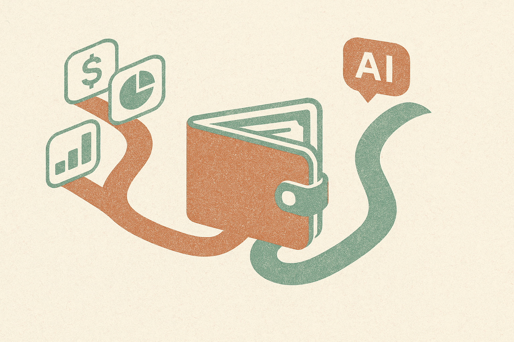

TL;DR: Treat MoonPay’s AI product and airdrop as a distribution experiment, not a market signal.

## What actually matters in Decrypt’s Robinhood headline?

Decrypt’s “Morning Minute: Robinhood Posts Its Best Quarter Ever” bundles a few market notes into one snapshot: Robinhood posted its best quarter ever, markets were rebounding after a slightly hawkish FOMC, BTC ETFs flipped to inflows, and MoonPay launched a new AI product plus an airdrop.

The easy read is “risk is back.” Maybe. But that is not the useful operator read.

The useful read is that crypto’s consumer surface area is changing again. Robinhood is still the familiar brokerage wrapper. ETFs are still the regulated allocation wrapper. MoonPay is pointing at a different wrapper: an AI interface tied to an incentive loop.

That does not mean the product works. It does not mean the airdrop has durable value. It definitely does not mean anyone should treat this as a trading cue. Airdrops are often noisy. They attract users, bots, mercenaries, and genuine early adopters in the same pile. The hard part is telling those groups apart after the campaign ends.

But as a product signal, it is worth watching.

## Is AI becoming the new crypto onboarding layer?

Crypto has always had an onboarding problem. Wallets, keys, chains, fees, bridges, swaps, compliance checks, tax forms, token incentives. Some of that is getting better. A lot of it is still weird for normal users.

AI is a plausible interface for that mess because the job is not just “answer a question.” It is translation. Turn user intent into the next safe action. Explain tradeoffs. Catch obvious mistakes. Route people through identity checks. Summarize what just happened. Maybe help them recover when something fails.

That is the part I care about with MoonPay’s AI launch. Not the airdrop itself. The airdrop is customer acquisition. The AI product is the bet that a conversational or agentic layer can reduce friction enough to make crypto products feel less like infrastructure and more like consumer software.

There is a catch. In finance, an AI assistant cannot just be charming. It has to be bounded. It needs clear refusal rules, audit trails, transaction previews, permissioning, and escalation paths. If it touches money movement, “the model sounded confident” is not a control.

## Where does this leave builders?

Robinhood’s quarter says retail finance demand is alive. BTC ETF inflows, as reported by Decrypt, say institutional wrappers still matter. MoonPay’s AI airdrop says crypto teams are testing AI as the front door.

Those are three different signals, and they should not be mashed into one hype ball.

For AI builders, the most interesting pattern is not “AI plus crypto.” It is “AI plus regulated or semi-regulated user action.” The assistant becomes a guide, but the product has to decide where autonomy stops. Read-only help is one risk level. Drafting an action for user review is another. Executing a transaction is a very different product.

That distinction is where many AI demos cheat. They show the happy path. Real users show up with stale KYC, unsupported regions, confusing balances, phishing links, failed transactions, and vague intent. The assistant has to handle all of that without becoming a liability machine.

My practitioner’s take: if you are building in fintech or crypto, do not start by making an “AI agent that does everything.” Start with one high-friction flow, like onboarding, transaction explanation, support triage, or post-action receipts. Measure completion, support deflection, user confusion, and abuse. The catch most teams miss is that incentives distort the data. If an airdrop is attached, usage may prove people like rewards, not that they trust the AI.
