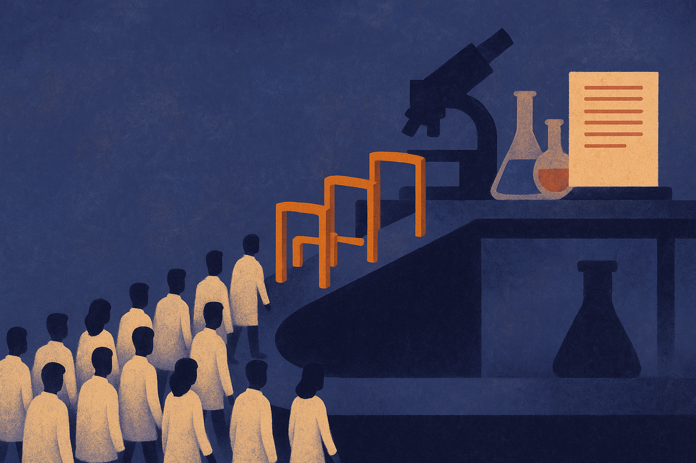

TL;DR: OpenAI’s free ChatGPT access for 100,000 academic researchers matters because it lowers the access barrier, but the real bottleneck is turning model use into verified research workflows.

## What did OpenAI actually announce?

OpenAI announced in “Accelerating scientific discovery with ChatGPT for Academic Researchers” that it is giving 100,000 academic researchers free access to ChatGPT’s most advanced AI models. OpenAI framed the program around accelerating scientific research, collaboration, and discovery.

That is the concrete news. Not a new benchmark. Not a proof that ChatGPT can autonomously do science. Not evidence that model access alone produces better papers.

The scale is the part to pay attention to. One hundred thousand researchers is large enough to change habits across labs, departments, and graduate cohorts if the access is easy to use. It is also large enough to create a messy natural experiment in how scientists actually use frontier models when cost is less of a blocker.

My read: this is a distribution move with scientific branding. That does not make it bad. Distribution is how tools become normal. The question is whether the normal use is “help me think and check faster” or “generate plausible-looking work that nobody audits.”

## Where can ChatGPT actually help researchers?

The high-value use cases are not mysterious.

Researchers spend a lot of time on literature triage, outlining, code scaffolding, data cleaning, translation, grant drafts, reviewer response drafts, and summarizing long technical material. Those are places where a strong model can reduce friction without pretending to be the scientist.

The best workflows will keep the model close to the work and far from unsupported claims. Ask it to compare two methods after you provide the papers. Ask it to turn a messy protocol into a checklist. Ask it to write a Python script, then run the script, test it, and inspect the output. Ask it to identify assumptions in a statistical plan. Useful. Boring. Real.

The risk is that free access gets mistaken for free accuracy. Academic work has failure modes that are harsher than office work. A hallucinated citation can waste a day. A wrong unit conversion can poison an experiment. A confident summary of a niche paper can steer a student into a false premise.

## What changes if universities take this seriously?

If universities treat OpenAI’s program as an IT perk, the impact will be uneven. Some labs will use it well. Some will ban it by default. Some will quietly use it with no shared standards.

The better version is boring governance plus practical training. What data can be pasted into ChatGPT? What data cannot? When should a researcher disclose AI assistance? How should model-generated code be reviewed? Should prompts and outputs be saved for important analytical steps? Who is responsible when a model-generated summary is wrong?

Those questions are not anti-AI. They are how AI becomes usable in serious work.

The thin part of OpenAI’s announcement is measurement. “Accelerating scientific discovery” is a big claim. Access can speed up pieces of the research process, but discovery is a chain. Better drafts do not automatically mean better hypotheses. Faster code does not automatically mean cleaner analysis. More collaboration does not automatically mean reproducible results.

I would look for downstream receipts: documented time savings, fewer administrative delays, better replication practices, broader participation from less-funded institutions, and fewer researchers stuck behind paywalls for model access. Those are measurable. The magic language is not.

Practitioner’s take: if you run a lab, do not start with “use ChatGPT for research.” Start with three approved workflows: literature triage with citation checks, code assistant with required tests, and reviewer-response drafting with human source verification. Write a one-page policy for sensitive data and disclosure. The catch most people miss is that the model is not the workflow. The workflow is the prompt, the evidence, the review step, and the record you can defend later.
