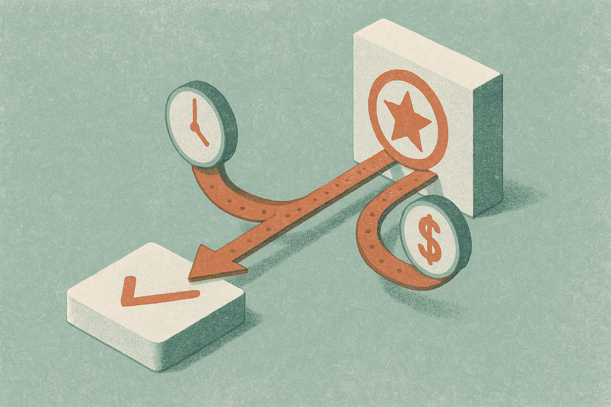

TL;DR: OmegaUse-OfficeVal tests LLM agents on 100 real office tasks that take humans about 2.32 hours each, and the headline is blunt: current frontier models are far cheaper and faster than people but still fall short of human-quality deliverables.

Most agent benchmarks answer the wrong question. They ask whether an agent can complete a task. The question a business actually has is whether the finished work is good enough to ship, and whether it cost less than paying a person to do it. Those are different things, and until now the second one has been mostly hand-waved.

The benchmark I want to walk through is **OmegaUse-OfficeVal: Benchmarking LLM Agents on Long-Horizon Office-Suite Tasks with Economic Grounding**, posted to arXiv (cs.AI and cs.CL). It does something I have wanted to see for a while: it attaches money and time to each task, so quality gets weighed against cost instead of measured in a vacuum.

## What does OmegaUse-OfficeVal actually measure?

It is 100 tasks, drawn from office-suite requests that real practitioners proposed and then adapted through a privacy-preserving process. So these are not synthetic puzzles cooked up to be tricky. They are the kind of spreadsheet, document, and presentation work people actually pay for.

Two numbers ride along with every task. One is human labor time: how long it takes a person to do the task, averaging 2.32 hours. The other is a task price proxy: a stand-in for what the work is worth. Those two signals are the whole point. They let you compare human cost against LLM inference cost directly, and they let you weight results by value so that nailing a high-stakes task counts for more than nailing a trivial one.

The 2.32-hour average matters. A lot of agent evals live in the world of tasks that take a competent person two minutes. Those tell you almost nothing about whether an agent can hold a plan together across a real workflow. Long-horizon means the agent has to keep context, sequence steps, and not lose the thread halfway through. That is where most of them break.

## How do you grade a spreadsheet without a human in the loop?

This is the part I find genuinely useful for anyone building their own internal evals. The team built code-based verifiers from fine-grained rubrics.

Think about what that means in practice. Instead of asking another LLM to judge whether a deliverable is good (which is noisy, expensive, and gameable), they wrote actual code that checks specific properties of the output against a detailed rubric. Did the pivot table roll up to the right totals. Are the required columns present. Does the summary hit the points it was supposed to hit.

Code-based grading is the difference between an eval you can trust and an eval that drifts every time you rerun it. LLM-as-judge scoring has a real reproducibility problem: same input, different scores, and a slow bias toward outputs that sound confident. Deterministic verifiers give you stable numbers. The tradeoff is that they are expensive to build and only cover what you thought to check, so the rubric quality becomes the ceiling on the eval's honesty. OmegaUse-OfficeVal leans into that tradeoff, and I think it is the right call for work products where correctness is checkable.

## What did the frontier models actually score?

Here is where I have to be honest about the limits of what the sources give me. The abstract states the finding plainly: all evaluated frontier LLMs were substantially cheaper and faster than human workers, but none of them approached human-level deliverable quality. It does not, in the material I have, publish the per-model scores or name which frontier models were tested. So I am not going to invent a leaderboard.

But the shape of the result is the story. Cheaper and faster, not yet good enough. That is the tension every operator is living right now.

Cheap and fast are seductive because they are easy to measure and easy to sell. Quality is the hard, quiet variable, and it is the one that decides whether you actually save money or just create a new job for a human reviewer who now has to catch the agent's mistakes. If an agent does a 2.32-hour task for a few cents in thirty seconds but a person needs 45 minutes to verify and fix it, your real savings collapsed. The economic grounding in this benchmark is exactly what forces that conversation.

## Why economic grounding changes how you should read agent claims

Every vendor deck right now shows a completion rate. "Our agent solves 68% of tasks." That number is close to meaningless without cost and value attached.

An agent that solves 68% of tasks but produces garbage on the other 32% with no signal about which is which is worse than useless in a workflow, because you cannot trust any single output. An agent that solves 68% and flags the rest as low-confidence is deployable. And an agent that solves the cheap tasks but fails the expensive ones has a value-weighted score much worse than its raw completion rate suggests. OmegaUse-OfficeVal's value-weighting is designed to surface exactly that gap.

This is the framing shift I want more people to steal. Stop asking "can the agent do it." Start asking three things: what fraction of the value did it deliver, what did that cost in inference, and what did verification cost on top. That third number is the one everyone forgets, and it is often the one that kills the business case.

The benchmark is fully open-sourced, code and dataset both, with a project site at omegause-officeval.github.io. That matters because you can actually inspect the tasks and the verifiers rather than trusting a marketing chart.

## Practitioner's Take

If you are deploying agents for real office work, do not copy this benchmark, copy its structure. Pick ten tasks your team actually does, time how long a competent person takes on each, and estimate what that hour is worth to you. Then write deterministic checks for what "done right" means, even crude ones, before you point an agent at the task. Now every agent run gives you three numbers instead of a vibe: value delivered, inference cost, and the human minutes spent fixing the output. The catch most people miss is that verification cost is part of the total, and it does not go to zero as models improve. When the deliverable quality still lags humans, as OmegaUse-OfficeVal found, your reviewers become the real bottleneck, and a "cheaper and faster" agent can quietly be more expensive once you count the cleanup. Measure that before you scale, not after.
