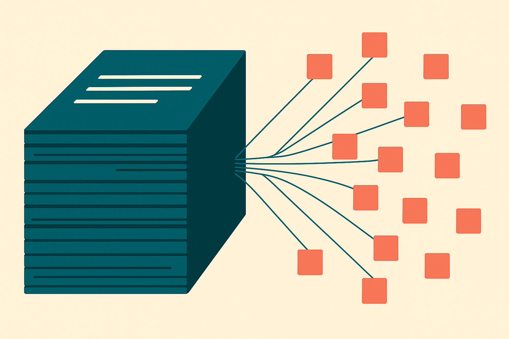

TL;DR: AskChem indexes 2.4 million provenance-carrying claims from 147K chemistry papers instead of ranked documents, and grounding a GPT-5.5 reader in it pushed resolvable citations from 88.3% to 100%, which is a strong signal that the unit of retrieval, not just the model, decides how trustworthy your answers are.

Most retrieval systems still hand you a stack of documents and let you do the reading. You ask a question, you get ten PDFs, you skim, you cross-reference, you assemble the answer yourself. That works when you want one paper. It falls apart when the answer lives in fragments spread across forty of them, which is the normal case in science.

AskChem, described in "AskChem: Claim-Centered Infrastructure for Chemistry Literature Synthesis" (posted to arXiv across cs.AI, cs.CL, and cs.LG), makes a specific bet: the document is the wrong atom. The right atom is the claim.

## What does claim-centered retrieval actually mean?

The system converts each paper into a set of atomic, typed claims. Each claim carries a source DOI and either a verbatim quote or an explicit evidence locator pointing back to where it came from. So instead of retrieving "this paper is probably relevant," you retrieve "this specific finding, stated this specific way, is grounded in this specific place."

That shift sounds small. It is not. When your retrieval unit is a whole paper, the model still has to find the relevant sentence inside it, decide whether the sentence supports the answer, and remember where it came from. Three chances to hallucinate. When your retrieval unit is already a single grounded claim, two of those steps are done before the model sees anything.

AskChem layers three structures over the shared claim store. There is a stabilized faceted taxonomy for hierarchical browsing, the kind of thing where you drill down through categories. There is an evidence graph that links claims to each other through relations, so a claim that supports or contradicts another is connected, not just co-located. And there is what the paper calls an exploratory living taxonomy that situates papers under scientific principles rather than keywords. The first is for finding, the second is for reasoning across findings, the third is for orientation when you do not yet know what you are looking for.

The numbers on scale: 2.4M claims from 147K papers. That averages out to roughly sixteen claims per paper, which feels about right for the density of a real chemistry article. It is not one giant embedding blob. It is millions of small, addressable, cited units.

## Why does the 88.3% to 100% jump matter?

On AskChem-Bench, the team's own benchmark, grounding a GPT-5.5 reader in AskChem produced 100% resolvable DOIs, versus 88.3% for the same reader without retrieval. It also had the highest citation density among five tested systems.

Read that carefully before you get excited. This is the authors evaluating their own system on their own benchmark, and "resolvable DOIs" measures whether a cited identifier actually points to a real paper, not whether the cited paper actually supports the claim. A DOI can resolve perfectly and still be attached to the wrong sentence. So 100% resolvable is a floor, not a ceiling, on trustworthiness. It tells you the plumbing works. It does not tell you the model reasoned correctly.

Still, the 88.3% baseline is the interesting number. Nearly one in eight citations from an ungrounded GPT-5.5 reader pointed to a DOI that does not resolve. That is the fabrication tax we have all been paying and mostly ignoring. In a chemistry workflow, a citation that looks real but points nowhere is worse than no citation, because it survives a casual glance. Moving the retrieval unit to a pre-grounded claim closes that specific gap by construction. The model cannot invent a DOI when the DOI arrives attached to the claim.

Citation density is the other half. Highest among five systems means answers came back with more grounded references per claim. Combine density with resolvability and you get answers you can actually audit, which is the whole point of using AI on a literature review instead of trusting a summary.

## How would an agent use this instead of a human?

AskChem is live at askchem.org with a web interface, but the part that matters for builders is the access surface: REST, an SDK, and MCP. That MCP hook means an AI agent can query the claim store directly as a tool, the same way it would call any other function.

This is the quiet structural argument in the whole paper. If your retrieval layer returns ranked documents, an agent has to spend tokens and turns reading, which is slow, expensive, and lossy. If your retrieval layer returns typed claims with provenance baked in, the agent gets structured, cited facts it can compose without re-deriving them. The infrastructure is designed for the reader to be a model, not a person, and that is where more of this is heading.

The catch: someone has to do the claim extraction, and the quality of the whole system rides on it. Converting a paper into atomic typed claims is itself a model-driven step, and the sources here do not report how accurate that extraction is. A claim that misreads a hedged result as a definitive one inherits a perfect DOI and a verbatim quote and looks completely trustworthy. Provenance guarantees you can trace a claim back. It does not guarantee the claim was extracted faithfully in the first place. That is the layer to scrutinize before you build on top of this pattern.

## Practitioner's take

If you run a RAG pipeline in any domain, not just chemistry, the lesson transfers directly: stop retrieving documents and start retrieving pre-verified claims with provenance attached. The engineering work moves upstream, into an extraction step that turns each source into atomic, cited units before anything hits your vector store. That is more work at index time and far less hallucination at query time, which is the trade you want in any setting where a wrong citation costs you. Try it on a small corpus first: extract typed claims, attach a source ID and a verbatim quote to each, then measure resolvable-citation rate before and after, the way AskChem did. The number most people miss is the one AskChem does not publish, which is claim-extraction accuracy. Perfect provenance on a subtly wrong claim is a confidence trap, so budget real evaluation for the extraction step, not just the retrieval step.
