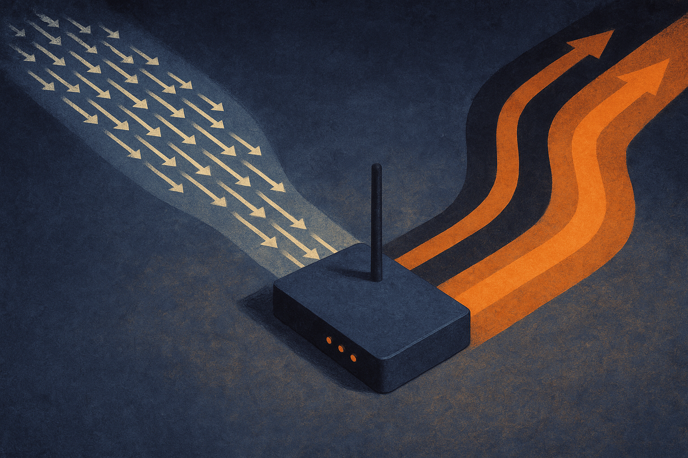

TL;DR: OpenAI cut prices on GPT-5.6's Luna and Terra tiers, and for most production workflows the cost drop reshapes what's viable more than any capability bump does.

OpenAI's post, "Advancing the price-performance frontier with GPT-5.6," leads with lower pricing on two tiers, Luna and Terra, and pitches the story as efficiency for enterprise deployment at scale. That framing is the tell. When a lab leads with price instead of a new benchmark record, it's telling you where the competition is now: cost per useful token, not top-line capability.

I want to separate what's actually confirmed here from what OpenAI would like you to assume. The blog post is real. The two tier names are real. The specific numbers are not in front of me, and Hacker News mirrored the headline without adding independent detail, so I'm not going to quote a price I can't see. What I can do is walk through why a price cut on a mid-cycle model matters, and where builders get burned assuming cheaper means free-to-be-sloppy.

## Why does a price cut matter more than a capability bump right now?

For most people shipping AI features, the frontier stopped being about whether the model *can* do the task. It can. The question is whether the task is affordable at volume.

Take a support-triage workflow that classifies and drafts responses for 200,000 tickets a month. At a certain cost per token, running the best model on every ticket is fine. Push the volume up, add a few reasoning steps, fan out to sub-agents, and the same architecture that was a rounding error becomes a line item someone in finance circles in red.

That's the wall a lot of teams hit in the last year. Not "the model isn't smart enough." It's "the smart version costs 8x what the budget allows, so we route to the cheap model and eat the quality hit." A price cut on a capable tier collapses that tradeoff. Suddenly the workflow you prototyped on the expensive model becomes the workflow you actually ship, unchanged.

This is why OpenAI framing it as "price-performance frontier" is more honest than it sounds. The frontier that moved isn't raw intelligence. It's the set of things that are now economically sane to run with a good model instead of a cheap-and-degraded one.

## What are Luna and Terra actually for?

OpenAI splitting GPT-5.6 into named tiers, Luna and Terra, tells you they've accepted that "one model, one price" doesn't match how workloads actually look. Some tasks want cheap and fast. Some want deep reasoning and can pay for it. The tiering is an admission that a single flagship model priced for its hardest use case overcharges every easy use case.

The public material doesn't spell out the exact positioning of each tier, so I won't pretend to. But the pattern across the industry is clear: a lighter, cheaper tier for high-volume classification, extraction, and routing, and a heavier tier for the multi-step reasoning and agentic work where a wrong answer compounds. If Luna and Terra follow that split, the operator's job becomes routing, sending each request to the cheapest tier that clears the quality bar for *that* task.

That routing layer is where the real savings live, and it's also the part OpenAI's blog post won't do for you. Cheaper tiers don't help if every call goes to the expensive one out of habit.

## Where does the cheaper price bite back?

Here's the catch most people miss when a price drop lands: cheaper per token quietly changes your behavior, and not always for the better.

When tokens get cheap, teams stop rationing them. You add another reasoning pass because why not. You stuff more context into the prompt because it's affordable now. You fan out three agent calls where one would do. Each decision is defensible. Together they eat most of the savings and add latency. I've watched teams celebrate a per-token discount and then post a *higher* monthly bill a quarter later because usage expanded to fill the cheaper space.

The second bite is quality drift. If the price cut nudges you to move a workflow from a premium model to a cheaper tier, you have to re-run your evals. Not vibe-check it. Actually run the test set. A tier that's 90% as good on average can be 60% as good on the specific edge cases your business cares about, and average benchmark numbers hide that completely. The price is public and precise. The quality tradeoff is private and yours to measure.

The third bite is lock-in creep. Every time a provider makes it cheaper to stay, it gets marginally harder to justify the engineering cost of keeping a second provider warm. That's not a reason to avoid the cheaper price. It's a reason to keep your prompt and eval layer provider-agnostic so a future price move somewhere else stays cheap to act on.

## How should a builder respond this week?

Don't rewrite anything on the strength of a blog post. Pull the actual per-token numbers for Luna and Terra from the pricing page, not the announcement, and put them next to what you pay today. The announcement sells the frontier; the pricing page has the digits that go in your spreadsheet.

Then find the one workflow where cost, not capability, was the reason you shipped a compromise. That's the workflow to move first, because it's where a price cut converts directly into either margin or a better product with zero new risk. Everything else waits for evals.

Practitioner's take: treat this as a routing and eval exercise, not a migration. Instrument your workloads by cost-per-task and quality-per-task before you touch a single model string, because the price cut only pays off where you can prove the cheaper tier clears your bar. Move the cost-bound workflows now, hold the quality-bound ones until your test set says go, and cap your usage growth on purpose so the discount lands in your budget instead of evaporating into extra reasoning passes nobody asked for. The lab gave you a cheaper number. Whether it becomes real savings or just more spend depends entirely on the plumbing you build around it, and that part is still your job.
