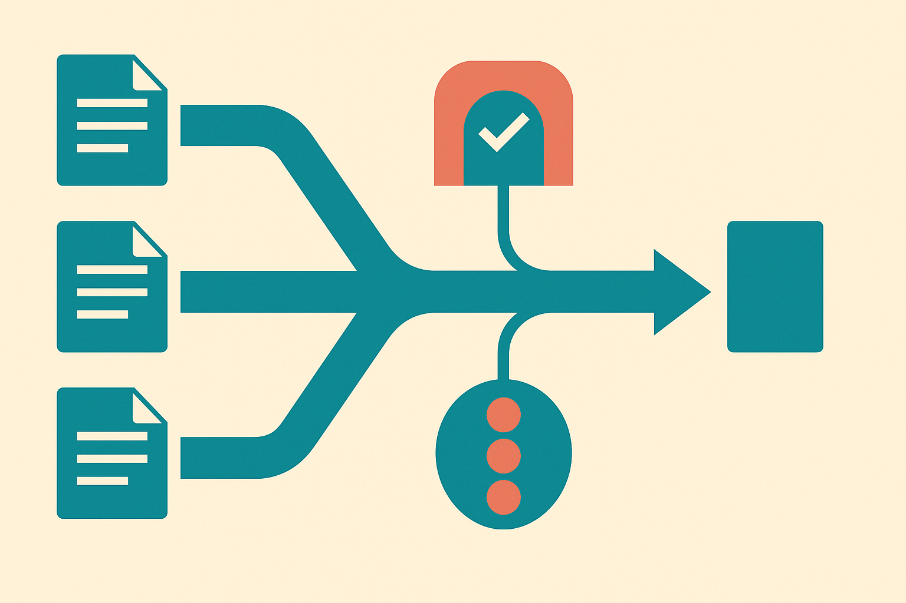

TL;DR: OpenAI’s Python SDK updates are less about shiny capabilities and more about production control: speed tiers, provenance checks, backoff behavior, and enterprise connection patterns.

## What changed in openai-python v2.52.0?

The primary source here is OpenAI’s GitHub release, “openai/openai-python v2.52.0,” published July 31. It is a short changelog, but the shape matters.

OpenAI added “content provenance checks” to the API surface. The release note does not spell out the contract, supported content types, or failure modes, so I would not build a compliance claim from that line alone. Still, the direction is clear. Provenance is moving from policy deck language into SDK-level plumbing. That is where it belongs if builders are expected to verify, route, store, or reject content based on origin signals.

The same release also fixes client behavior so the SDK honors `Retry-After` delays up to two minutes. That sounds tiny. It is not. Bad retry behavior is one of those invisible bugs that only shows up when traffic spikes, rate limits bite, or an upstream service asks you to slow down. Respecting the server’s requested delay can be the difference between a graceful queue and a self-inflicted outage loop.

OpenAI also added documentation for “API-key mTLS HTTP client recipes.” Again, not flashy. But in larger companies, network and identity requirements are often the blocker, not prompt quality. If a platform team requires mutual TLS patterns, a working recipe can save days of glue work and security review churn.

## Why does v2.51.0 make this more interesting?

The day before, OpenAI shipped “openai/openai-python v2.51.0,” which added “fast tier” support, then fixed helper methods to include that tier. The release notes do not describe pricing, availability, or latency promises. So do not read more into it than OpenAI published.

But even the existence of an SDK-level service tier flag is useful. It suggests that model calls are becoming more configurable at runtime. Not just “which model?” but “which service class for this request?” That is the right abstraction for real products.

A chat turn inside a live sales workflow may need a different latency profile than an overnight document tagging job. A user-facing agent step may deserve the faster path. A background summarizer probably does not. Whether OpenAI’s “fast tier” is the right fit depends on the actual product contract behind it, but the pattern is sound: route AI work by user value, not developer convenience.

Taken together, v2.51.0 and v2.52.0 point at a less glamorous phase of AI tooling. The SDK is becoming a control plane for operations. Speed selection. Provenance checks. Backoff behavior. Enterprise transport setup. These are not benchmark wins. They are the knobs teams need after the demo works and before the app can be trusted with real users.

## What is the real signal for builders?

The signal is that AI infrastructure is getting more like normal production infrastructure. That is good. Also annoying. You now need to treat SDK upgrades as product and ops events, not just dependency maintenance.

If provenance checks affect routing or storage, you need tests around the exact response fields. If `Retry-After` handling changes timing, you need to see how your workers, queues, and request timeouts behave under pressure. If fast tier becomes part of your routing logic, you need metrics by route, not one blended average across the whole app.

The catch: small SDK features can create big assumptions. “Fast” can become “always use fast.” “Provenance” can become “we are safe.” “Retry-After” can become “resilience handled.” None of those are true by default.

Practitioner’s take: pin the SDK version, read both OpenAI changelogs, then test these changes in one narrow workflow. Put fast tier behind a feature flag on a latency-sensitive path. Log `Retry-After` behavior in staging under forced rate-limit conditions. Try content provenance checks in a non-blocking audit path before using them for policy decisions. The missed step is measurement: these knobs only matter if you can see p95 latency, error rates, retry delays, and user impact separately.
