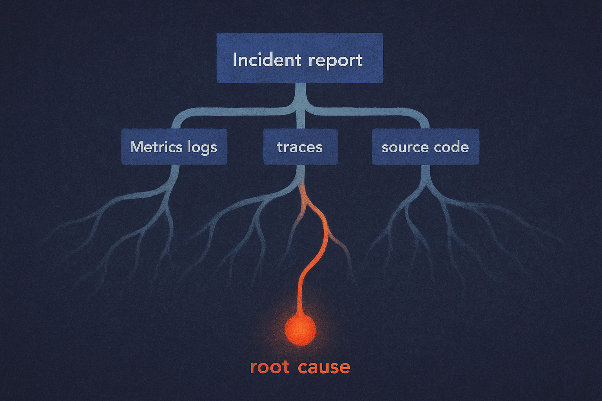

TL;DR: Treat AI agents as incident investigation assistants, not autonomous oncall engineers, because ORCA-bench shows they still fail badly on realistic root cause analysis.

## What does ORCA-bench actually test?

The primary source here is **“ORCA-bench: How Ready Are Language Model Agents for Oncall?”**, listed on arXiv cs.AI and cs.CL, with a public dataset at `https://hub.harborframework.com/datasets/orca-bench/ORCA-bench`.

It is useful because it does not ask a model to fix a tidy coding bug in a repo. It asks agents to do something closer to production oncall work: start from an ambiguous user-facing incident report, inspect telemetry, reason over time, connect symptoms across systems, and identify the root cause.

The benchmark uses a live OpenTelemetry-instrumented microservice system. Agents get six days of metrics, logs, and traces through real interfaces: Prometheus, Jaeger, and OpenSearch via Grafana. They also get full source-code access. The task set has 1,079 root cause analysis cases that vary report specificity, time-to-detection, and co-occurring faults.

That last bit matters. Incidents are rarely clean. A slow checkout flow may be a database issue, a retry storm, a bad deploy, a queue backlog, or two problems making each other look worse. Oncall is less “find the broken line” and more “separate signal from noisy evidence while the clock is running.”

## How far are frontier agents from real oncall work?

Pretty far.

ORCA-bench reports that across five frontier agents, the best root cause analysis accuracy was 25.3% on Medium-difficulty tasks, which the benchmark treats as the realistic-input setting. On Hard tasks, the best result dropped to 10.0%. The weakest model hallucinated an implausible root cause in 40% of incident reports.

That is not a small gap hidden by a weird benchmark. ORCA-bench says ground-truth symptoms were curated and signed off by expert SREs, and its LLM-as-judge was independently re-scored by humans with Cohen’s weighted kappa of 0.90. No benchmark is production, but this one at least tries to model the mess: time gaps, partial reports, mixed signals, telemetry tools, code, and concurrent faults.

The most interesting result may be source-code access. Removing source code degraded every metric. That should not surprise operators, but it is a good reminder for agent builders. Telemetry alone often tells you what happened. Code helps explain why it happened. A trace might show latency in a service. The code may reveal a timeout, cache miss pattern, bad fanout, or fallback path that turns a small problem into an outage.

The paper also makes the right caveat: this is a curated 50 GB, six-day testbed with public code and instrumentation, and tasks are investigated in isolation. Real production systems are larger, stranger, more dynamic, and full of undocumented local history. If agents struggle here, giving them the pager in a real company is theater.

## So where should teams use these agents?

Use them in the loop, not at the wheel.

A good oncall agent today can gather context before a human opens Grafana. It can summarize the incident timeline, list changed services, compare current metrics to a baseline, pull suspicious logs, inspect recent deploys, and draft hypotheses with evidence attached. It can also be asked to argue against its own top hypothesis, which is a useful guardrail against confident nonsense.

The wrong use is “auto-RCA, auto-remediate, sleep through the page.” ORCA-bench gives receipts for why that is reckless. A 25.3% best-case accuracy on realistic tasks is not a reliability system. It is a junior helper with fast hands, broad memory, and no real judgment yet.

There is also a product lesson. Agent vendors should stop demoing clean bug fixes as proof of ops readiness. Oncall needs long-context telemetry reasoning, tool discipline, calibrated uncertainty, and refusal behavior when the evidence is thin. The hallucination rate matters as much as the success rate, because a false root cause during an incident can burn the exact minutes the team cannot spare.

Practitioner’s take: wire an agent into your observability stack as a read-only investigator first. Give it runbooks, service ownership, deploy history, traces, logs, metrics, and source code. Measure whether it shortens time-to-context, not whether it “solves incidents.” The catch most teams miss: you need an evaluation set from your own past incidents, including messy and unresolved ones, before you can trust any benchmark result inside your environment.
