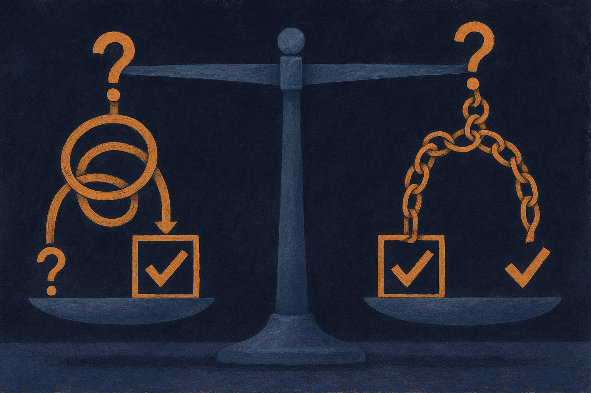

TL;DR: When you charge every method for the tokens it actually spends, letting a language model reflect on and rewrite its own answers never beats simply sampling the same question several times and keeping the most common answer, and on small models the reflection often makes things worse.

That is the finding in "Sample More, Reflect Less: Self-Refine and Reflexion Lose to Repeated Sampling at Equal Token Cost, from 1.5B to 7B," posted across cs.AI, cs.CL and cs.LG on arXiv. It is a small, careful paper, and I think it lands a bigger punch than its 150-question benchmarks suggest. It attacks a habit half the agent ecosystem is built on: the assumption that if you make a model check its own work, it gets smarter.

## What did the paper actually test?

The setup is a designed experiment, not a demo. Seven methods. Three open models at 1.5B, 3B and 7B parameters. Two math benchmarks, 150 questions each. Every method gets compared against one dead-simple baseline: ask the same question repeatedly, keep the answer that comes up most often. Majority vote over repeated samples.

The crucial move is the accounting. The authors count every generated token, including the ones spent on critiques, reflections, debate turns, and self-checking. Then they compare each method to repeated sampling at that method's own measured cost. So if Self-Refine burns three times the tokens of a single chain of thought, it gets compared to repeated sampling that also burns three times the tokens.

This is the part almost everyone skips. A method that plans, criticizes, rewrites, and debates with copies of itself generates far more text than one plain chain of thought. And generating more text raises accuracy on its own, independent of whether the clever idea did anything. So a gain over a single chain of thought proves nothing. It might just be the extra tokens. The only honest test is to spend the same tokens on the boring baseline and see who wins.

## What did they find?

All 36 comparisons are paired by question, with bootstrap confidence intervals and correction for testing many hypotheses at once. This matters because the paper this one builds on, Wang et al. (2024), reported the same general direction but gave point estimates with no confidence intervals and no significance tests. So the new work is turning an interesting observation into something you can actually stand on.

The headline: no method is reliably better than repeated sampling at equal cost anywhere. Not once, across all three model sizes and both benchmarks. Ten of the comparisons come out reliably worse, and every one of those ten is a method where the model inspects its own output. All 18 self-inspection comparisons are negative.

Then it gets more interesting, because the two flavors of self-inspection behave differently as models grow.

Choosing gets less harmful with scale. Take Best-of-N: generate eight samples, then let the model pick the best one. At 1.5B, just counting the most common answer instead of letting the model choose beats the model's own choice by 8.0 and 11.3 points on the two benchmarks. At 7B, that gap shrinks to 2.0 and 1.3 points, no longer distinguishable from zero. So a small model is actively bad at picking its own best answer, and a bigger one roughly breaks even. Voting never loses.

Rewriting does not recover with scale. Self-Refine and a forced version of Reflexion stay 3.6 to 10.1 points below the baseline even at 7B. Letting the model criticize and rewrite is a net negative, and getting a bigger model does not fix it in this range.

## Why does self-reflection backfire?

The most telling detail is buried in the methodology, and it is the kind of thing you only catch when you release all your generations, which these authors did. Reflexion as published never triggered its own retry on the smallest model. It judged itself correct every single time. So it silently collapsed into a plain single chain of thought while looking, on paper, like a sophisticated reflective agent.

Sit with that. The mechanism that was supposed to make the model reconsider mistakes was gated behind the model's own judgment of whether it made a mistake. A weak model is not good at that judgment. So the gate never opened, and the whole apparatus did nothing, or worse, added confident wrong critiques that dragged the rewrite off a correct answer.

That is the real lesson under the numbers. Self-inspection asks the model to do a harder task, evaluating correctness, using the same capability that produced the answer in the first place. If the model could reliably tell right from wrong, it would have written the right answer already. Repeated sampling sidesteps this entirely. It never asks the model to judge anything. It just samples the model's own distribution and trusts that the correct answer shows up more often than any single wrong one. On math, where there is one right answer and many scattered wrong ones, that assumption holds up well.

## Does this kill reflection agents?

No, and I want to be careful here, because the honest read cuts both ways.

The scope is narrow: two math benchmarks, open models from 1.5B to 7B, single-answer questions with a checkable result. Frontier models are far bigger, and the paper's own trend, choosing getting less harmful as models grow, hints that some of these effects soften at scale. Reflection with a real external signal, a compiler, a test suite, a search result, a verifier, is a different animal from a model grading itself. This study tested self-inspection, the model looking at its own text with no outside ground truth. That is exactly the setting where you should expect it to struggle, and it does.

But the frame is broadly useful, and it is one most agent builders never apply. Whenever you add a reasoning step, ask: compared to what, at the same token cost? If your reflective loop beats a single chain of thought, that is not evidence of anything. Beat majority vote at equal spend, or you are paying extra for a story about metacognition.

Practitioner's take: before you ship a self-critique or reflect-and-retry loop, run the boring control. Sample your prompt N times, take the majority answer, and measure it at the same token budget your fancy loop consumes. On any task with a checkable answer, that baseline is your real bar, not single-shot. If your loop cannot clear it, either wire in a genuine external verifier so reflection has something true to check against, or drop the loop and spend the tokens on more samples. The catch most readers will miss: this is a math-and-small-models result, so do not assume it transfers to open-ended writing or to GPT-scale models unchecked. Treat "sample more, vote, verify externally" as the default, and make reflection earn its place against that default on your own task, with your own token counter running.
