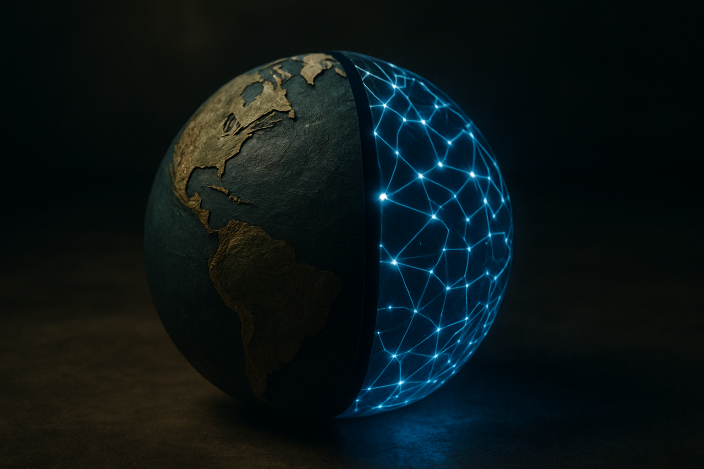

TL;DR: If a product sits inside a trust layer like Google Earth, generated pixels need containment and provenance before launch.

## What actually went wrong with Nano Banana?

Decrypt’s report, “Google Yanks Google Earth AI Image Tool a Day After Launch Over Deepfake Fears,” is the primary source here. The core fact is simple: Google launched a Google Earth AI image tool called Nano Banana, then pulled it a day later after concerns that users could generate fake satellite scenes from text prompts.

That sounds almost small if you file it under “AI image generator shipped, people got nervous.” It is not small.

Google Earth is not just a canvas. It is a reference surface. Investigators, journalists, open-source intelligence researchers, human rights groups, and ordinary people use it to check whether a video or photo matches a place. During breaking news and reports of atrocities, satellite context can become part of the verification chain.

So the product category matters. A fantasy skyline generated in a standalone app is one thing. A synthetic satellite-like image appearing near a tool people already use to verify reality is another. Same pixels, different blast radius.

The interesting part is not that someone could fake a satellite image. That has been possible for years with Photoshop, 3D tools, and now image models. The issue is placement. Google Earth carries inherited credibility. If generation enters that environment without hard boundaries, the trust of the host product gets borrowed by the fake.

## Why are fake satellite scenes harder to contain?

Most deepfake debates focus on faces, voices, politicians, and scams. Satellite imagery is quieter, but it has a nasty property: people use it as supporting evidence.

A fake scene does not need to fool everyone. It only needs to add friction. It can slow down verification, muddy a breaking story, or give bad actors a screenshot to circulate before anyone has time to check the chain of custody. In that sense, the harm is not only belief. It is delay.

There is also a UI problem. Users do not read provenance metadata with care. They react to surfaces. If something appears in, around, or near Google Earth, many people will assume it has some relationship to Google’s map data unless the interface makes the opposite painfully obvious.

That is the design bar for synthetic media in high-trust tools: obvious separation, persistent marking, export controls, and context that survives screenshots as much as possible. None of those are perfect. Watermarks can be cropped. Labels can be ignored. Metadata can be stripped. But weak controls are still better than vibes.

Google pulling Nano Banana after one day suggests the company either underestimated this trust-context problem or decided the launch risk was not worth defending once investigators raised alarms. The public facts are thin, so I would not overread the internal story. The external lesson is clear enough.

## What should builders take from Google’s retreat?

The lazy answer is “don’t ship scary AI features.” I do not buy that. Synthetic imagery has good uses in maps, planning, education, simulation, disaster prep, and product demos. The question is where it lives and what claims the interface allows users to make.

If the generated output can be mistaken for evidence, treat it like evidence-adjacent media. Put it in a sandbox. Make the synthetic state visible before, during, and after generation. Do not let exports look like native verified assets. Add provenance where possible, but do not pretend metadata solves screenshots. And test abuse with the exact communities likely to be harmed or slowed down, not only with internal red teams.

This is also a reminder that “AI feature” is too broad a label. A model inside a toy app, a newsroom tool, a health workflow, and a geospatial verification product may use similar generation tech. They should not share the same launch checklist.

For builders, the practical move is to map the trust your product already has before adding generation. Ask: do users treat this screen as evidence, record, recommendation, or playground? If it is evidence or record, generated content needs a separate lane, visible synthetic cues, constrained sharing, and abuse testing against real misuse cases. The catch most teams miss: the model is not the risky part by itself. The risky part is letting synthetic output inherit credibility from the product around it.
