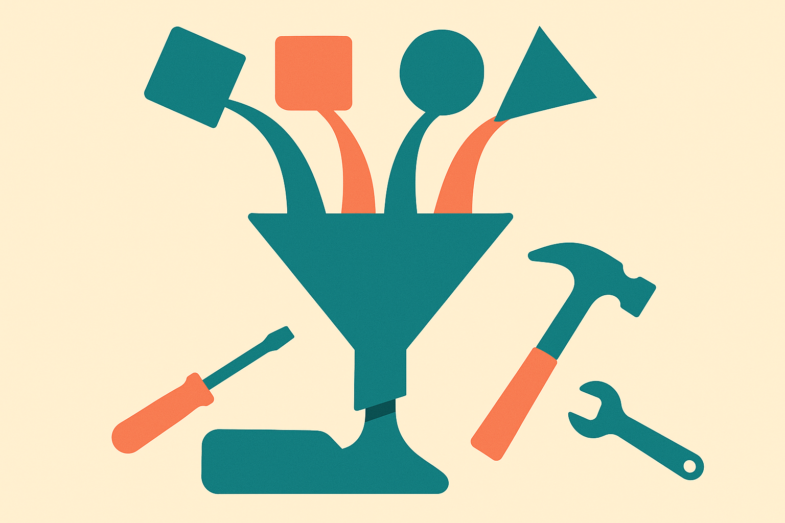

TL;DR: Go adding standard generic collections would matter less as a syntax upgrade and more as a shared default for the infrastructure code around AI systems.

## What is actually on the table?

The primary source here is the Go proposal titled “container/: generic collection types,” surfaced on Hacker News as “Golang proposal: container/: generic collection types.”

That title is doing a lot of work. It points at the `container/` area of Go’s standard library, which has long had useful but pre-generics packages like lists and heaps. Go added generics in 1.18, but the standard library has moved carefully. That caution is part of Go’s culture. Once something lands in the standard library, it carries compatibility weight for a long time.

So the interesting part is not, “Can Go have a generic set or queue?” Of course it can. People have been writing those in project code and third-party packages for years.

The real question is whether Go wants blessed collection types with the standard library’s taste baked in. Naming. Iteration style. Error behavior. Zero values. Memory habits. Comparability rules. All the little choices that become team defaults.

That is why a proposal like this gets attention. Collections are boring until every service in a company has its own slightly different queue, ordered map, set, or priority structure.

## Why should AI builders care?

Most AI product work is not model architecture. It is orchestration.

You have request queues. Tool-call state. Retrieval result sets. Deduping. Ranking. Chunk windows. Eval case stores. Background jobs. Rate-limit buckets. Agent memory indexes. Cache eviction policies. Streaming buffers. Fan-out and fan-in between services.

A lot of that code is collection code.

Python hides some of this because the language has batteries-included data structures and a huge standard ecosystem. TypeScript teams reach for npm. Rust has a strong standard collection story. Go has maps, slices, and channels, which get you far, but teams still fill gaps with custom utilities or external packages.

For AI systems, those gaps show up in places that are easy to underestimate. A retrieval service may need stable ordering and dedupe. An agent runner may need a priority queue for scheduled tasks. An eval harness may need sets and maps that make intent obvious to reviewers. A model gateway may need tight control over memory and allocation under load.

None of this is glamorous. It is exactly why it matters.

When infrastructure code is boring, shared, and readable, teams spend less time debating helper packages and more time finding actual product failures. In AI systems, those failures are usually not “the model is bad” in isolation. They are stale context, bad routing, hidden retries, noisy tools, missing observability, and state bugs.

Collections sit under all of that.

## What is the catch?

The catch is that standard collections can also freeze mediocre abstractions.

Go has avoided some standard library sprawl by being conservative. That has costs, but it also keeps the language coherent. A generic collection package has to feel like Go, not like a transplant from Java, C++, or a framework-heavy enterprise codebase.

The thin signal here is important too. A Hacker News item tells us there is developer interest, not that the proposal has landed or that the final API is settled. Treat this as a design direction to watch, not as a shipping dependency.

If I were running a Go-heavy AI platform team, I would not wait for this to refactor everything. I would do something simpler: inventory the custom collection helpers already scattered across services. Look for queues, sets, heaps, ordered structures, and cache wrappers with overlapping behavior. Standardize the ones tied to correctness. Delete the cute ones. Keep interfaces small.

The practical move is to make your internal collection code boring now, so adopting standard generic collections later is a swap, not a migration project. The catch most teams miss: the value is not fewer lines of code. It is fewer private semantics hiding inside the lines you forgot to review.
