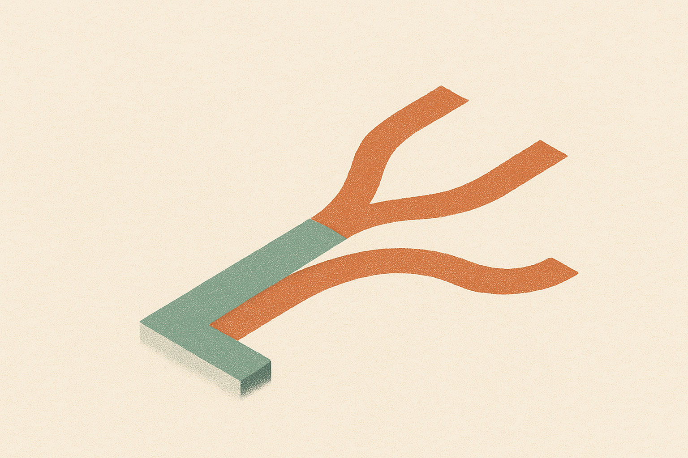
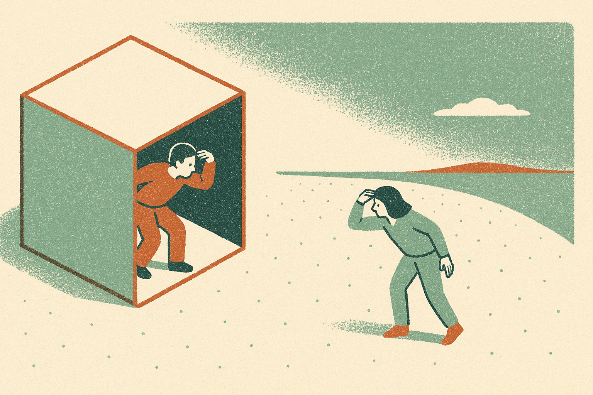
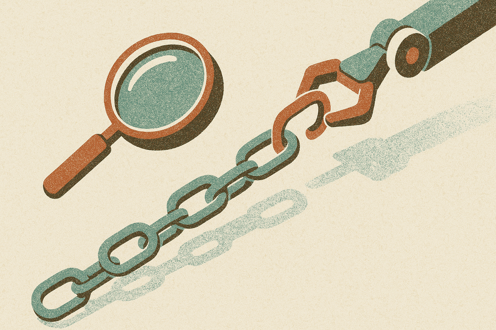

TL;DR: OpenAI reporting ten model-assisted advances in math and theoretical computer science is real progress worth taking seriously, but the word "advance" is doing a lot of work, and the useful question is not whether a model can do math but how much a human still has to steer.

The primary source here is OpenAI's blog post, "Ten advances in mathematics and theoretical computer science," which describes new results on long-standing open problems across geometry, cryptography, and complexity. That is the whole of what I have to work with, so I am going to be honest about where the source is thin and where I am reasoning past it. This is the kind of announcement that gets flattened into "AI solves math" within an hour of posting, and that flattening is where most people lose the plot.

## What did OpenAI actually claim?

OpenAI says its models contributed to ten advances on open problems in mathematics and theoretical computer science, spanning geometry, cryptography, and complexity theory. That is the claim. Ten results, three named areas.

What the blog post does not give me, at least in the material I have, is the crucial detail on each: was the model generating the key idea, filling in a proof a human sketched, or searching a space a human defined? Those are three very different things, and they get collapsed under the single word "advance."

This matters because "advance" in math has a wide range. It can mean closing a famous open conjecture. It can mean improving a known bound from one value to a slightly better one. It can mean finding a construction that was believed to exist but nobody had written down. All of these are real. Not all of them are the thing people imagine when they read the headline. Without the per-result breakdown, I would treat "ten advances" as ten data points of varying weight, not ten conjectures felled.

I want to be clear that skepticism about the framing is not skepticism about the work. Advances in cryptography bounds or complexity separations are genuinely hard, and if models are contributing at that level, that is a real shift from where we were two years ago, when the honest answer was that frontier models could barely keep a multi-step proof internally consistent.

## Why is this different from the competition-math results?

We have already seen models do well on olympiad problems and competition benchmarks. Those are impressive, but they are a fundamentally different category, and conflating the two is the most common mistake I see.

Competition problems have known answers. Someone wrote them, someone solved them, the solution exists in a book somewhere. A model doing well there is doing sophisticated pattern completion against a distribution of solved problems. Open research problems have no answer key. Nobody knows if the thing is true, and the search space is not bounded by "a clever high schooler could solve this in ninety minutes."

If OpenAI's ten results are on genuinely open problems, that is a step past benchmark performance into something closer to research contribution. The catch: research contribution is almost never a solo act by the model. In the cases I have seen described elsewhere in this field, the pattern is a mathematician posing the right sub-question, the model proposing candidate approaches, the human verifying and discarding most of them, and a proof emerging from that loop. That is real and it is useful. It is also not "the model solved it," and the marketing incentive always pushes toward the shorter, wronger sentence.

I would want to know, for each of the ten, whether the result has been checked by mathematicians outside OpenAI, whether it has been submitted for peer review, and whether the proof is machine-verifiable in something like Lean. Those are the receipts that separate a durable advance from a plausible-looking artifact. The blog post is the announcement, not the verification, and those are not the same event.

## What can an operator actually take from this?

If you are not a research mathematician, the direct application looks like zero. The second-order signal is what matters, and it is worth reading carefully.

The signal is this: models are getting good enough at long, verifiable chains of reasoning that they can contribute in a domain where being wrong is immediately caught. Math is unforgiving. A proof either holds or it does not. If models are producing anything durable there, it tells you something about their reliability on other tasks where the chain is long and the correctness is checkable.

That describes a lot of technical work. Migrating a codebase with a test suite that either passes or fails. Deriving a pricing formula you can validate against known cases. Working through a legal or compliance chain where each step has a clear rule. The common thread is verifiability. Where you can cheaply check the output, model reasoning becomes an asset even when it is wrong half the time, because you catch the wrong half. Where you cannot check cheaply, the same capability is a liability, because plausible and correct look identical until they do not.

So the practical read is not "models do math now." It is "models are getting better at problems with hard verification, and your leverage comes from building the verification, not from trusting the output." The math results are a proof of concept for a working style, not a product you can buy.

The honest bottom line: OpenAI has given us an announcement with ten claimed results and no per-result depth in what I can see, which means the right posture is interested but reserved. Wait for the outside verification. Watch whether mathematicians in those specific subfields nod or wince.

If you want to actually use this, do not chase math. Instead, audit your own workflows for tasks that are hard to do but easy to check, because those are exactly where this class of model reasoning pays off right now. Set up the checker first: a test suite, a reference case, a formal spec, whatever makes wrong answers visibly wrong. Then let the model grind on candidate solutions and keep only what survives the check. That is the loop OpenAI is almost certainly running behind these ten results, whether the post spells it out or not, and it is the one piece of this you can copy today. The catch most people miss: the value was never the model's cleverness, it was the verification wrapped around it, and if you skip building that wrapper you inherit all the confidence and none of the correctness.
