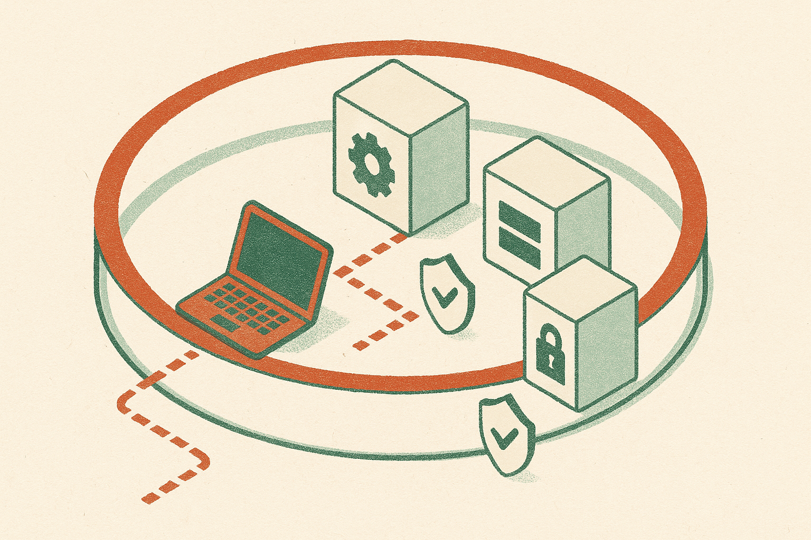

TL;DR: Tailscale can shrink the attack surface, but it cannot save an AI company whose internal services, secrets, or identities still trust the wrong thing.

## What did the Hugging Face discussion actually show?

The primary source here is the Hacker News thread titled “Tailscale didn't stop the Hugging Face intrusion.” That title is doing a lot of work. It does not prove Tailscale failed. It points at a more useful lesson: private networks are not magic walls.

This matters because AI companies have unusual blast radius. A normal SaaS breach is bad enough. An AI infra breach can touch model weights, training data, eval sets, fine-tuning pipelines, inference endpoints, customer prompts, API keys, private datasets, internal notebooks, and deployment credentials. Some of those are code. Some are data. Some are secrets hiding inside data.

Tailscale, and tools like it, are very good at replacing the old “open port plus VPN plus hope” setup. They make it easier to put services off the public internet. They make device identity and network access cleaner. That is real value.

But the network is only one layer. If a trusted developer device is compromised, the private network may faithfully connect the attacker to whatever that device can reach. If an internal app grants broad access after network admission, the app is now the weak point. If service tokens sit in notebooks, environment files, CI logs, or shared drives, the private network did not cause the failure, but it also did not stop it.

That is the distinction builders should keep in their heads. Tailscale can answer, “Is this device allowed to talk to that service?” It does not automatically answer, “Should this user be allowed to dump this model artifact at 2 a.m. from this workflow?”

## Where do AI teams usually overtrust the network?

The common mistake is treating “not publicly reachable” as “safe.” Those are not the same.

AI teams often move fast with shared infrastructure: Jupyter, internal dashboards, vector databases, object storage buckets, experiment trackers, model registries, CI runners, queue workers, and small admin tools written during a sprint. Many of these start as “just for the team.” Then they become production-adjacent. Then they hold credentials or point at systems that do.

A private network makes those tools less exposed. Good. But once a user or device is inside, the real question becomes authorization at the resource level. Can a contractor reach the model registry? Can a CI worker read production inference secrets? Can a research notebook mint long-lived cloud credentials? Can a support tool fetch customer prompt history without an approval trail?

This is where AI ops needs boring security discipline. Short-lived credentials. Per-service permissions. Separate environments. Human approval for sensitive exports. Logs that show who accessed what, not just which IP connected. Alerting on weird data movement. Fast revocation when a laptop, token, or account goes bad.

None of that is glamorous. It is also the difference between “an attacker touched one box” and “an attacker walked through the company.”

## What should replace the “VPN equals safe” mental model?

The better model is layered trust.

Network access should be necessary, not sufficient. Device posture should matter. User identity should matter. The app should still enforce permissions. Secrets should expire. Sensitive data should require narrower paths than ordinary internal tools. Model artifacts should be treated more like crown jewels than build outputs.

For AI builders, I would also add one extra rule: assume your development environment is part of production risk. Research machines, notebooks, eval harnesses, and demo apps often have surprising reach. They can call real APIs, read real datasets, or hold real tokens. That makes them attractive targets.

So yes, put internal services behind Tailscale or an equivalent private access layer. That is a sensible default. But do not stop there. The next question is whether each internal service can defend itself after the network says yes.

For builders, the practical move this week is simple: pick one sensitive AI asset, such as model weights, customer prompts, fine-tuning data, or production API keys, and trace every path that can reach it. Include laptops, notebooks, CI, dashboards, and support tools. Then remove one broad permission, shorten one credential lifetime, and add one useful audit trail. The catch most teams miss: the breach path usually does not look like a hacker smashing the front door. It looks like a trusted workflow doing something it was technically allowed to do.
