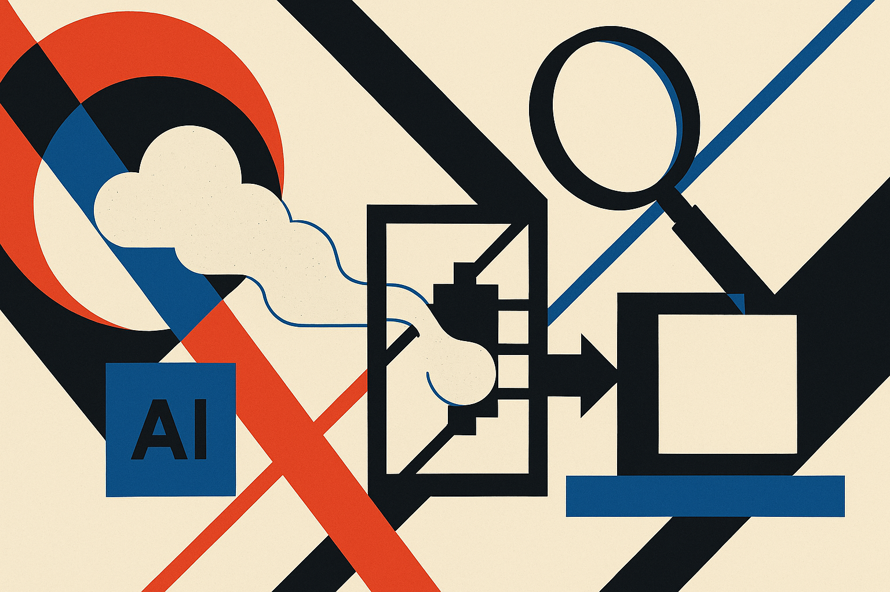

TL;DR: Treat the claimed GPT 5.6 disproof of the Maxwell Conjecture as a verification problem first, because model-generated math only matters when the proof artifacts survive independent checking.

## What exactly is being claimed?

The primary source here is the Hacker News submission titled “The Maxwell Conjecture Is False (GPT 5.6 Sol).” That is a compressed, high-voltage claim: a named mathematical conjecture, a negative result, and attribution to a model.

That does not make it wrong. It also does not make it true.

Hacker News is useful as an early signal. It shows what technical people are passing around, poking at, and arguing over. It is not a referee. A headline saying “GPT 5.6 Sol” tells us almost nothing about the important parts: the precise statement of the conjecture, the proposed counterexample or proof, whether the proof is formalized, whether domain experts have checked it, and whether the model actually generated the core insight or helped polish a human-discovered argument.

That distinction matters. AI-assisted math can be real without the marketing wrapper being clean. A model can suggest a construction, find a missing lemma, generate a proof sketch, or translate a human idea into a formal proof assistant. Those are different claims. They deserve different levels of credit.

The version number is not the receipt. The proof is.

## How should an AI-generated math claim be checked?

For a claim like this, I would want three layers before taking it seriously.

First, a clean mathematical artifact. Not screenshots. Not a chat transcript as the main evidence. A written proof with definitions, assumptions, and enough detail that a specialist can attack it. If the claim is a counterexample, the construction should be explicit enough to reproduce.

Second, independent verification. Ideally by people who know the conjecture and are not invested in the model story. AI-generated arguments often look locally plausible while hiding a gap in a reduction, an unstated regularity condition, or a quiet change in the problem statement. That is not a dunk on models. Humans do the same thing. The difference is that models can produce confident-looking connective tissue at scale.

Third, machine-checkable support where possible. Formal proof systems are not mandatory for every result, but this is exactly where they shine. If the claim can be encoded in Lean, Coq, Isabelle, or another proof assistant, the conversation changes. The model’s role becomes less mystical: it proposed steps, and a checker enforced the rules.

The interesting product pattern is not “AI proves theorem.” It is “AI proposes, tools constrain, humans audit, artifacts persist.” That is the workflow worth building around.

## What does this say about model reasoning?

The optimistic read is that frontier models are becoming useful collaborators in domains where correctness is harsh. Math is not forgiving. You cannot charm your way past a false lemma. If GPT 5.6, or any model, helped find a valid disproof of a serious conjecture, that would be a meaningful marker for AI-assisted research.

The sober read is that these claims are easy to overstate. A model can generate a promising proof sketch that later collapses. It can rediscover known work. It can solve a weakened version of the problem. It can be used by a human who did the key reasoning, then get headline billing because the model name travels farther than the mathematician’s process notes.

That is why I do not like treating these moments as model IQ scorecards. The better question is operational: did the system shorten the path to a verifiable result? Did it help search a space that humans found hard to search? Did it leave behind artifacts that others can check, reuse, or falsify?

For builders, the play is simple: if you are using models for hard reasoning, do not ship the answer, ship the checking loop. Capture the prompt trail, normalize the statement, force the model to produce verifiable intermediate claims, run external checkers where possible, and bring in a human reviewer before calling anything solved. The catch most readers miss is that the model’s most valuable output may not be the final proof. It may be the candidate structure that gives your verification system something concrete to attack.
