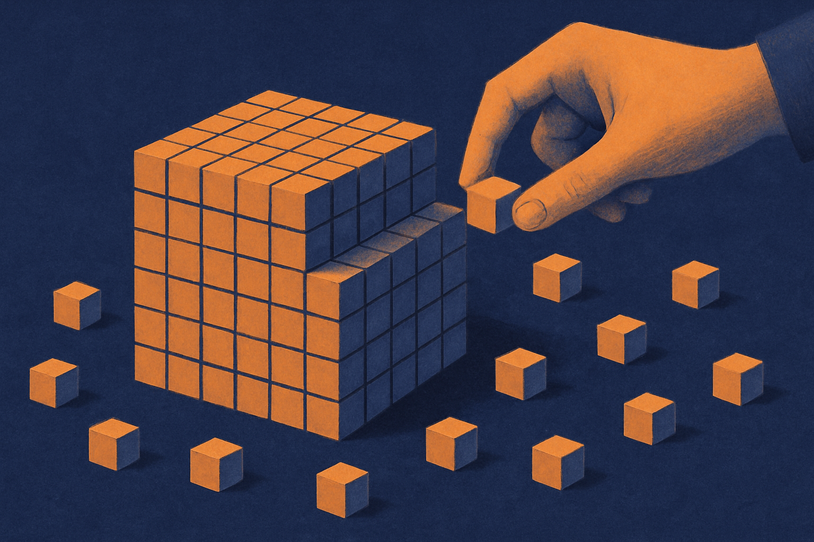

TL;DR: AI generates code that runs; it does not generate products that ship, and the distance between those two things is where most of the real work still lives.

A Hacker News thread going around, titled "AI doesn't generate working products, that's still your job," put words to something a lot of builders have felt for the last year but kept quiet about. The demo works. The generated component renders. And then you spend the next three weeks turning that into something a stranger can pay for without emailing you a bug report. That gap is not a temporary artifact of models being early. It's structural, and understanding why matters more than any prompt trick.

I want to be precise here, because this argument gets flattened in both directions. AI coding tools are genuinely good and getting better. I'm not doing the "it's all hype" routine. But "the model wrote working code" and "you have a working product" are separated by a set of problems the model was never trying to solve.

## What does "working" actually mean to a model versus a user?

When a model produces code, "working" means the snippet is syntactically valid, plausibly correct, and matches the pattern of a million similar snippets it trained on. It compiles. The happy path runs. For a function or a demo, that's the whole job.

A user's definition of "working" is different and much larger. It includes the input they typed that you didn't anticipate. The double-click that fires the request twice. The slow network that leaves a spinner spinning forever. The state that gets corrupted when they refresh mid-flow. None of these show up when you're watching a model generate clean output against a clean example.

This is the core mismatch. Models optimize for the modal case, the typical example, because that's what training rewards. Products live or die on the edge cases, the rare inputs, the failure modes that only appear at scale. The model has no incentive to imagine the angry user on a bad phone connection, because that user was never in the training signal for "generate a working login form."

So the code works in the sense the model meant. It doesn't work in the sense your users mean. Both statements are true, and the second one is the one that gets you a refund request.

## Why doesn't more context or a better prompt close the gap?

The intuitive fix is more information. Give the model your whole codebase, your requirements doc, your edge cases, and surely it produces the real thing. Context windows are huge now. Why isn't this solved?

Because the missing piece isn't information the model lacks. It's judgment about a system that doesn't fully exist yet. Product work is a sequence of decisions where each choice constrains the next: this data model makes that feature cheap and this other one expensive; this error-handling strategy is fine for ten users and a disaster for ten thousand; this auth shortcut is acceptable now and a security incident in six months.

Those decisions require holding the whole system, its users, its future, and its business constraints in your head at once and reasoning about tradeoffs that have no textbook answer. A model can help you enumerate options. It cannot own the consequence of picking one, because it doesn't carry the accountability that makes the tradeoff real.

There's a related trap. The better the generated code looks, the less you inspect it. Fluent output buys unearned trust. I've watched competent engineers ship a model's confident-looking function without reading it closely, then spend a day debugging something the model quietly assumed. The polish is real. The correctness is your problem. The nicer the surface, the easier it is to skip the check that would have caught the flaw.

## Where does the human actually add the value now?

If the model handles a large chunk of the typing, the obvious anxiety is that the human role is shrinking. I think it's the opposite. The role is moving up the stack, and the parts that move up are the parts that were always the hard, valuable ones.

Deciding what to build. Deciding what not to build, which is harder. Knowing which edge cases matter for this product and which are theoretical. Integrating five generated pieces into a coherent whole where the seams don't leak. Owning the security posture, the data model, the failure behavior, the thing the user feels at 11pm when something breaks.

The generation of individual pieces was never the bottleneck for good engineers. The bottleneck was assembly, judgment, and responsibility. AI compressed the cheap part and left the expensive part exactly where it was. If anything it raised the value of the expensive part, because now you can produce ten times more pieces that all need someone to make them cohere.

This is why "AI will replace developers" and "AI does nothing" are both wrong. It replaced a task. It didn't replace the job. The job was never the typing.

## What this means for how you actually work

Treat the model as a fast, tireless junior who produces plausible drafts and has zero accountability. You would never let that person ship unreviewed. Same rule.

Concretely: let the model generate aggressively, then spend your saved time on the things it can't do. Read the generated code as if a stranger wrote it, because effectively one did. Write the edge-case tests yourself, because you know your users and the model knows the modal case. Own the integration points, the data model, and the failure modes explicitly, because that's where the seams leak and no prompt will catch it for you. Keep a running list of the assumptions the model made silently, and check each one against reality.

The catch most people miss is a velocity illusion. AI makes the first 80% feel instant, which makes the remaining 20% feel like failure, like you're doing something wrong because the fast part stopped. You're not. That last stretch, the edge cases, the integration, the hardening, the judgment, is the product. It always was. The model just moved the starting line, not the finish. Ship accordingly, and don't let the speed of the draft fool you into thinking the hard part is optional.
