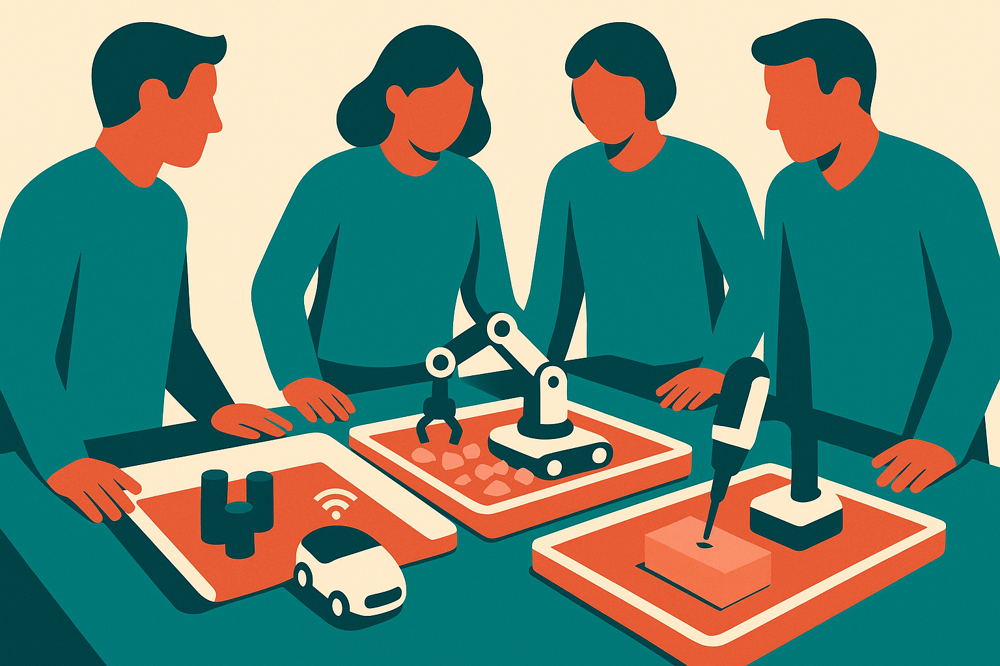

TL;DR: The hard part of work agents is not getting one model to act, it is letting a team supervise, rerun, hand off, and audit that action without turning every task into a bespoke chat transcript.

## What does “multiplayer” change?

The primary source here is the Hacker News item titled “qm – Multiplayer agent harness for work.” The supplied material gives only that title, so there is not enough to judge qm as a product. But the framing is useful.

Most agent tools still feel single-player. One user prompts. One model responds. Maybe it edits files, calls tools, opens a browser, writes a PR, drafts a report, or kicks off a workflow. That is fine for experiments. It breaks down at work.

Real work is shared. A support escalation has an owner, a reviewer, a customer context, a policy boundary, and a handoff. A sales research task may start with one rep, get corrected by a manager, then feed a CRM note. A code migration may need an engineer to scope, an agent to edit, CI to fail, another engineer to inspect, and the agent to retry with constraints.

“Multiplayer” should mean more than several people watching the same chat window. It should mean roles, state, permissions, checkpoints, comments, and durable task history. It should also mean the agent can be interrupted without losing the plot.

That is the missing layer between chatbots and production automation.

## What should an agent harness prove?

“Harness” is the other important word. A harness is not the agent. It is the rig around the agent.

For builders, that matters. The model will change. The browser tool will change. The coding assistant will change. The company’s tolerance for autonomous action will change after the first bad run. A useful harness should let the team swap models, constrain tools, replay runs, inspect logs, and compare outcomes.

If qm is trying to be that layer, the product question is not “does it have agents?” Almost everything has agents now. The question is whether it makes agent work operable.

Can a teammate see why an agent chose a path? Can a manager approve a risky tool call before it happens? Can a failed run be resumed from the useful part instead of restarted from a blank prompt? Can the same task template run across five customer accounts with visible differences? Can a human take over halfway through?

Those are boring questions. They are also the questions that decide whether an agent system survives contact with a team.

## Where does this fit in real work?

I would put multiplayer agent harnesses in the same bucket as internal developer platforms, workflow engines, and shared notebooks. They become valuable when the work is repeated often enough, uncertain enough, and high-stakes enough that plain automation is too rigid.

The trap is pretending every knowledge task needs this. It does not. If the task is one-off, low-risk, and personal, a chat interface is still faster. If the task is deterministic, a script or workflow engine is cleaner. The agent harness earns its keep in the messy middle: research, triage, migration, QA, ops, procurement, sales prep, incident follow-up, policy review.

That middle is where humans still need to steer, but models can carry a lot of the search, drafting, checking, and tool use.

For now, I would evaluate qm, or any tool with this pitch, by running one real shared workflow through it for a week. Pick something with handoffs and mistakes, not a demo task. Require saved runs, review points, clear ownership, and a way to compare agent output against the team’s current process. The catch most readers miss: the first win is usually not “full autonomy.” It is fewer lost handoffs, fewer repeated explanations, and a task record the next person can actually trust.
