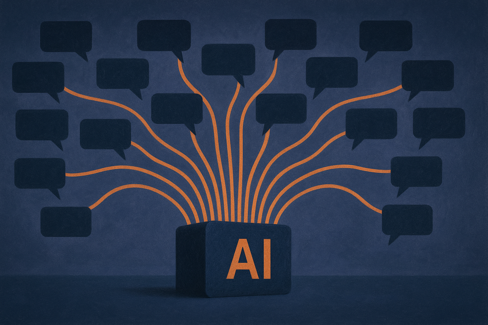
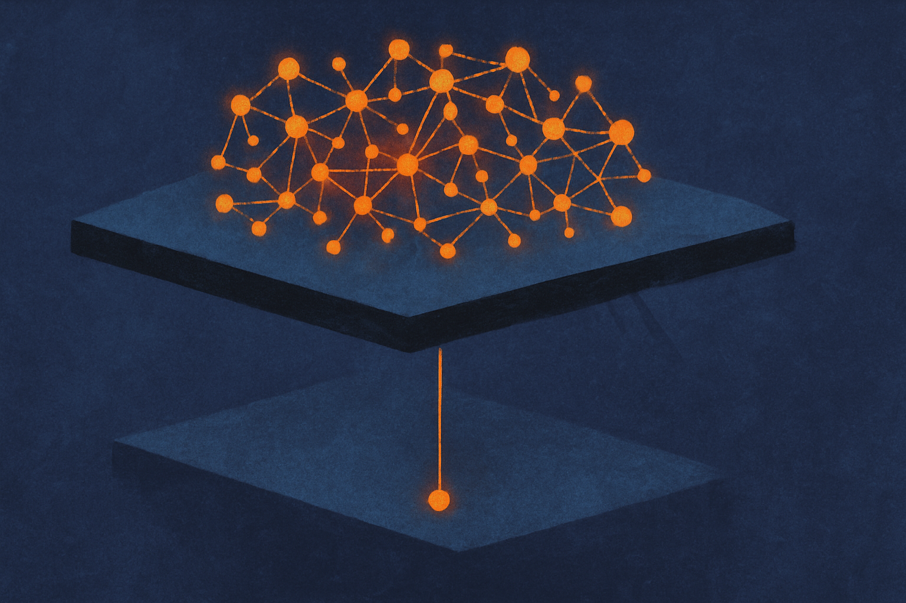

TL;DR: OpenAI catching a Cambodia scam ring on ChatGPT is a signal that model providers now run active abuse-hunting teams, and if you build on their APIs you inherit both their detection and their blind spots.

OpenAI published a report, "Disrupting a Criminal Scam Operation," describing how it identified and shut down a Cambodia-based operation that used ChatGPT to support investment fraud, romance scams, gambling schemes, and impersonation. That is the whole primary source here, and it is thin on operational detail, so I want to be careful about what we can actually conclude versus what I am inferring. The takedown is real. The lessons for builders are the interesting part.

## What did OpenAI actually catch?

The report names four abuse categories: investment fraud, romance scams, gambling operations, and impersonation. Cambodia is worth flagging specifically. The country has become a hub for industrial-scale "pig butchering" scam compounds, where trafficked workers run long-con romance-into-investment fraud at volume. If you have read reporting from the last two years on Southeast Asian scam centers, this fits the pattern exactly.

What ChatGPT adds to that operation is speed and polish. A scam that used to need a human who wrote passable English now needs a human who can paste a prompt. Translation, believable back-and-forth messages, fake investment prospectuses, romance-script variation across dozens of simultaneous targets. That is the labor the model absorbs.

What OpenAI does not say, and this is the part I would push on, is how many accounts, how much volume, or how they attributed the activity to one operation. "Disrupted" is doing a lot of work. It could mean banned accounts, or it could mean a coordinated action with law enforcement. The report leans toward the former reading based on how these disclosures usually go. Treat the scale as unspecified.

## How does a model provider even detect this?

This is where the report matters more than its details suggest. OpenAI is telling you, implicitly, that it runs pattern detection across usage. Not reading your individual chats for fun, but looking for signatures: clusters of accounts generating similar scam-shaped content, requests that map to known fraud templates, behavioral fingerprints across sessions.

That detection runs at the platform level. It sees things a single account never would, the same way a bank spots fraud rings by watching transaction patterns across millions of customers rather than one statement. A romance-scam prompt in isolation looks like fiction writing. A thousand near-identical ones across coordinated accounts looks like an operation.

For builders, the honest read is that this cuts two ways. The good: OpenAI is actively hunting large-scale abuse, which reduces the odds your platform becomes the go-to for scammers because the model provider is already watching. The catch: that same detection layer sits above your application, and you have almost no visibility into it or control over it.

## What does this mean if you build on these APIs?

You inherit the provider's abuse posture whether you want to or not. Two concrete consequences.

First, your legitimate users can get caught in the net. If you build a product that generates persuasive outbound messages (sales outreach, dating-app icebreakers, cold email, negotiation coaching), your traffic can look statistically similar to the exact abuse OpenAI is hunting. I have seen this with content-generation startups: a spike in flagged completions with no clear reason, because the model's classifier can't tell your sales rep from a pig-butchering script. The behavioral signature is close.

Second, you don't get the detection for free inside your own app. OpenAI catching scam rings at the platform level does nothing to stop a bad actor using your product as intended to generate one convincing scam message. Platform-level detection needs volume and repetition to fire. A single well-crafted abuse case walks right through. Your app is the layer responsible for that, and nobody upstream is covering it.

So if you're building anything that generates messages aimed at other humans, you need your own abuse controls. Rate limits per user. Content classifiers on your outputs, not just the provider's. Actual human review on flagged accounts. Know-your-customer friction proportional to how much damage your product could do in the wrong hands. The provider handles the scam ring; you handle the lone operator.

## Is this security theater or real signal?

Bit of both, and it's worth being clear-eyed. These takedown reports are partly a trust exercise. OpenAI, Anthropic, and Meta all publish them because they're under regulatory and reputational pressure to show the models aren't a free tool for fraud and influence ops. The reports are curated. You see the wins, not the misses, and never the base rate of how much abuse slips through undetected.

That said, the underlying work is real. Building a detection team that can attribute coordinated activity across accounts is genuine engineering, not a press release. The fact that OpenAI can point to a specific Cambodia operation means the pattern-matching works at least some of the time.

Where I stay skeptical: one disclosed takedown tells you nothing about the denominator. If scam compounds run on ChatGPT, Claude, Gemini, and a dozen open-weight models hosted on rented GPUs, shutting down accounts on one platform pushes the operation sideways, not out of business. Open models with no central provider to run detection are the obvious escape hatch, and the report says nothing about that gap because OpenAI can't police what runs on someone else's hardware.

The report is a data point that platform-level abuse hunting exists and occasionally works. It is not evidence the problem is contained.

If you're building on these APIs, treat OpenAI's detection as a backstop for coordinated, high-volume abuse, not as your abuse strategy. Assume your legitimate persuasion-adjacent traffic could trip their classifiers, so log completions and be ready to talk to your account rep when volume gets flagged. Then build the layer they can't: per-user rate limits, output classifiers tuned to your specific misuse cases, and human review on anything that looks like coordinated account creation. The scam ring is OpenAI's problem to catch. The single bad actor using your product exactly as designed is yours, and that's the one most builders never plan for until it shows up in a screenshot.
