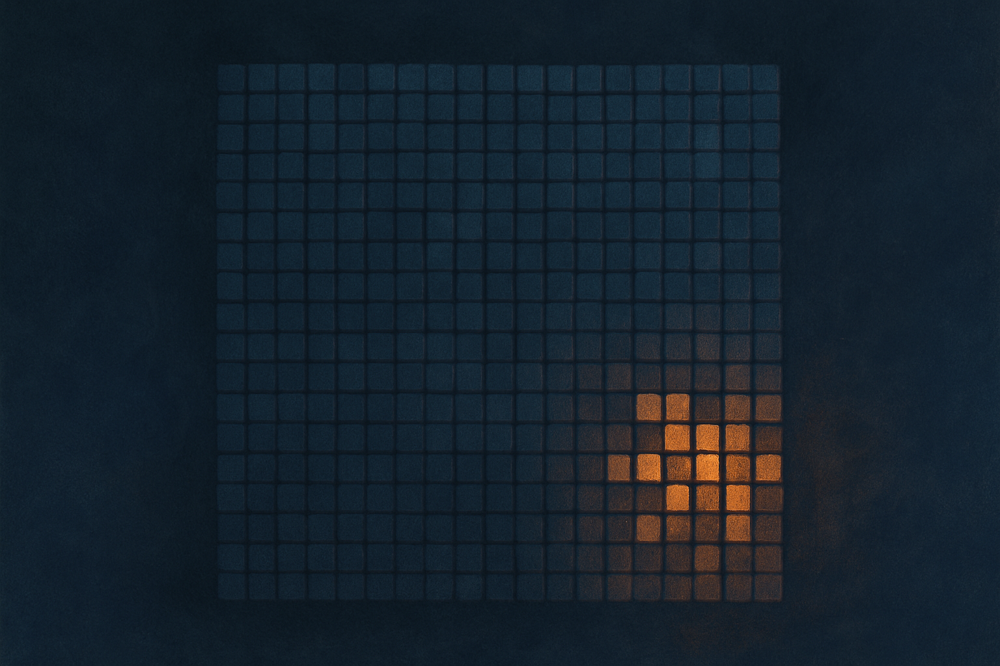
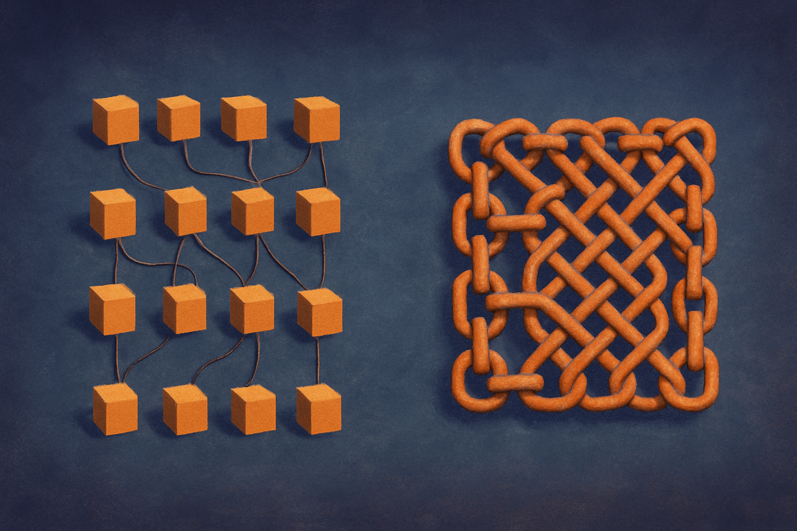

TL;DR: A LocalLLaMA user is chaining 16 DGX Spark units with 100GbE breakout links to run trillion-parameter open models at home, and the interesting part is not the flex, it's what the interconnect and memory math tell you about when local frontier inference is real versus a very expensive space heater.

The primary source here is a post by /u/ciprianveg on r/LocalLLaMA titled "Setting up of a 16xGB10 (DGX Spark) cluster," with a build described as 16 Asus GX10 nodes linked by a Mikrotik CRS804-4DDQ switch using four breakout cables splitting 400GbE into 100GbE. The stated goal: run open frontier models like DeepSeek V4 Pro, Kimi K3, and future ones like GLM 5.5 and Minimax M4, with the option to load 2T+ parameter models when needed. The phrase used is "AGI at home," with a wink. I'll take the wink seriously and the AGI part not at all.

This is one Reddit post, not a benchmarked writeup, so treat the performance implications as my analysis rather than measured results. But the build is specific enough to reason about, and it's a good lens on where local inference actually stands in mid-2026.

## What is this cluster actually built to do?

The core unit is the DGX Spark class device (the Asus GX10 is a Grace-Blackwell desktop machine in that family). Each node carries a unified memory pool, and the whole point of buying 16 of them is to stack that memory into something big enough to hold a model that no single consumer or prosumer box can.

Trillion-parameter open models are almost all mixture-of-experts now. DeepSeek's line, Kimi K2 before K3, GLM, Minimax: these are sparse. A 2T model might only activate 30 to 40 billion parameters per token. That matters enormously, because MoE is what makes this build plausible at all. You need the full weight set resident in memory, but you only compute a fraction of it per forward pass. Memory capacity is the wall you have to clear; raw compute per token is comparatively modest.

So the design goal is coherent: pool enough unified memory across 16 nodes to hold a 2T-parameter sparse model, then route each token to the handful of experts that need to fire. The user even notes the more common plan is running two models on two separate 8-node halves, which is the smarter default. The full 16-node monster is the occasional stunt, not the daily driver.

## Why the interconnect is the whole ballgame

Here's the part most people skip when they fantasize about home clusters. The GPUs are not the bottleneck. The wire between them is.

When you split a model across 16 machines, every token's journey crosses node boundaries. In an MoE setup, tokens get dispatched to experts that may live on a different physical box, and the activations have to travel there and back. That's an all-to-all communication pattern, and it's brutal. It scales badly and it punishes any latency or bandwidth shortfall mercilessly.

The build uses 100GbE per node off a Mikrotik switch with 400GbE breakouts. That's serious networking for a home. It is also nowhere near what NVIDIA's own datacenter racks use. NVLink and the switched fabrics inside a real GB200 rack move data at terabytes per second between chips, not 100 gigabits. The gap between 100Gb Ethernet and an NVLink domain is not a rounding error. It's one to two orders of magnitude, and it lands directly on the operation that MoE inference does most.

What this means in practice: expect this cluster to run big models, and expect it to run them slowly for interactive use, especially at low batch sizes where you can't hide the communication cost behind parallel work. Batch throughput will look better than single-stream latency. If the goal is "I typed a prompt, how fast do tokens come back," the interconnect tax shows up immediately. If the goal is "grind a large batch of offline jobs overnight," it looks a lot more reasonable.

## Is this cheaper than just renting an API?

Almost certainly not, if you're comparing dollars per token against a hosted endpoint. Sixteen Grace-Blackwell desktop units plus a high-end switch and optics is a five-figure build, probably deep into it, before you count power and the time to make heterogeneous inference software actually work across nodes. DeepSeek and Kimi endpoints on hosted providers are cheap per million tokens. On pure economics, renting wins for most workloads and it isn't close.

So why build it? Three real reasons, none of them cost.

Data control is the honest one. If your inputs can't leave your network, for legal or contractual or paranoia reasons, then "just use the API" isn't an option and the whole calculus changes. You're not buying tokens, you're buying the property that no token ever leaves the room.

Availability and independence is the second. Open weights on your own metal don't get deprecated, rate-limited, silently swapped for a distilled version, or fenced behind a new safety layer mid-project. For research and long-running agent workloads, that stability has value that per-token pricing doesn't capture.

And the third reason is that it's a lab. The person building this is learning multi-node MoE serving, RDMA-class networking, and model sharding at a level you cannot get from clicking an API. That skill compounds. "AGI at home" is a joke, but "I now understand exactly where distributed inference breaks" is a genuinely marketable outcome.

## What should a builder take from this?

Match the tier of your build to the model class you actually run. Most people reading this do not need 16 nodes. A single DGX Spark class box, or two, already runs quantized 30B to 100B-active MoE models at usable speeds, and that covers the large majority of real local work. The jump to a 16-node fabric is specifically about holding 2T-parameter weight sets, and if you're not routinely running those, you're buying interconnect complexity you'll fight more than use.

If you do go multi-node, the order of operations is: nail the network first, weights second. Get your RDMA or high-bandwidth Ethernet path clean and measured before you obsess over which model to load, because a badly wired cluster turns a great model into a slow one and you'll blame the wrong layer. Test with a smaller MoE across two nodes and measure your all-to-all latency before you commit to sixteen. The catch most readers miss is that the headline "runs 2T models" says nothing about tokens per second, and for interactive use, tokens per second is the number that decides whether the whole rig is a tool or a trophy. Build it to grind batches, not to chat, and it earns its keep.
