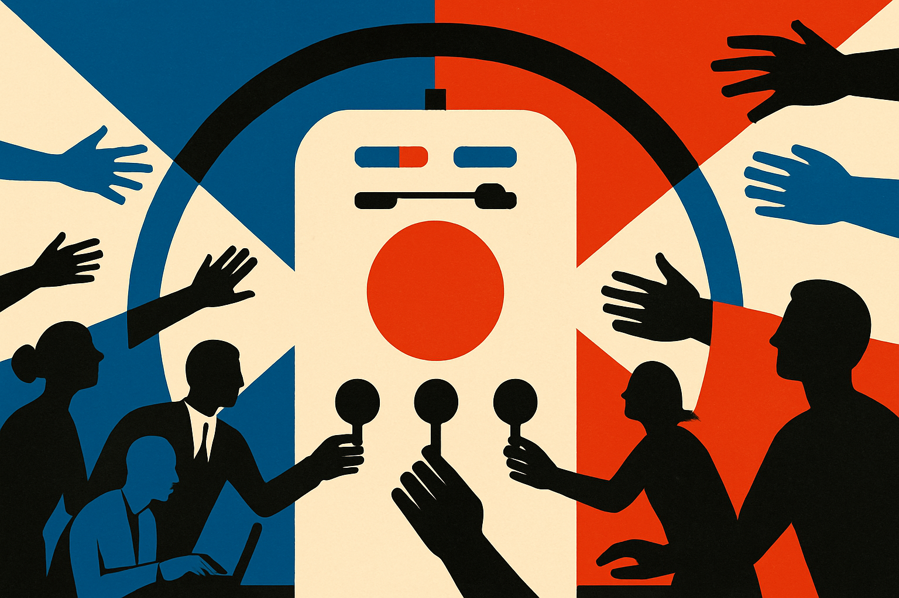

TL;DR: The trust problem is not ignorance, it is exposure without agency.

## Why would knowing more about AI make people like it less?

Decrypt’s “The More Americans Know About AI, the Less They Like It: Gallup” reports a finding that should make builders uncomfortable: Gallup says Americans are becoming more skeptical of AI, and that people who know more about it are less favorable toward it.

That cuts against the standard tech industry reflex. The usual move is to say the public just needs better education. Explain the tools. Show the productivity gains. Run a demo. Put a chatbot in the workflow and let people see the magic.

Gallup’s signal suggests that may not be enough. Awareness is not automatically reassurance. If people learn about AI mostly through layoffs, automated customer support, murky business deployments, and claims that whole categories of work are about to be “reimagined,” they are not being irrational when they get more skeptical.

They are reading the room.

The key distinction is exposure versus agency. A person can know AI is useful and still dislike the way it is being rolled out. A worker can use a coding assistant or writing tool and still worry that management sees it as a headcount argument. A customer can appreciate a faster answer and still hate being trapped behind a bot when the stakes are high.

That is not anti-technology. It is a rational response to asymmetric control.

## What are people actually reacting to?

Decrypt reports that Gallup found rising concern around job losses, business use of AI, and AI’s broader impact. Those three concerns are connected.

Job loss is the obvious one, but “business use” may be the more important phrase. Most people are not deploying frontier models. They are having AI deployed on them. In hiring screens. In support queues. In productivity monitoring. In content feeds. In insurance, banking, education, and workplace software.

The public story says AI is a tool. The lived experience often feels like AI is a policy decision made somewhere else.

That is where a lot of the backlash comes from. Not from the model architecture. Not from whether the system is open-weight or closed. From the question: who gets to decide when AI is used, what it is allowed to do, and what happens when it is wrong?

The industry also has a messaging problem of its own making. Too much AI marketing still sounds like replacement math. Fewer agents. Fewer analysts. Fewer designers. Fewer junior employees. Even when the product is genuinely helpful, the sales pitch often tells workers they are the cost center being optimized.

Then executives wonder why adoption meets resistance.

## What should builders do with this?

The bad response is to treat skepticism as a branding issue. Better website copy will not fix a rollout that removes discretion, hides automation, or gives users no recourse.

The better response is product design with social context. Tell people where AI is being used. Tell them what it is not used for. Give them a human handoff when the decision matters. Keep logs. Make appeals possible. Separate assistive use from automated decision-making. Do not bury the important parts in policy language nobody reads.

For internal tools, involve the people whose work will change before the procurement contract is signed. Ask what would make the system useful, and what would make it threatening. Those answers will be more practical than another executive offsite about transformation.

For customer-facing tools, measure trust after failure, not after first use. Everyone likes a fast answer when it is correct. The real test is what happens when the model misunderstands a bill, rejects a claim, gives the wrong instruction, or loops the user into nonsense. That is where public opinion is formed.

Practitioner’s take: if you are shipping AI into a company or product, do not assume familiarity creates trust. Run a small deployment where users can see, correct, and override the system. Track which tasks people keep using after the novelty wears off. The catch most teams miss: the model may work fine, while the rollout still teaches people that AI means less control.
