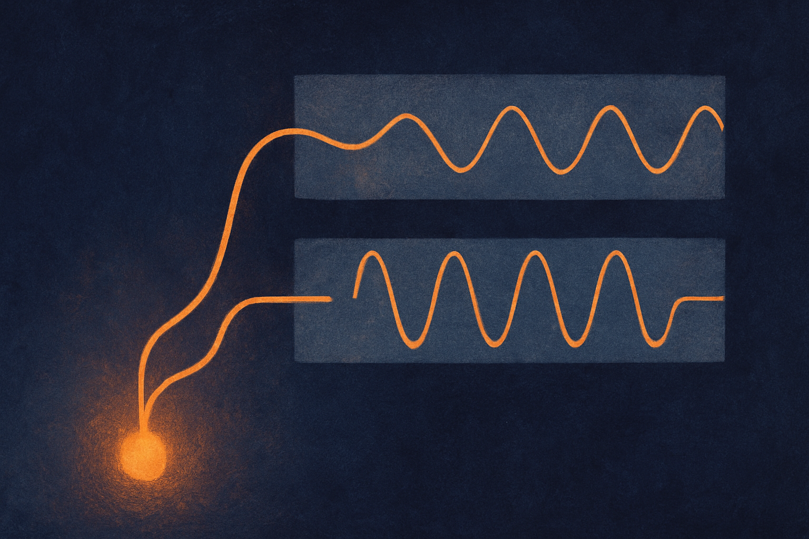
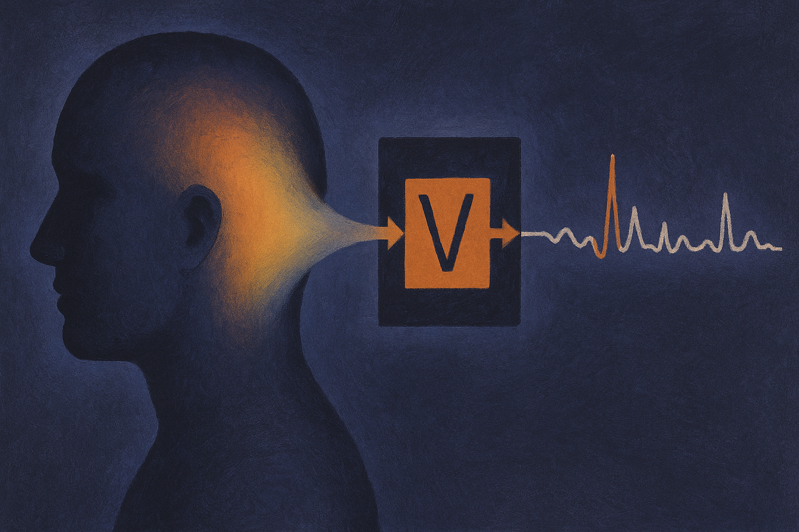

TL;DR: CENDRe explains what a time-series CNN is looking at in both time and frequency, picks the number of concepts for you, and aligns its highlights with the regions the model actually uses, which matters most for people doing fault diagnosis and other critical-domain classification.

The paper is "CENDRe: Concept Extraction with Natural Domain Representations," posted to arXiv under both cs.AI and cs.LG. It targets a narrow but real problem: you have a convolutional net classifying time-series data, it works, and you have no principled way to say why. In a lab demo that is fine. On a factory floor diagnosing bearing faults, it is not.

## What problem is CENDRe actually solving?

Concept extraction is the idea that a trained model's latent space contains recurring patterns, "concepts," that you can pull out and inspect. Instead of a heatmap that says "the model cared about this region," you get named, reusable patterns and a score for how much each one pushes a given class.

For time-series specifically, the authors call out three limitations in existing concept extraction methods, and this is the useful part because it tells you exactly what was broken.

First, prior methods work only in the time domain. If your signal's meaning lives in its frequency content, and for rotating machinery, audio, vibration, and a lot of sensor data it does, a time-only explanation is describing the wrong axis. You see when something happened but not the spectral signature that defines it.

Second, they make you predefine the number of concepts. You guess K, you rerun, you eyeball the results. That guess quietly shapes everything downstream.

Third, and this is the one that quietly undermines trust, the localizations they produce are often misaligned with the regions the model uses. The explanation points somewhere the model was not actually looking. An explanation that does not match the model's behavior is worse than none, because it looks credible.

## How does CENDRe work under the hood?

Three stages, and each maps to one of those three limitations.

It discovers concepts by clustering per-timestep latent representations in two stages, with a silhouette-guided aggregation step that selects the number of concepts automatically. Silhouette score is a standard clustering metric for how well-separated your clusters are, so instead of you picking K, the method uses cluster quality to settle on it. That removes the guessing.

It localizes each concept through gradients of a presence score. The presence score contrasts the latent representations against learned prototypes for each concept, and the gradient of that score tells you which parts of the input drive the concept's presence. The result is a mask that concentrates on the regions actually responsible, which is the authors' answer to the misalignment problem. The localization is tied to the model's own signal, not to a separate saliency heuristic bolted on after.

Then comes the piece I find most clever. Those same gradients get propagated through a differentiable invertible mapping of the input, such as a Fourier transform. Because the mapping is differentiable and invertible, the gradient information flows cleanly into the frequency domain and you get localizations for the same concepts as frequency bands. One concept, two views: where in time, and where in the spectrum. That is the "natural domain representations" in the name.

Finally each concept gets a relevance score quantifying its contribution to each class, so you can rank which patterns matter for which output.

## Does it hold up, and where?

Two evaluation settings, and I read the results as solid-but-honest rather than a blowout.

On synthetic benchmarks, CENDRe reaches representation correctness comparable to state-of-the-art concept extraction methods, and significantly higher importance correctness. Read that carefully. On finding the right concepts, it ties the field. On correctly scoring how much each concept matters, it pulls ahead. The importance gap is the meaningful claim, because a method that finds the right patterns but misjudges their weight will still mislead you about why the model decided what it did.

The real-data test is bearing-fault diagnosis. Bearings are a well-studied case with known physics: specific defect frequencies show up when a race, ball, or cage fails, and diagnostic engineers already inspect specific frequency bands for them. CENDRe extracted the frequency bands driving the model's predictions, and those bands landed in regions commonly inspected for fault diagnosis. That is the tell that matters. When an explanation method independently rediscovers the bands human experts already look at, it is producing evidence you can check against domain knowledge, which time-domain methods structurally cannot give you here.

I want to be measured. This is one real dataset in a domain that is unusually friendly to frequency analysis. The paper does not claim a universal win, and the "comparable" on representation correctness is a fair signal that this is an addition to the toolbox, not a replacement for everything.

## Who should care about this?

If you build or audit models in a critical domain with periodic or spectral signals, this is directly relevant. Predictive maintenance, medical signals like ECG and EEG, power systems, structural monitoring, anything where "which frequency" is a first-class question your domain experts already ask.

The broader point is where interpretability is heading. The trend that works is explanation methods tied to the model's own computation and expressed in the vocabulary the domain already uses, rather than generic heatmaps that force a human to translate. CENDRe does both: gradients anchored to the model's presence score, and a frequency view that speaks the same language as the engineer reading it.

Practitioner's take: if you have a time-series CNN in production and your domain experts think in frequencies, this is worth a pilot on data you already understand, because the fastest way to trust an interpretability method is to run it where you know the right answer. Bearing data, ECG, motor vibration, anything with published defect or diagnostic frequencies. Check whether CENDRe's bands land where your experts say they should. If they do, you have earned trust to point it at cases you do not understand yet. The catch most readers will miss: "comparable" representation correctness means concept discovery is roughly at parity with existing methods, so the actual edge here is importance scoring and the frequency-domain view, not concept-finding itself. Do not adopt it expecting better concepts. Adopt it because it tells you how much each concept matters and shows you the spectrum, which is exactly the gap that made time-domain explanations unusable for spectral problems. And validate the auto-selected concept count on your own data before you rely on it, because silhouette-guided selection is a heuristic, not a guarantee.
