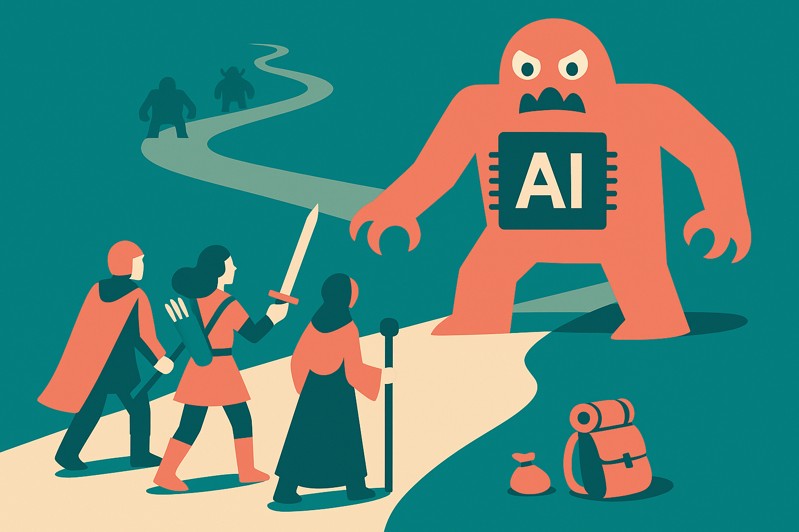

TL;DR: DungeonBench is useful because it tests tactical discipline over time, where today’s frontier models can look competent in one fight and still waste resources badly across a day.

## What does DungeonBench actually test?

The primary source is the arXiv paper titled “DungeonBench: A Benchmark for Rules-Rich Tactical Reasoning in Dungeons & Dragons Combat,” listed under cs.AI and cs.LG. The setup is Dungeons & Dragons combat using the 2014 System Reference Document, with a simulator resolving a large slice of combat-relevant rules.

That matters because many agent benchmarks flatten the hard parts. They ask for a plan, a text answer, or a move in a simplified game state. DungeonBench keeps more of the annoying stuff: battlefield geometry, action economy, creature traits, timing windows, spells, reactions, objectives, preparation, consumables, and scarce resources.

At each step, the system gives the policy a complete tactical observation, a pending decision, and an indexed list of legal executable options. That last part is important. The model is not being asked to invent a valid D&D action from prose. It is being asked to value legal choices.

This turns the benchmark into a cleaner test of judgment. Given the state and the allowed moves, can the policy pick the right thing? Can it decide when to hold a spell slot, when to move, when to attack, when to react, when to rest, and when to trade present advantage for future survival?

That is closer to real agent work than it may sound. Most production workflows are not pure chat. They are constrained decision loops with tools, permissions, budgets, deadlines, and consequences.

## Why does the “Day” track matter more than the single fight?

DungeonBench has two tracks. Encounter measures local tactical play in one fight. Day links encounters together through persistent hit points, spell slots, consumables, preparation, and short-rest timing.

The paper reports the interesting failure mode plainly: frontier language-model policies often win direct encounters, but linked encounter days expose failures in resource budgeting, rest timing, and rule-aware tactical discipline.

That is the whole story.

A model can look smart when the task is “win this fight.” Burn the good spell. Use the scarce item. Take the flashy action. If the reward is local, that can work.

But if the task is “survive the day,” the same behavior becomes brittle. The policy needs to estimate future risk, not just immediate board advantage. It needs to understand that a legal move can still be a bad move. It needs restraint.

This is where a lot of agent demos fall apart too. The agent completes the first step with confidence, then burns API budget, fills the context with junk, calls tools too often, or takes irreversible actions because the local objective was overfit. “Got the answer” is not the same as “managed the run.”

The abstract does not provide specific win rates or a full ranking table, so I would not treat DungeonBench as a model leaderboard yet. The useful claim is narrower: full tactical observations do not saturate the benchmark. Even with the state spelled out and legal moves enumerated, the best policies still struggle when the cost of a choice carries forward.

## Why use Dungeons & Dragons instead of another benchmark?

D&D is messy in a productive way. It is not just chess with fantasy names. The rules are conditional. The board matters. Abilities interact. Timing matters. There are short-term and long-term resources. Objectives may differ from “kill everything as fast as possible.”

That makes DungeonBench a good fit for testing agents that need to operate under rules rather than vibes.

The paper also says the same engine-generated decision stream can support heuristic controllers, language-model policies, learned option rankers, and masked-action reinforcement-learning agents. That is the right shape. A useful benchmark should let different approaches compete on the same decision points, not only reward one interface style.

I would still watch for two limitations. First, D&D rules are formal compared with the real world. The simulator knows what is legal. Many business processes do not. Second, tactical combat is not the same as research, coding, sales ops, or incident response. Transfer is an assumption, not a guarantee.

Still, this benchmark points at a better evaluation habit. Don’t only ask whether a model can solve the current step. Ask whether it can preserve optionality, respect constraints, and avoid spending tomorrow’s budget to look smart today.

Practitioner’s take: if you are building agents, steal the pattern, not the fantasy setting. Give the agent a complete state, a list of legal actions, scarce resources, and a multi-step objective where early wins can create later failures. Then score the whole run, not the prettiest turn. The catch most teams miss is that bad agents often fail from impatience, not ignorance.
