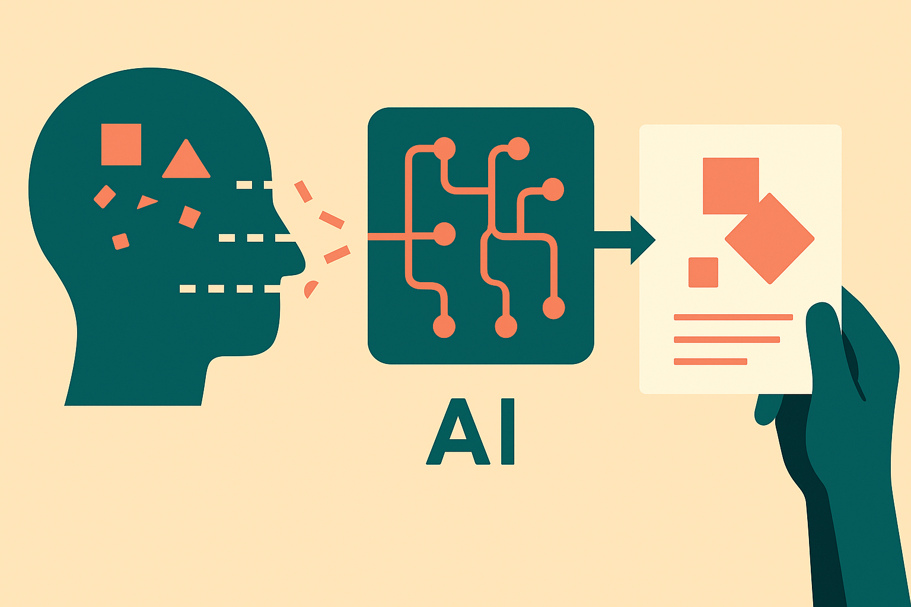

TL;DR: The useful idea in EPC is simple: a good explanation should be small enough to understand and still preserve the model behavior it claims to explain.

## What does EPC actually measure?

The primary source here is the arXiv paper **"A Human-Centered Validation of the Explainability-Performance Coefficient"**. It proposes an EPC score, extending the Explainability-Performance Coefficient, as a model-agnostic way to judge explanation quality.

The core trade-off is the right one. If an explainer highlights half the input, it may preserve model performance, but it has not explained much. If it highlights one token, one pixel patch, or one feature, it may be tidy, but it may destroy the model’s original prediction. EPC tries to score the middle: sparse feature selection plus preserved model performance.

That sounds dry. It is not.

A lot of explainability tooling still fails at this exact point. Saliency maps look persuasive. Feature importance charts feel useful. Token highlights are easy to show to a stakeholder. But many of them are artifacts of the explainer, the model architecture, or the input representation. They tell a story. EPC asks whether the story still works when you keep only the parts the story says matter.

That is a better bar.

## Why does human validation matter?

The paper reports empirical validation across tabular, text, and image modalities. That matters because explainability often overfits to one demo format. A feature attribution method that seems sensible on structured data can become mush on images. A token explanation that looks good in sentiment analysis may not transfer cleanly to another task.

The more interesting claim is that higher EPC scores aligned with independent human-based explanations, including human lexical sentiment judgments and spatial visual annotations. I would not read that as “EPC proves what humans think.” Humans are inconsistent, task framing matters, and many real production decisions do not have clean human annotation targets.

But it is still a meaningful test. If a metric says an explanation is high quality, and humans mark totally different evidence, someone needs to explain the gap. Sometimes the model found a real non-human pattern. Sometimes the explainer is broken. Sometimes the dataset is full of shortcuts. EPC gives teams a way to surface that conversation with more structure than “this heatmap looks plausible.”

The paper also says EPC uncovers operational dependencies among network activations, data dimensionality, and explainer performance. Translation for builders: the quality of an explanation is not just about the explainer. It depends on the model internals and the shape of the data. That is annoying, but true.

## Where would this help in real systems?

I would use EPC less as a dashboard vanity metric and more as a regression test for explanations.

Say a bank, hospital, insurer, marketplace, or compliance-heavy SaaS team has an existing model and an explanation layer. Today, a model update can improve accuracy while quietly degrading explanation quality. Or an explainer update can produce cleaner-looking outputs that no longer preserve the model’s actual behavior. EPC gives you a way to test that drift.

It also gives product teams a way to compare explanation methods without pretending that prettier is better. If one method selects fewer features but keeps the prediction mostly intact, and another produces dense, noisy attributions, you have a grounded reason to prefer the first. Not the only reason. But a real one.

The catch is that EPC is still a metric, not a guarantee of trust. It does not solve causal explanation. It does not tell you whether the model should be used. It does not replace domain review. It can also reward explanations that preserve bad behavior if the underlying model is using biased or spurious signals.

Practitioner’s take: try EPC as part of an explanation evaluation suite, especially before shipping XAI into regulated or high-stakes workflows. Compare explainers on sparsity, preserved performance, and alignment with human annotations where you have them. The missed catch is that explanation quality should be tested after every model or data change, not just once during a demo.
