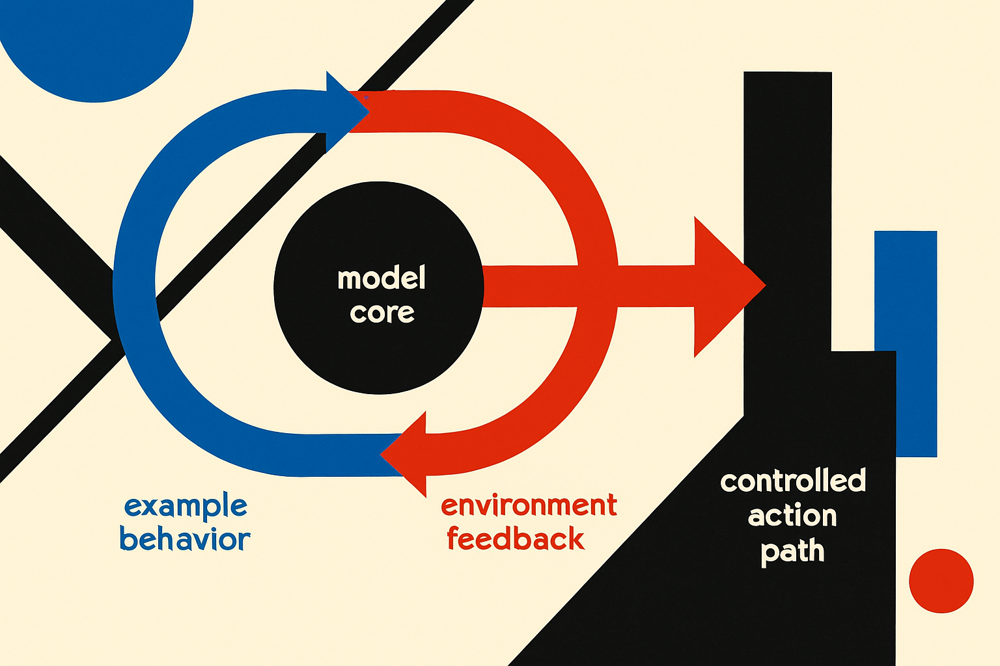

TL;DR: The next practical AI gains are coming less from bigger base models and more from post-training that teaches models when to plan, check, adapt, and break from imitation.

## What changed if the model did not get bigger?

My primary source here is Two Minute Papers’ “Another DeepSeek Moment Has Arrived,” which argues that DeepSeek’s latest flash model made a large jump without changing the underlying architecture or model size. Two Minute Papers said several benchmark results more than doubled, one improved by 7x, and the new flash model even beat the larger pro model, described as roughly five times bigger.

That is the important part. Not “bigger model gets better.” We know that story.

The claim is that the same base model got much better because the post-training changed.

If that holds up across real workloads, it is a very big deal. It means the raw knowledge was already inside the model, but the model was bad at choosing the right move. Post-training becomes the playbook layer: when to reason longer, when to call a tool, when to check an answer, when to backtrack, when to stop.

This also explains why benchmark jumps can look shocking. A base model can know a lot and still fail because it uses its abilities in the wrong order. A better post-training recipe can make the same “brain” look newly intelligent.

I would still separate the signal from the sizzle. Two Minute Papers is excited, maybe very excited. Benchmarks are not production. A model that wins on math, coding, or reasoning sets can still be annoying in an agent loop, weak at instruction nuance, or expensive to host locally. But the pattern is hard to ignore: model behavior is becoming a first-class artifact.

## Why is copying humans not enough?

The same idea shows up in Two Minute Papers’ “NVIDIA's AI Learns Why Copying Humans Isn't Enough.”

That work is about a virtual parkour character trained from only 19 clips, about 30 seconds of internet parkour. Pure imitation gives you nice human-looking motion, but it is brittle. The character can copy moves, then fail when the obstacle arrangement changes. Pure goal-seeking has the opposite problem. It may finish the level, but it stops looking human.

The NVIDIA approach, as described by Two Minute Papers, puts the controller in two classrooms at once. One teaches it to imitate human motion. The other teaches it to solve obstacle courses. A judge scores whether the motion looks human and fits the obstacle context, while the controller learns to fool that judge and still reach the destination.

That is not just animation research trivia. It is the same operator lesson in a different body.

Imitation is not enough. Goal optimization is not enough. You need a policy that can preserve taste, style, and constraints while adapting to the situation in front of it.

## What should operators change now?

For builders, this shifts the question from “which model has the biggest score?” to “what behavior have we actually trained into the system?”

A customer-support agent does not just need knowledge of the refund policy. It needs escalation judgment. It needs to notice when the user is angry. It needs to avoid over-answering. It needs to recover when a tool call fails.

A coding agent does not just need Python knowledge. It needs a repair loop. Run tests. Read the error. Make the smallest fix. Run again. Stop when green. Explain only what matters.

A research assistant does not just need retrieval. It needs source discipline. Separate claims from evidence. Mark uncertainty. Refuse to smooth over conflicts.

That is post-training thinking, even if you are not training weights. You can build some of it with prompts, evals, tool contracts, synthetic traces, preference data, and workflow tests. The point is to define the moves, not just admire the model.

Practitioner’s Take: pick one workflow where your model already “knows” the answer but often acts poorly. Instrument the failures. Is it skipping checks, choosing tools too early, copying examples too literally, or failing to recover? Then build a small behavior eval around that loop before swapping models. The catch most teams miss: the win is usually not more knowledge. It is teaching the system the right sequence of actions under pressure.
