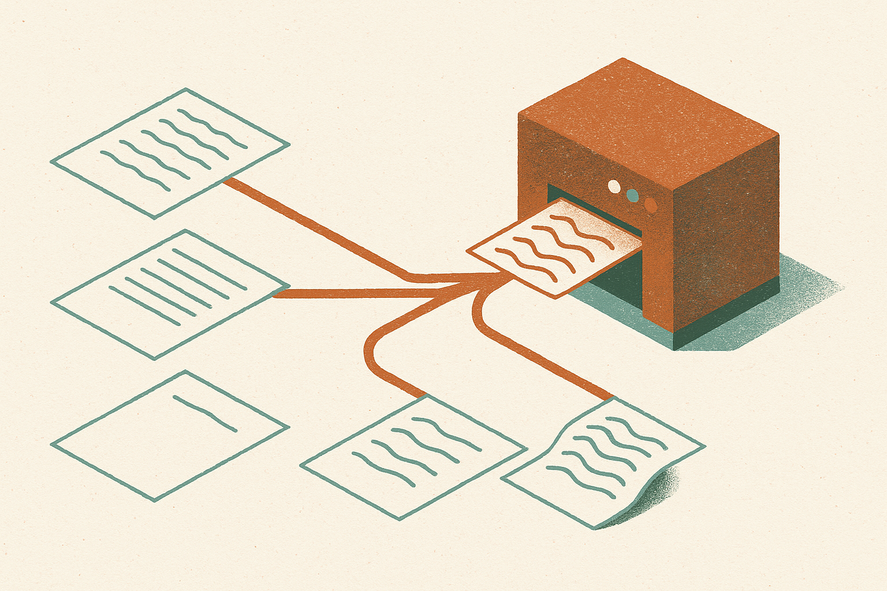

TL;DR: AI-text detectors that catch 90%+ of pure LLM output collapse to 15-31% recall on human writing that an LLM rewrote, which means the scores schools and employers rely on don't measure the case they actually care about.

The paper is "ARB: A Matched Authorship-Rewriting Benchmark Dataset for AI-Text Detector Evaluation," posted to arXiv under both cs.AI and cs.CL. It does something most detector research skips: it separates who wrote the ideas from what model last touched the text. That distinction turns out to be the whole game.

## What does the ARB benchmark actually test?

Most AI-detection benchmarks are binary. Human wrote this, or a model generated it from scratch. You measure how often the detector calls the machine text machine. Clean, but naive, because it doesn't match how people actually use LLMs in 2026. Almost nobody types "write my essay" and pastes the raw output. They write a draft and ask the model to clean it up. Or they generate a draft and rewrite it themselves.

ARB models this with four variants built from the same 1,800 human source texts, 600 each from XSum, WritingPrompts, and OpenWebText. For each source item you get:

- HUMAN: the original human writing.
- Free-LLM: text the model generated directly, the conventional benchmark case.
- H2L: human text that an LLM rewrote.
- LLM2L: LLM text that the same model rewrote.

Four generators produce these variants: Llama-3.2-3B, Qwen2.5-7B, Mistral-7B, and Gemma-2-9B. All open-weight, which matters because the authorship signal is reproducible instead of hidden behind an API.

The matched design is the clever part. Because every variant traces back to the same source text, you can isolate the effect of a single factor: was the underlying content authored by a person or a machine, holding the rewriting step constant. That's the question a plagiarism officer or an editor is actually asking, and no standard benchmark answers it.

## How badly do detectors miss human text an LLM rewrote?

The numbers are stark, and they were measured at a strict operating point: TPR@1%FPR, meaning the detector is tuned to flag at most 1% of genuine human text as fake. That's the responsible setting. You don't want to accuse innocent students, so you accept lower recall in exchange for very few false positives.

At that setting, FastDetectGPT caught 91.2% of direct LLM text and Binoculars-falcon-7b caught 93.5%. Textbook strong performance. Then ARB fed them H2L, human writing an LLM rewrote. FastDetectGPT dropped to 30.8%. Binoculars fell to 15.1%. That's a decline of 60 to 78 percentage points on the case that most resembles real-world AI-assisted writing.

RADAR shows the same collapse, 66.8% down to 12.2%. Two of the five detectors, BERT-Defense and RoBERTa-Defense, stayed below 3% recall across every regime, which is a polite way of saying they didn't work at all under this evaluation.

Here's the twist that makes the paper worth reading twice. When the same models rewrote LLM-generated text (the LLM2L variant), the detectors mostly held up. FastDetectGPT kept 78.3% recall, Binoculars kept 83.0%. That's a drop of only 10 to 13 points from the direct case.

So it isn't the rewriting that fools the detector. Both H2L and LLM2L went through the same paraphrasing step with the same model. The difference is the origin. Detectors are keying off the statistical fingerprint of the human's underlying word choices and structure, and a rewrite doesn't fully erase that fingerprint. When the source was human, enough humanness survives the rewrite to fool the detector. When the source was the model, the machine signal dominates and survives.

That reframes what these detectors measure. They aren't detecting "was an LLM involved." They're detecting "was the deep structure of this text authored by a machine." Those are different questions, and the gap between them is exactly where AI-assisted human writing lives.

## Why does this break the way most people use detectors?

Think about who runs AI-text detectors. Universities checking essays. Publishers screening submissions. Companies auditing content pipelines. Nearly all of them are worried about the H2L case, a person who wrote something and ran it through ChatGPT or Claude to polish it. That's the ambiguous, contested, career-affecting scenario.

And that's the exact scenario where ARB shows detection falling to 15-31% recall. The tool is confident and accurate on the case nobody argues about (pure machine generation) and nearly blind on the case everyone fights over. Worse, the marketing and the published accuracy numbers come from the easy case. A vendor can honestly claim 90%+ detection and still miss two out of three real disputes.

I want to flag the limits of the study, because good judgment means not overclaiming. ARB used four open-weight models in the 3B to 9B range, not the frontier closed models most people actually rewrite with. It's plausible the fingerprint story shifts with larger models or with API-served systems that apply their own post-processing. The authors don't test GPT-class or Claude-class rewriters here. The pattern is clear and consistent across three datasets and five detectors, which is strong, but the generalization to frontier rewriters is an assumption, not a measurement.

Still, the direction of the finding is the uncomfortable one. If anything, more capable rewriters would launder the human fingerprint more thoroughly, not less, which would push recall down further, not up.

## What should a practitioner take from ARB?

If you operate a detection pipeline, stop reporting a single accuracy number and start reporting it per regime. Your detector's real-world performance is the H2L number, not the Free-LLM number, because H2L is what walks through your door. Run ARB or build a matched set of your own: take human text you trust, rewrite it with the models your population actually uses, and measure recall at 1% FPR. If it lands near 20%, you don't have a detector, you have a coin flip with a false-positive guarantee.

For anyone using detection to make consequential decisions about a person, the honest read is: don't. Not on rewritten work. The false-negative rate is too high to catch cheaters and the tool's confidence invites overreach on the false positives you do get. Use it as one weak signal among many (draft history, version diffs, oral defense of the work), never as a verdict. The catch most readers will miss is buried in the LLM2L result: these detectors work fine when the content was machine-born, so a detector "hit" is more trustworthy than a "miss," but a miss tells you almost nothing. Asymmetric evidence, and treating it symmetrically is how you punish the wrong person.

The deeper shift ARB points at is that origin-of-ideas detection may just be the wrong frame going forward. As assisted writing becomes the default, "did a model touch this" stops being a meaningful question. Provenance you can trust will come from process, not from forensics on the finished text.
