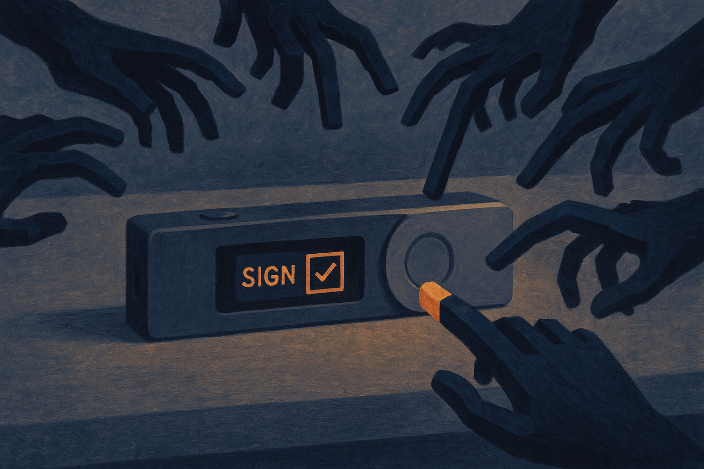

TL;DR: AI is not breaking Bitcoin wallets, it is making the human side of self-custody cheaper to attack at scale.

## What did Decrypt actually report?

The primary source here is Decrypt’s “Morning Minute: The Coldcard Bitcoin Hack Nears $114 Million in Potential Losses.” Decrypt framed the incident as part of a broader self-custody problem, writing that self-custody is “under attack” and that AI is becoming one of crypto’s leading threats.

That is a strong claim. It is also directionally plausible, but easy to overstate.

From the material available, the clean read is this: a Coldcard-linked Bitcoin security incident may involve up to $114 million in potential losses, and Decrypt is connecting that to a larger pattern where AI makes attacks on crypto users more convincing. The important word is “potential.” That is not the same as confirmed realized theft, final attribution, or proof that an AI system directly compromised a hardware wallet.

I would be careful with the phrase “AI hack” here. It can make readers picture a model cracking private keys or defeating Bitcoin’s cryptography. That is not the practical risk most teams should be planning around. The risk is messier and more boring: better phishing, better impersonation, better research on targets, better malware lures, better fake support flows, and more convincing transaction confusion.

That is still serious. Just not magical.

## What did AI actually change?

AI lowers the cost of customized deception.

A few years ago, good spearphishing took effort. The attacker had to know the target, write in the right tone, understand the product, and keep the con going. Now a model can help with all of that. It can rewrite scam messages in clean English. It can mimic a support rep. It can generate plausible troubleshooting steps. It can translate the same attack into many languages. It can scrape public context and turn it into a believable pretext.

For self-custody, that matters because the signing moment is sacred. If a user signs the wrong thing, approves the wrong transaction, installs the wrong firmware, reveals the wrong seed phrase, or trusts the wrong recovery process, the chain will not call customer support for them.

This is why “hardware wallet security” is not only about secure elements, air gaps, and seed storage. Those still matter. But the attack surface has moved outward into the workflow around the device.

The model does not need to beat the wallet. It only needs to beat the user interface, the support experience, the browser session, the Discord message, the email, or the moment of panic.

## Where should builders focus?

Wallet teams should treat AI-assisted deception as a product problem, not only a user education problem.

That means clearer transaction previews. Better warnings when an address, domain, app, or signing pattern is weird. Safer defaults for blind signing. Harder-to-spoof support channels. Recovery flows that assume a user may be under live social pressure. More simulation of real scams inside onboarding, not generic “never share your seed phrase” banners that everyone clicks past.

There is also room for AI on defense, but with limits. Models can help classify suspicious messages, explain transactions in plain language, and flag mismatches between what a user thinks they are doing and what a transaction appears to do. The catch is that AI explanations can also be wrong, vague, or overconfident. If a wallet adds an assistant, it needs strict boundaries. It should cite concrete transaction details, not improvise trust.

For users, the practical bar is simple: slow down the signing moment. Treat urgency as hostile. Verify firmware and apps through known channels. Do not troubleshoot seed phrases in chat. Do not assume a polished message is legitimate. In 2026, clean language and convincing tone are no longer trust signals.

Practitioner’s Take: If you build in crypto, map every step before a signature and ask, “Could a model make this lie more believable?” Then fix the step, not the slogan. Add friction where money leaves, remove ambiguity where permissions appear, and test support flows against AI-generated impersonation. The missed catch is that self-custody does not fail only when private keys leak. It fails when the product lets a user confidently authorize the wrong thing.
