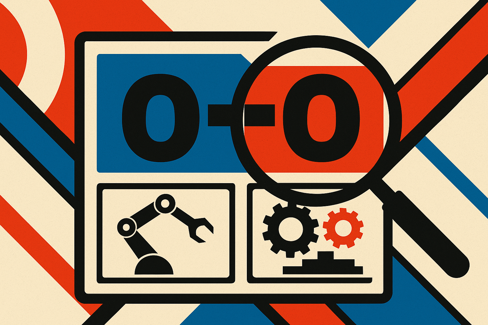

TL;DR: The best multimodal models hit human-level accuracy at telling whether two people already know each other, but they cheat their way there by leaning on a "stranger" default, and unlike humans they get no extra lift from watching how people actually behave.

The primary source here is FriendBench: Benchmarking Dyadic Familiarity Inference in Humans and Multimodal Large Language Models, posted to arXiv under both cs.AI and cs.CL. The setup is clean enough to explain in one breath: show a 20-second clip of two people doing an ice-breaker conversation, and ask whether they were already familiar or meeting for the first time. Every pair answers the same kind of prompt, so the words carry almost no signal. What tells you the answer is the manner: the timing, the ease, the physical shorthand friends have that strangers don't.

The team ran 26 models from seven companies across text, audio, and video, against matched human panels, over 96 balanced dyads. Balanced matters. Half the pairs are friends, half are strangers, so a coin flip lands at 50 percent and there's no free lunch from guessing the majority class.

## What is FriendBench actually measuring?

It's measuring social inference from behavior, not from content. That distinction is the whole point.

Most vision-language benchmarks reward reading what's on screen: objects, text, actions, captions. FriendBench strips that away. Because every pair runs the same prompt, the transcript is nearly useless. You can't infer familiarity from "so, uh, what do you do for work" because friends and strangers both say versions of that. The answer lives in the delta between the words and the delivery, the stuff humans read without thinking: does one person finish the other's sentence, is the laughter real or polite, is the body language relaxed or careful.

That makes it a good probe for something the field talks about but rarely tests directly: theory of mind and social reasoning under thin, ambiguous signal. Not "what is happening" but "what is the relationship between these two people, given only how they move through a scripted task." That's a harder and more human question.

## Do models actually match humans here?

On raw accuracy, yes, and this is the headline that will get quoted out of context. FriendBench reports that in every modality the best model and the human crowd are statistically indistinguishable on accuracy. Text, audio, video: pick a channel, and the top model lands where the human panel lands.

But how they get there is not the same, and that's the finding that matters. Humans stay balanced across the two answers. The strongest models lean toward "stranger." FriendBench frames this precisely as a difference in effective prior, not discrimination. In plain terms: the models aren't better at telling friends from strangers, they're biased toward calling everyone a stranger, and because the test is balanced that bias happens to bank points on the stranger half while costing them on the friend half. It nets out to human-level accuracy for a reason that has nothing to do with human-level perception.

This is the trap in every "matches humans" claim you'll read this year. Aggregate accuracy hides the mechanism. Two systems can post the same number while one is genuinely reading the situation and the other is playing the base rate. FriendBench's contribution is separating those, and it takes a balanced dataset plus a look at answer distribution to do it. If they'd used an unbalanced set, the prior bias would have masqueraded as skill or been washed out entirely.

## Why does watching behavior help humans but not models?

This is the part I keep chewing on. FriendBench notes that richer channels help both humans and models, but unequally, and that only humans gain from visible behavior on top of speech.

Read that again. Give a human the audio, they do better than text. Give them the video on top of the audio, they do better still, because they can see the body language. Give a model the same video on top of the same audio, and the extra behavioral signal doesn't move it. The model can transcribe the scene, but it isn't converting posture, gaze, and micro-timing into a familiarity judgment the way a person does.

That's a specific, useful gap. It's not that models are blind. They're processing the pixels. They just aren't extracting relational meaning from behavior, the layer humans read automatically. For anyone building products on top of multimodal models, this is the honest ceiling: current systems can describe a social scene far better than they can interpret the relationships inside it. Description is close to solved. Social interpretation from behavior is not.

## What should a builder take from this?

Stop trusting "matches human accuracy" on any social or perceptual task until you've seen the confusion matrix and the answer distribution.

The FriendBench pattern is going to repeat everywhere. If you're evaluating a model for anything that involves reading people, sentiment from a call, engagement from a meeting recording, rapport in a support interaction, run it against a balanced set and check whether it's discriminating or just defaulting. A model that calls every ambiguous interaction "cold" or "stranger" will post fine numbers on a balanced eval and then fall apart the moment your real-world distribution skews warm. The prior bias is invisible until the base rate shifts, and in production the base rate always shifts.

The second lesson: don't assume adding video buys you social understanding. FriendBench shows the extra modality helping humans and not helping the strongest models on this task. If your feature depends on the model reading behavior rather than transcribing content, budget for that gap being real, and test it directly rather than assuming a video-capable model reads a room. Test on the interpretation you actually need, on balanced data, with the answer distribution in view. The catch most people miss is that a benchmark can be "solved" on the scoreboard and still be wide open on the mechanism, and the mechanism is what your users will feel.

FriendBench released the stimuli, the human ratings, and the model predictions, which means you can check the mechanism yourself instead of taking the accuracy number on faith. That's the right way to ship a benchmark, and the right way to read one.
