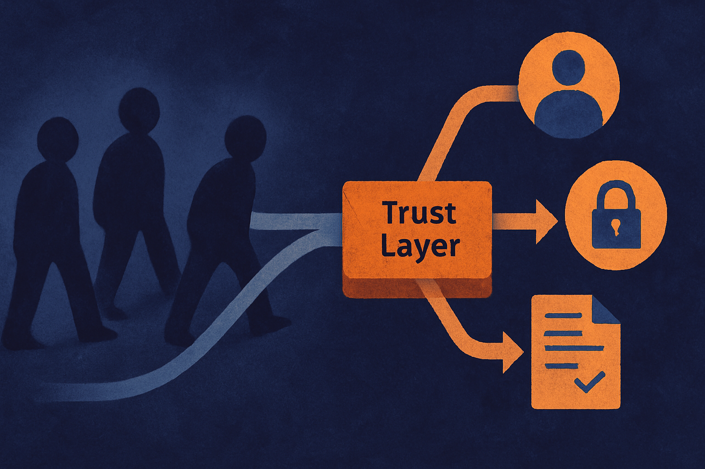

TL;DR: DNS could become useful identity plumbing for AI agents, but only if builders treat it as a trust starting point, not a complete trust system.

## Why would agents need DNS at all?

Domain Name Wire’s “Trust and identity with AI agents – DNW Podcast #598” centers on Elliot Noss, the former Tucows CEO, and his idea for Groundmark. The stated question is simple: is DNS the right backbone for a future full of agents?

That is a good question because agents break a lot of the assumptions behind today’s web identity.

A website is mostly static. A user visits it, reads it, signs in, buys something, leaves. An agent is different. It may act across many services, request data, negotiate with APIs, schedule work, and maybe spend money if a human has delegated that power. In that world, “what domain is this?” becomes “who is this agent, who controls it, what is it allowed to do, and can I prove that later?”

DNS has a real claim here. It is global. It is already delegated. It already maps names to infrastructure. It already has registrars, registries, records, expiry, and dispute processes. That does not make it perfect. It makes it boring in the useful way.

DNW also notes prior conversations with GoDaddy about Agent Name Service and Identity Digital about DNSid. Groundmark is another version of the same instinct: agents need names that can be checked outside the model’s own claim about itself.

## What does DNS identity solve, and what does it not solve?

The useful part is discovery and attribution.

If an agent says it acts for a company, a domain-linked identity could help another system check whether that claim points back to an owner, a policy, or a known endpoint. That is much better than asking a language model to self-describe. Models are persuasive. They are not identity systems.

But DNS does not answer the full trust problem.

A domain can tell me something is associated with a name. It does not prove the current task is approved. It does not prove the human behind the agent intended this specific action. It does not prove the agent did not get prompt-injected five minutes ago. It does not decide whether the agent can access payroll data, approve a refund, or email a customer list.

That means DNS identity needs to sit beside other controls: signed requests, scoped permissions, revocation, audit logs, human approval for risky actions, and service-side policy checks. The boring parts matter more than the name.

This is where agent identity can go wrong in product language. A clean naming layer sounds like the solution because naming is visible. Authorization is messier. Accountability is messier still. If a customer support agent refunds the wrong order because another page injected instructions into its context, the domain record is not the whole postmortem.

## What should builders watch next?

I would watch for interoperability, not branding.

If Groundmark, Agent Name Service, DNSid, and other efforts each create separate identity islands, developers will hesitate. Agent identity needs to work across registrars, clouds, SaaS apps, local agents, and enterprise directories. Nobody wants to write custom trust logic for every naming scheme.

The winning pattern may look less like a shiny new namespace and more like a bundle of practical conventions: domain-bound agent records, machine-readable policies, cryptographic signing, common revocation behavior, and logs that humans can inspect after the fact.

There is also a governance question. DNS has institutions and rules, but agents will push into use cases DNS was not designed to judge. A domain owner can delegate a subdomain. Should that mean every agent under it inherits trust? Maybe for discovery. Not for authority.

Practitioner's take: if you are building agents today, do not wait for the naming layer to settle. Start by separating identity, permission, and audit in your own system. Give every agent a stable ID, bind it to an owner, sign its calls where you can, scope every tool permission, and log the reason each action was taken. The catch most readers miss: the hard problem is not “what is the agent called?” It is “what was this agent allowed to do at that exact moment, and can I prove it later?”
