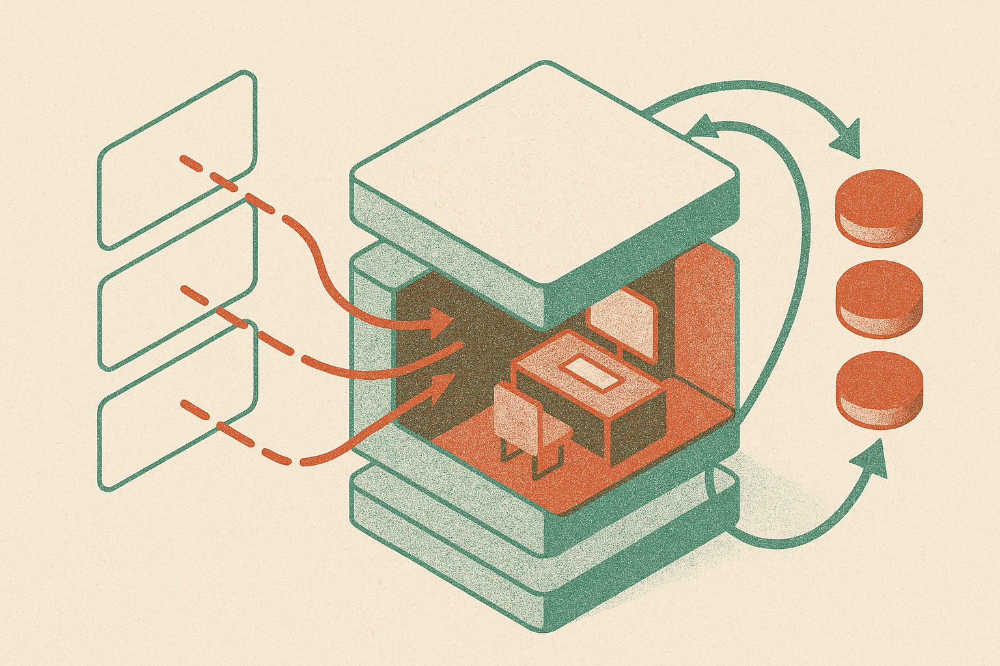

TL;DR: GradCuit shows that some reasoning gains may come from optimizing a model’s temporary internal state at test time, not from changing weights, writing longer chains of thought, or sampling more answers.

## What is GradCuit actually optimizing?

The primary source here is the arXiv cs.CL and cs.LG paper, “GradCuit: Credit-Assigned Gradient Flow Enables Robust and Interpretable Test-Time Latent Reasoning.”

The core move is simple to say and tricky to implement: keep the language model frozen, insert optimizable latent states at a chosen Transformer layer, then update those states using feedback from the generated answer.

That is different from ordinary chain-of-thought prompting. In chain-of-thought, the model reasons through visible tokens. If the answer is wrong, you can ask again, sample more, rerank candidates, or use an external verifier. GradCuit instead creates a small internal workspace between the prompt representation and the continuation. Because causal self-attention connects later continuation tokens back to earlier latent states through the remaining Transformer blocks, the system can send reward-weighted gradients from the whole generated continuation directly into those latent states.

That matters for credit assignment. A final answer may depend on a bad intermediate move several tokens earlier. Token-only methods often see that indirectly. GradCuit gives the optimizer a path into the hidden reasoning state that helped produce the continuation.

## Are the gains large enough to care about?

On the reported benchmarks, yes, but not in a magic-wand way.

GradCuit reported an average accuracy of 64.5% across five instruction-tuned backbones, three reasoning benchmarks, and two answer formats. That was 6.6 percentage points above chain-of-thought prompting and 2.4 points above the strongest competing method. Those are meaningful gains in this class of research because the weights stay frozen. The improvement comes from test-time computation, not training a new model.

The stability result is more interesting to me than the headline accuracy. Across seven learning-rate settings, GradCuit consistently beat LatentSeek and reduced accuracy standard deviation from 1.53 to 0.82. In plain terms: it was less fussy about the optimization knob. That is the kind of detail that separates a paper trick from something builders might eventually use.

There is also a strange but useful clue in the random-walk variant. GradCuit reported that even random-walk latent updates stayed competitive with LatentSeek. I would not overread that as proof that gradients barely matter. But it does suggest the latent space being searched is doing real work, and that internal state perturbation may be a useful test-time axis even before the method is fully refined.

## What does the interpretability angle tell us?

GradCuit’s token-level gradient attribution found that latent influence concentrates on reasoning-connector tokens. Think “therefore,” “so,” “because,” and other glue that shapes the route from one thought to the next. That fits the premise. The optimized latents are not just nudging surface wording. They appear to steer the connective tissue of reasoning.

The layer finding is also practical: early-to-middle Transformer layers were the most effective optimization space. That makes intuitive sense. Too early, and the model may not have enough task structure yet. Too late, and the generation may already be locked into local next-token behavior. The middle layers are where a lot of reusable computation likely gets organized.

The catch is access. This is not something you can do through a normal hosted chat completion API. You need gradient access to model internals, control over a selected layer, backward passes at inference time, and a reward signal that is good enough to optimize against. That means more cost, more engineering, and more chances to overfit the test-time objective.

For builders, the immediate move is not “ship GradCuit tomorrow.” It is to separate three knobs in your reasoning stack: better prompts, more candidate answers, and stateful test-time optimization. If you run open weights and have verifier-style rewards, try small experiments where you optimize hidden activations for hard math, code, or structured QA tasks. The catch most readers miss: the reward function becomes the product surface. If the feedback is shallow, the model will get better at satisfying the scorer, not necessarily at solving the problem.
