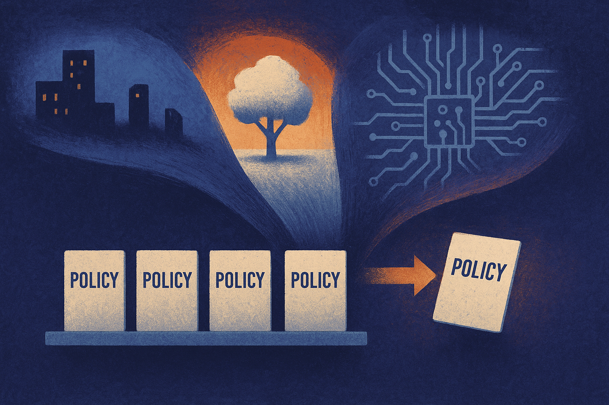

TL;DR: If your environment is uncertain but clarified right before action, prepare a small menu of policies instead of forcing one compromise policy or maintaining one policy per scenario.

## What problem is this actually solving?

The arXiv cs.AI/cs.LG paper “Optimizing Minimax Regret in Uncertain MDPs with Small Sets of Policies” focuses on a very operator-shaped problem: you do not fully know the environment when planning, but you may learn which version you are in shortly before execution.

That is common outside toy reinforcement learning. A delivery system may not know final traffic conditions until dispatch. A grid controller may not know demand and renewable supply until close to runtime. A clinical workflow may not know the patient subtype until more data arrives. The state and action space may stay the same, but transition probabilities and rewards shift.

The usual choices are both ugly.

One option is to train or synthesize a single policy that works across all possible MDPs. That is simple to deploy, explain, audit, and monitor. It can also be too conservative, because it has to average across worlds that may need different behavior.

The other option is to prepare an optimized policy for every possible MDP. That may look great in a benchmark. In a real org, it can collide with policy-count limits, regulatory review, interpretability, testing cost, and plain operational sanity.

The paper proposes the middle path: $k$-adaptable policy synthesis. Prepare $k$ policies in advance. Once the uncertainty is resolved, pick the best policy from that small set.

## Why does minimax regret matter here?

The objective is minimax regret, not average performance. That distinction matters.

Regret measures how far a selected policy falls short of the best policy that could have been used for a given MDP. Minimax regret asks: what is the worst shortfall across all possible environments, and how do we make that worst case smaller?

That is a good fit for systems where being badly wrong in one scenario matters more than being slightly better on average. It also matches how many teams think about deployment risk. They do not ask only, “What is the expected score?” They ask, “Where does this fail, and how bad is the miss?”

“Optimizing Minimax Regret in Uncertain MDPs with Small Sets of Policies” reports that the problem is NP-hard, which is not surprising. You are jointly deciding which MDPs should share a policy and what those policies should be. That is a clustering problem and a policy optimization problem tangled together.

The proposed algorithm, KAPS, is an exact nested branch-and-bound method with problem-specific bounds and heuristics. The key phrase is “jointly optimizes.” It does not first group environments and then separately fit policies. It searches over both decisions.

The paper’s most practical experimental result is also the least flashy: across UMDP benchmarks, the largest reduction in regret consistently came from moving from one policy to two. Not ten. Not one per world. Two.

That is the receipt I care about. If this pattern holds in applied settings, it suggests many teams are overpaying for either simplicity or specialization. A second prepared policy can absorb a lot of uncertainty without turning the system into a zoo.

## Where would this show up in real AI systems?

This is not only about classical MDP planning. The same shape appears in agent and workflow design.

A customer-support agent may need one policy for high-confidence account recovery and another for ambiguous or fraud-sensitive cases. A warehouse robot may need one policy under normal congestion and another under degraded sensor coverage. A coding agent may need one strategy when tests are reliable and another when the repo is under-specified.

The catch is that “policy” does not have to mean a neural network checkpoint. It can be a decision rule, a planner configuration, a prompt-and-tool workflow, a controller, or a human escalation protocol. The paper is formal, but the deployment pattern is broader: build a small set of approved behaviors, then route based on late-arriving context.

I would not read KAPS as a plug-and-play answer for every production system. Exact branch-and-bound methods can be expensive, and benchmarks are not your messy operating environment. Also, the paper shows a consistent gain from one to two policies across tested UMDP benchmarks, not a universal law that two always wins.

For a builder, the practical move is simple: stop asking whether you need one general policy or infinite specialization. Identify the top two or three environment modes that create regret. Build a small approved policy menu. Add a routing step that runs only after the relevant uncertainty is observed. Then measure worst-case miss, not just average score. The catch most readers miss: the routing decision becomes part of the product surface, so it needs tests, logging, and review just like the policies themselves.
