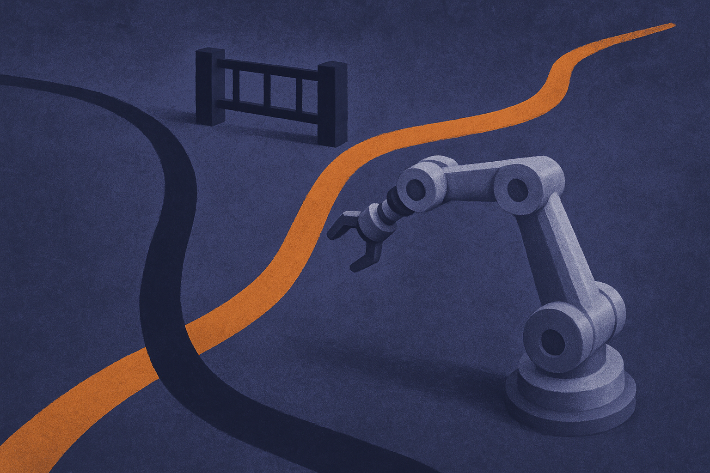
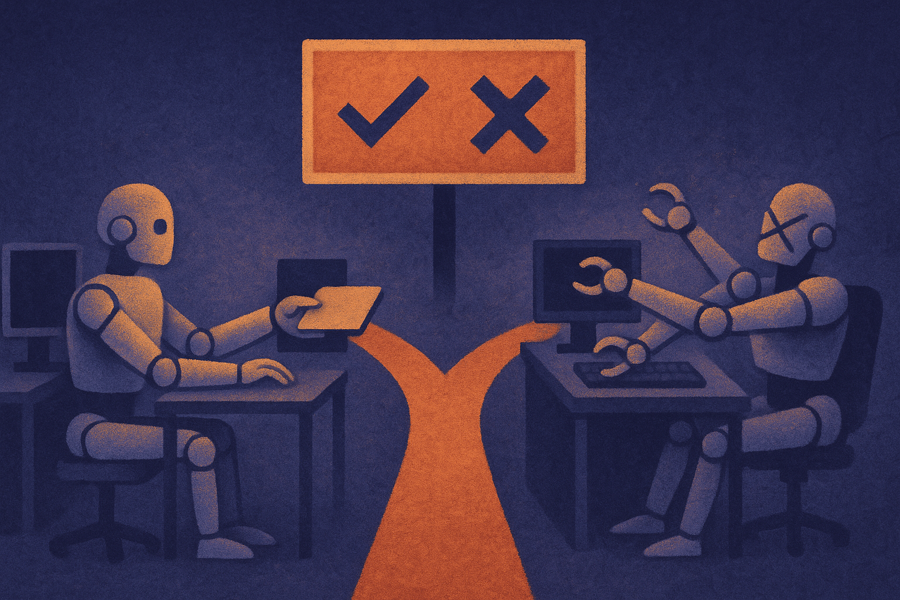
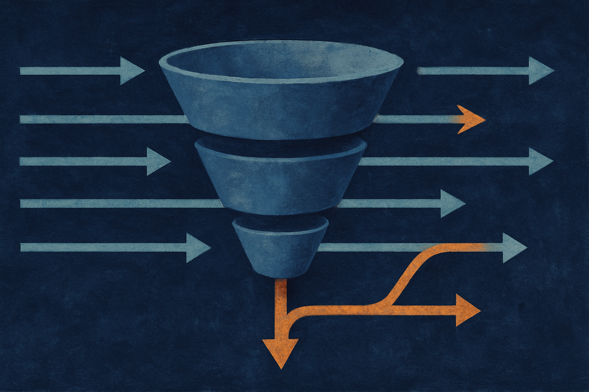

TL;DR: CoWAM adds a gatekeeper between a robot's world model and its motor policy, so the robot only changes its planned action when a predicted alternative provably clears a set of coordination rules and offers a real improvement, keeping harmful overrides under 1%.

The paper is "CoWAM: Coordination Contracts for Selective Policy Intervention with WAMs," posted to arXiv under both cs.AI and cs.LG. It sits at an intersection that most robotics hype skips over: not "can the model predict the future," but "should the robot act on that prediction." Those are different questions, and the second one is where a lot of impressive demos quietly fall apart.

## What problem is CoWAM actually solving?

A World Action Model, or WAM, takes a candidate action and rolls forward a predicted future conditioned on that action. Feed it "close the left gripper" and it shows you what it thinks happens next. Useful. But the authors make a sharp point up front: a plausible predicted future is not, by itself, a reason to change what the policy was going to do.

That distinction matters more than it sounds. If your robot's base policy was about to execute action A, and the world model dreams up a nicer-looking future for action B, the naive move is to swap in B. The problem is that world models hallucinate plausibly. A prediction that looks clean on screen can be wrong, and swapping actions on the strength of a wrong prediction is exactly how you get a two-armed robot slamming its own grippers together.

CoWAM's frame is conservative by design. Keep the nominal action. Only deviate when an alternative satisfies every active obligation and delivers a clear, low-risk improvement. It is the robotics version of "don't fix what isn't broken, and prove the fix before you apply it."

## How do coordination contracts work?

This is the piece worth understanding. Instead of a single "is this action good?" score, CoWAM expresses the requirements of bimanual coordination as explicit contracts. The paper names three: synchronization, role compatibility, and collision convergence.

Think about two arms handing off an object. Synchronization means the timing lines up. Role compatibility means one arm is holding while the other is releasing, not both trying to grab. Collision convergence means the two arms are converging toward a shared point without crashing. Each of these is a real constraint that a plausible-but-wrong prediction can violate.

Each contract combines three things: typed admissibility checks, event-conditioned verification, and calibrated intervention gates. In plain terms, a candidate action first has to be the right type of action for the situation. Then its predicted consequences get verified against specific events that should or shouldn't happen. Then a calibrated gate decides whether the evidence is strong enough to justify intervening at all.

That layered structure is the interesting design choice. A typed check is cheap and rules out obvious nonsense. Event-conditioned verification looks at the world model's prediction but asks pointed questions instead of trusting the whole rollout. And the calibrated gate is the part that keeps the system honest, because it is tuned to the actual reliability of the predictions rather than assuming they're trustworthy.

When the nominal action itself is inadmissible and no alternative clears the contracts, CoWAM doesn't guess. It invokes a predefined abstention fallback. The robot has a defined "I don't know, so I stop" behavior. For anyone who has watched a robot confidently do the wrong thing at full speed, that fallback is not a footnote.

## Do the numbers hold up?

The evaluation is where I want to be careful, because this is simulation, not a physical bimanual rig, and the authors are clear about that.

Across eight simulated bimanual tasks, CoWAM improves coordination-valid selection by 16.7 percentage points over the contract-only variant, and raises closed-loop success by 9.6 percentage points over the strongest selective baseline. Harmful interventions stay below 1%.

Two things stand out about how they set this up. First, they separated selector quality from proposal quality by making every method operate on identical candidate pools. That's a real methodological discipline. If one method got better candidate actions to choose from, you couldn't tell whether the selector or the proposals were doing the work. Locking the candidate pool means the 9.6-point gain is attributable to the decision layer, not to a luckier set of options.

Second, methods commit their decisions before shared oracle labeling. In other words, the system has to pick before the ground-truth judge weighs in, which blocks the subtle leakage where a method effectively peeks at the answer. These are the kinds of choices that separate a result you can trust from one you can't.

The comparison against a "contract-only variant" is telling. Contracts alone get you 16.7 points less than contracts plus the full verification-and-gating stack. That gap is the argument for the whole architecture: rules matter, but rules without calibrated evidence about when to trust a prediction aren't enough.

## Where does this actually apply?

The honest scope here is narrow, and that's a feature. This is about bimanual, coordination-rich tasks in simulation. It is not a general theory of robot decision-making, and the authors don't claim it is. What they establish is that coordination contracts are an effective interface for conservative policy intervention when you have predicted world-action evidence.

The transferable idea, though, is bigger than robotics. Any system that uses a predictive model to second-guess a working policy faces the same trap: the prediction looks good, so you act on it, and sometimes the prediction was wrong. That pattern shows up in agent frameworks that use a critic model to override a planner, in trading systems, in any "model A checks model B" setup. CoWAM's answer is to make the override conditional on explicit, verifiable obligations plus a calibrated confidence gate, with a defined fallback when nothing qualifies.

The catch most readers will miss is that CoWAM's whole value proposition rests on how well those intervention gates are calibrated. "Calibrated" is doing heavy lifting in this paper. A gate tuned on eight simulated tasks may not stay calibrated when the world model's error profile shifts, which is exactly what happens when you move from simulation to hardware or to a new task distribution. The sub-1% harmful intervention rate is genuinely good, but it's a number from a controlled setting.

If you're building an override layer between a predictive model and a policy that already works, steal the structure here: type-check candidates first, verify against specific events rather than whole rollouts, gate on calibrated confidence, and define an explicit abstention path. Then spend most of your effort on the gate calibration and re-check it every time the underlying model or the task changes, because that's the assumption that quietly breaks. Conservative intervention only stays conservative if the thing deciding when to intervene knows how much to trust what it's seeing.
